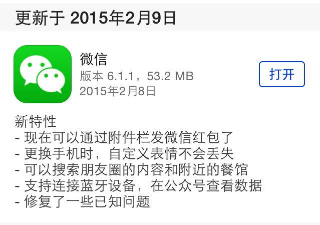
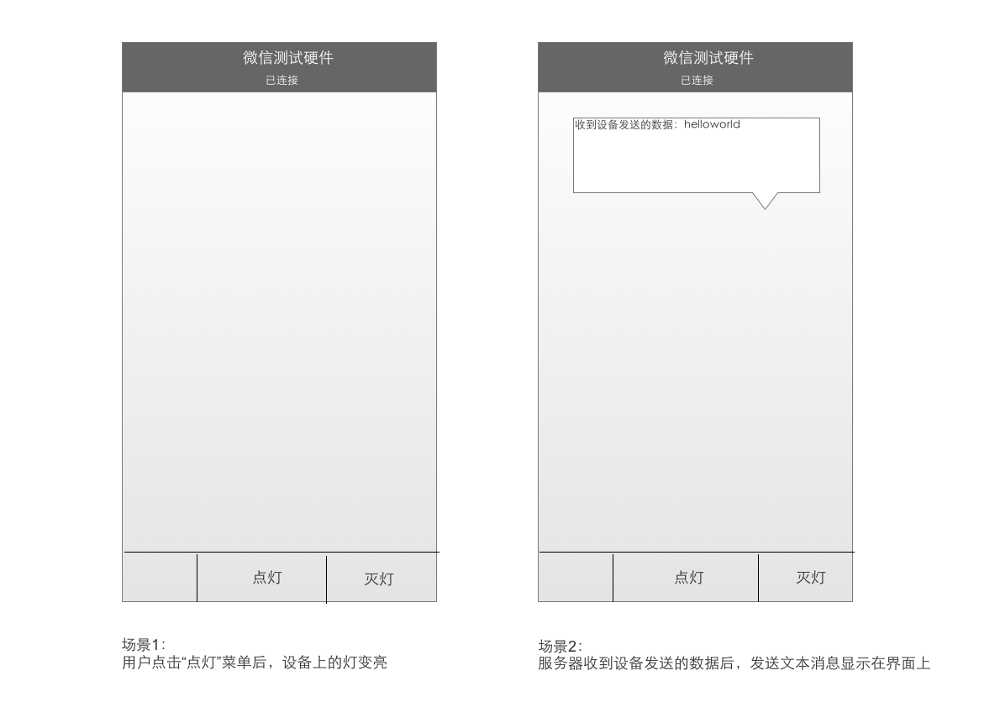
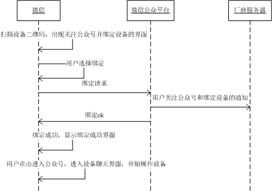
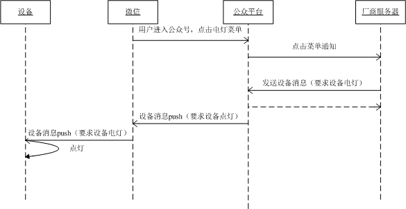
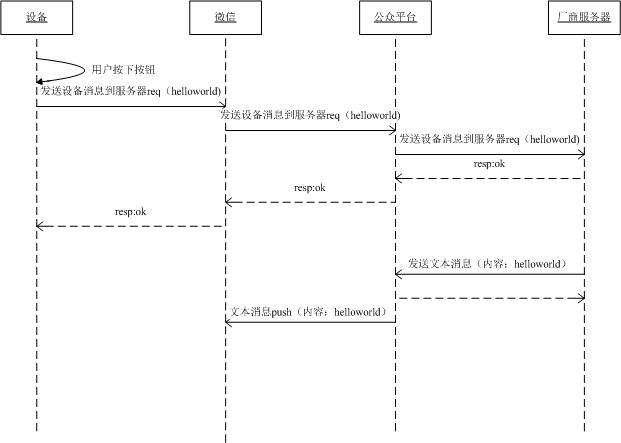
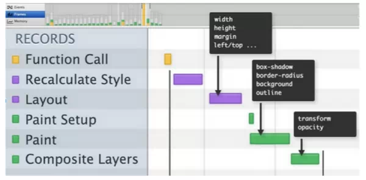
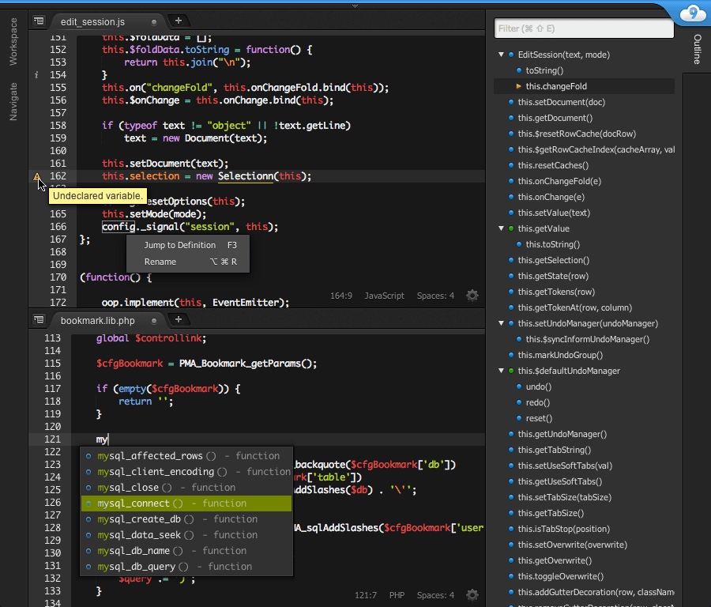
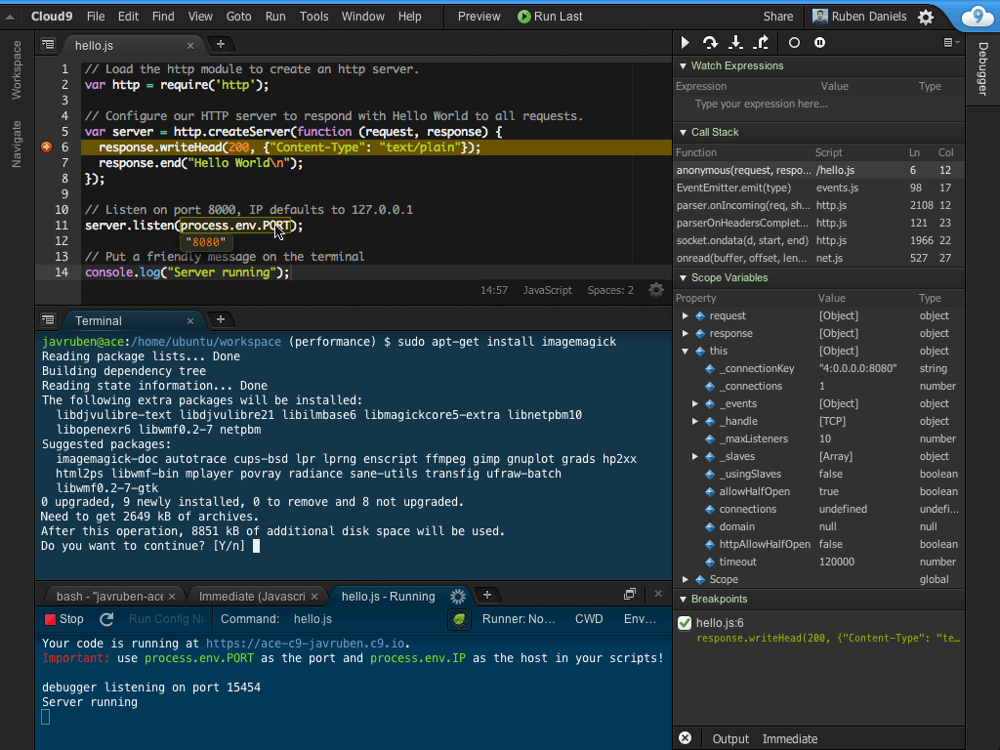
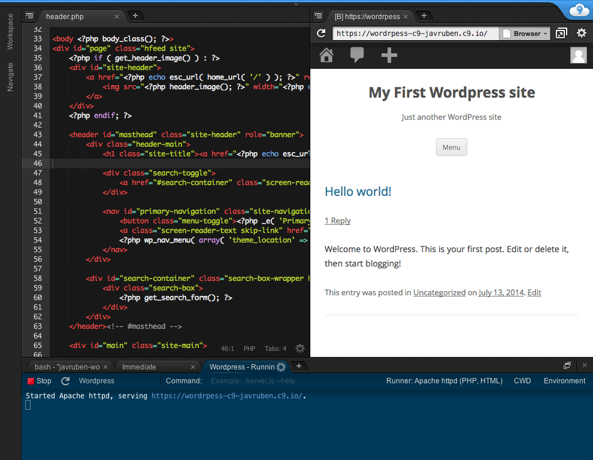

<2015> to be continued...
====================

### Preface
抓不住的2014，直面而来的2015。
AngularJS还没学完，却又被ReactJS吸引。
站在时间轴的原点，木然挥手，两段是无源的尽头。
下面，将是本人年终总结通报批评细数2015年自己究竟有哪些期待。

### 风车理论
在这里，就以我最喜欢的大蛇丸的风车理论开头吧。

现在还依稀记得，在我年幼懵懂的儿时，那时的大蛇丸是如此的风流倜傥，绝代风华，一个有理想有追求的励志哥。

当时他做了一件足以载入史册的事件，抱着“消灭人类暴政，世界属于三体”的理想，掀起了一场推翻火影独裁集权政体的运动。在这场运动中，出现很多我们熟悉的人物，包括绝代双骄的宇智波鼬鬼鲛晓之二人组，缺爱骚年我爱罗等。

众所周知，这场运动的高潮就是大蛇丸君袭击木叶村，木叶村村长三代火影于是出来应战，壮烈牺牲，击退了蛇丸君，最后在一群脑残粉的疯狂反抗下，镇压了这场政变。

在那场大战中，大蛇丸面对三代火影说过这样一句话：


这是蛇丸君的风车理论第一次出现，看到这里我感动的眼泪流出来。当时年轻的蛇丸君想以一己之力推翻暴政，现在想想真是太天真了。

若干年后，退隐多年蛇丸君已经成为了德高望重的蛇叔，诈尸重返人间，在遇到多年未见得老相好第五代火影，无不感慨的说出一番话：


时过境迁，人老花黄。此时的他，早已消逝了当年的雄心壮志，可同时也明白了其中的道理。

让我们再回到中忍考试时期大蛇丸袭击木叶的目的，按照大蛇丸所说：他是希望用“毁灭木叶这阵风来转动风车”，然而最后的结果是“火之意志”打败了他的“风车理论”，我们在感叹火之意志作为传统力量还相当强大的通知，也不得不接受毁灭木叶这阵风在一开始就没能刮起来，当然这次行动的失败也给大蛇丸带来了对于秩序的全新理解，这之后他便发生了转变。大蛇丸被封印后，“晓”组织在抱有明确目的的情况下实际上却履行的是大蛇丸的做法，于是当年的“毁灭木叶”成为了现在的月之眼。因此大蛇丸虽然没有看到他计划中的打乱洗牌过程，却在窥视种见到了新人物思想的崛起，按照他的说法，这正是“一阵新风”。 

正如蛇丸君尝试以一己之力推动“风车转动”最终失败，最后却发现与其尝试创造风不如等待“一阵新风”自行推动“风车转动”。想想雷军不也是人在中年发自肺腑道出那句引人深思的话语，“只要站在风口，猪也能飞起来。”。

并不是成为火影的人就能听懂“蛇叔的风车理论”，而是听懂“蛇叔风车理论”的人才有资格做火影！

总之，木叶村体制改革，火影与团藏的内部斗争，晓组织的大国政权颠覆，以及大蛇丸与佐助的革命之路，一切尽在不言中，与君共勉，尽情期待。

### WeChat  物联网
物联网这个概念提出已久，实现之路也在步履蹒跚的推进中。
鹅厂终于看不下去了，于是在“走别人的路，让别人无路可走”的中心指导思想下，正式向物联网进军大力推进。
起因源于一次更新，向物联网丢下一枚重磅炸弹，顿时引起轩然大波。



支持连接蓝牙设备，在公众号查看数据。具体怎么个玩法，可以在下面的链接中找到教程。http://iot.weixin.qq.com/

可以看看微信自家的简介：
```
设备功能是微信为服务号提供的物联网解决方案，设备功能建立在微信硬件平台之上。设备功能允许硬件设备厂商通过服务号，将用户与其拥有的智能设备相连。 
  
通过微信硬件平台规定的连接协议，各种智能设备如蓝牙设备、WIFI设备和其他移动网络设备都能方便的接入微信，完成设备、人、服务三者 的连接。 

微信硬件平台同时还提供了AirSync, AirKiss等用于蓝牙和WIFI技术的基础支持框架，以及硬件JSAPI等， 以方便硬件开发人员快速地将微信与智能设备进行互联。
```

微信官方的文档及其详细，并且还提供了一个实现一个蓝牙硬件公众号demo的开发教程：

```
该公众号只有两个菜单：点灯，灭灯。当用户点击“点灯”菜单时，设备上的灯变亮。当用户点击“灭灯”菜单是，设备上的灯灭掉。
```



实现流程图:







好炫酷有木有？

以后我们就可以用微信控制一切啦，想想就有点小激动。其实，这事也只能由微信来做，也只有微信才能互联一切，因为只有鹅厂才能做到人手一个微信。接下来，就是硬件厂商开始连接微信了。

### Canvas UI
下面就来谈谈移动端页面动画的问题。
现在移动端开发都喜欢搞个WebView里面套个页面，前段时间看了某个人做的一个动画页面，唏嘘不已，很明显的发现动画严重卡顿跳帧的现象，不要问人家为什么，因为人家是setTimeout系。。

刚好没多久看到一篇文章，《创新高性能移动 UI 框架-Canvas UI 框架》，写的十分精彩。

我们知道，现在动画一般是按照每秒大于等于 60 FPS（60 帧每秒）的标准，也就是16ms一帧。

再回过头来看看js里的setTimeout/setInterval，这两个函数处理回调的时间 tick time 精度都在 16ms 左右。呵呵，正常用这两个函数就已经 16 ms了，然而你还要在这里面重新绘图渲染DOM。。不卡顿或跳帧才怪！

这是其一，其二就是里面的DOM操作更加耗时耗性能




可能大家都知道，最近ReactJS特别火，其中用到了虚拟DOM能很快渲染页面，还能够回放，但要想在16ms内完成上面一些列操作，现在市面上的那些不管是真八核还是伪八核cpu都表示完全跑不动啊。。

那咋办呢？当然是有很多方法啦，这里就不再细说那些传统的，而是讲讲超乎传统打破极限的Canvas UI。

怎么做呢，很简单，把整个页面全画出来，你没看错，叔叔，我们不要DOM了，我们不用CPU渲染DOM，我们把DOM元素全画在canvas里。。为啥这样做呢，因为我们要用GPU加速渲染页面！

* 只用一个 Canvas DOM 元素，降低 DOM 数量与渲染的复杂度，可以将原来 CPU 密集型变成 GPU 操作。绝大多数针对 Canvas 是用硬件 GPU 加速渲染。
* GPU 的 ALU（计算单元） 比 CPU 要多很多，而控制运算（逻辑）则可以用 JavaScript 在 CPU 里做，甚至还可以用 WebWorker 多线程处理 CPU 密集型的操作，从而达到充分利用硬件资源的能力。
* Canvas 画布无论是 JavaScript & H5，还是 native 都有类似的 API。

下面是Flipboard 同学们写的一个 demo，酷炫吧。


* 这么复杂的 demo 在 MI4 以及配置以上性能很好，流畅度无限接近于 native，比较理想。
* 对比过 G+ 的 Android 应用，G+ 的 App 从动画上比 Flipboard 提供的的 demo 还「卡」些。
* 在小米 Note 上的动画流畅度已秒掉 iPhone 6，非常赞。

但是这样的话，我们就不能愉快的写CSS了。于是喜欢用js写样式的不作死就不会死的非死不可开源了一个用 JavaScript 写 css layout 子集的解决方案，实现了：
* padding
* width
* margin
* border
* flex 
* position( relative/absolute )
* 等等 Feature

github 地址：https://github.com/facebook/css-layout

### ES 6
万众期待的ES6终于要登场了，于是乎在线体验了一下预览版，地址忘记了。新增了好多语法糖，超喜欢不是吗。

lambda函数：
```
var array = [1, 2, 3];
array.forEach(v = > console.log(v));
```
终于有对象了：
```
class Animal {
    constructor(name) {
        this.name = name;
    }
    sayName() {
        console.log('My name is '+this.name);
    }
}
class Programmer extends Animal {
    constructor(name) {
        super(name);
    }
    program() {
        console.log("I'm coding...");
    }
}
```
自带模板引擎：
```
var num=Math.random();
console.log(`your num is ${num}`);
```
unzip:
```
var [x,y]=getVal(),
    [name,,age]=['wayou','male','secrect'];
function getVal() {
    return [ 1, 2 ];
}
```
不定参数，可以有默认值了。。
```
function sayHello2(name='dude'){
	console.log(`Hello ${name}`);
}

function add(...x){
	return x.reduce((m,n)=>m+n);
}

add(1,2,3)
```
还有let与const 关键字，for of 值遍历，iterator, generator，模块，Map，Set 和 WeakMap，WeakSet，Proxies，Symbols，之前讲过的Promises等等。

看完这些，我只能说，python大法好！

### Cloud 9
居然不知道C9，说明你已经out了，C9可不是那啥啥什么电子竞技战队，不是韩国面霜，而是一个绝对暴强的在线IDE。官网：https://c9.io/



基于满大街的Node.js，语法高亮引擎采用的是大名鼎鼎的ace.js，主题用的和sublime一样，提供vps，支持ssh，ftp，即时REPL，bash，代码云端同步，绑定github，同步到其仓库。宅男必备啊！



我这么卖力的宣传人家的产品，可不是在做广告啊。。



### Tricks
近日在调试微信页面，比如说你要调试微信的js-sdk，就不得不直面一个问题，微信里根本就没有Chrome控制台给你调试用嘛。。

尽管Chrome已经强大到能在桌面上模拟移动端页面，但是像调试微信页面等APP自己提供的API时，你总要在移动端页面看效果吧，总会有各种意想不到的情况，为了找出bug所在，在手机上是相当麻烦。

http://yujiangshui.com/multidevice-frontend-debug/
上面链接的文章总结了移动端前端开发调试各种方法，作者自己也说到：
```
基于 Chrome 的测试是鸡肋的，之所以说它鸡肋，是因为并不是所有用户都使用 Chrome 浏览器，这一点尤其体现在国内。国内用户大都使用 UC 浏览器、百度浏览器以及 QQ 手机浏览器等等，而这些浏览器通常使用的是 WebView，或者自己改造的内核。而 Chrome 作为最强大的浏览器，在它上面测试通过并不表示在当前 Android 的内置浏览器正常，通常内置浏览器功能会比较弱。

此外国内用户也有一定的比例使用微信、手机 QQ 等的内置浏览器来访问网页，使用的是 WebView 借用原生浏览器。也有人测试说如果安装了 QQ 手机浏览器，那么微信、手机 QQ 里面的浏览器就使用 QQ 手机浏览器的内核。这些都造成了 Android 下面移动端调试的难度和复杂度。

从这一点来看，Weinre 是最折中实用的测试方案。
```

所以，这里不会再重现主流市场上的用到的那些，包括weinre，只是说说自己的一个非主流方法。

怎样才能做到简单粗暴的打断点？2B用alert，文艺骚年用console.log，高手用debugger，逗比我表示继续用alert：
```
var debug = false;

function Debug(mode){
	this.init(mode);
}
Debug.prototype = {
	init: function(mode){
		if (mode === 'alert') {
			this.alert2log();
		}
		else if (mode === 'log') {
			this.log2alert();
		}
	},
	alert: function(s){
		console.log(s);
	},
	log: function(s){
		alert(s);
	},
	alert2log: function(){
		// 覆盖默认的alert为console.log
		var self = this;
		window.alert = function(str){
			self.alert.call(self,str);
		};
	},
	log2alert: function(){
		// 覆盖默认的console.log为alert
		var self = this;
		console.log = function(str){
			self.log.call(self,str);
		};
	},
};

if (debug) {
	var d = new Debug('log');
}
```
没错，很简单吧，也就是设置一个debug开关，当其为true时，覆写console.log为alert，这样调试的时候代码里面的console.log内容都会弹出来，在正式上线时在设置debug为false就可以了，这样就避免了有时到处用alert，最后搞忘了注释掉了，哈哈。

### Last
最后祝大家新年快乐，三羊开泰！
土豪请不要客气，尽情给我发红包，支付宝账号：18827359451

