Build VPN Server On Conoha VPS
===========================

### Preface
提到VPS，就不得不想到云服务器业鼻祖的亚马逊公有云服务AWS（Amazon Web Services），Dell云，微软Windows Azure，传说中的阿里云ECS，以及VPS.me，老牌免费VPS－HapHost，爆发新秀Linode，小清新的台湾Micloud，非主流德国Host1Free。。

AWS的确牛逼，产品包括弹性计算网云 Amazon EC2、储存服务 Amazon S3、数据库服务 Amazon SimpleDB 等，只要有一个信用卡就可以免费使用一年AWS VPS主机。。（信用卡没有的说T_T...）

好吧，对于上面提到的各种神器，对于一个没有信用卡没有美国手机号码翻不了墙不支持中国的学生来说太痛苦了，而且，生命的意义不在于浪费时间折腾在这些琐事上，所以才有了下文，就是想让各位看官免去各种不应该的折腾。

第一期送免费VPN，教你搭建私有VPN服务器，从此不用肉身翻墙。随后的系列里将带领你搭建私有Githubh和NPM。

### VPS
VPS（Virtual Private Server 虚拟专用服务器），是指通过虚拟化技术在独立服务器中运行的专用服务器。每个使用VPS技术的虚拟独立服务器拥有各自独立的公网IP地址、操作系统、硬盘空间、内存空间、CPU资源等，还可以进行安装程序、重启服务器等操作，与运行一台独立服务器完全相同。

这些VPS主机以最大化的效率共享硬件、软件许可证以及管理资源。每个VPS主机都可分配独立公网IP地址、独立操作系统、独立超大空间、独立内存、独立CPU资源、独立执行程序和独立系统配置等。VPS主机用户除了可以分配多个虚拟主机及无限企业邮箱外， 更具有独立主机功能，可自行安装程序，单独重启主机。

废话这里就不多说了，对于VPS大家应该都了解，开始进入正题。

### Conoha
Conoha是啥，也是一家提供VPS服务的日本厂商。为啥用这家的？第一，毕竟是日本的，小清新，我喜欢；第二，没有各种烦恼，一步到位，简洁明了，再也不用担心没有信用卡了。

既然这样，小伙伴我们开始上路吧！

首先进入[官网](https://www.conoha.jp)：

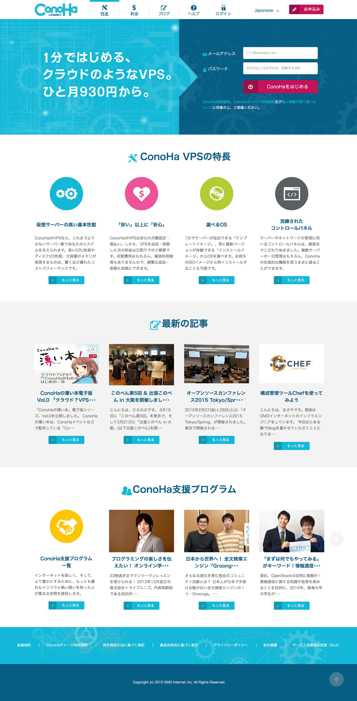

萌萌哒的官网！看不懂日文的同学不要着急，首先我们有谷歌翻译，再不济官网也提供了英文页面，我们可以换成英文的，一下子熟悉多了。

第一步嘛，当然是注册啦。

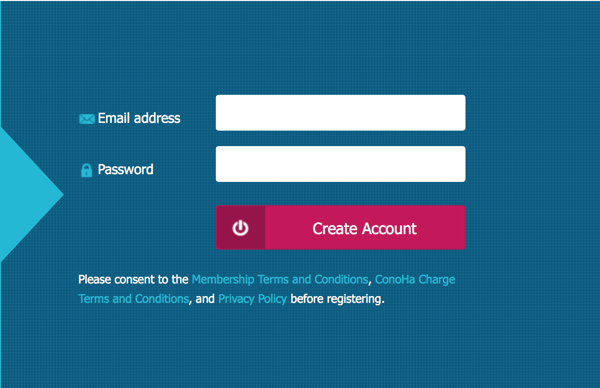

注册成功后会发送一封邮件到你的邮箱，里面会告诉你登录用的ID（不使用邮箱登陆哟）。

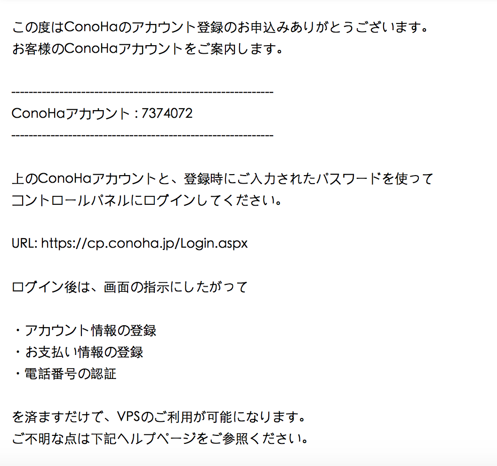

然后登录即可，接下来才是完善各种信息。

第一次登陆时会提示你添加一台VPS，选默认的，免费一个月，创建过程中会一步一步引导你完善各种信息，记住，电话号码请填写自己的，需要打电话验证哟，在日语说完后输入验证码就可以了（完全听不懂说什么啊）。

这是Dashboard界面：

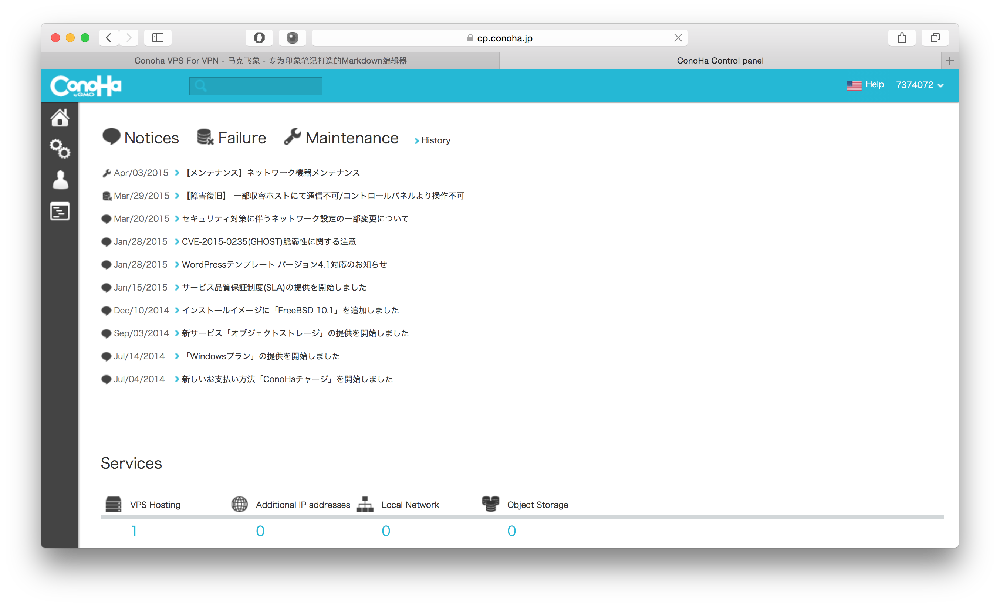

小齿轮是Services，可以看到有关VPS的相关信息：

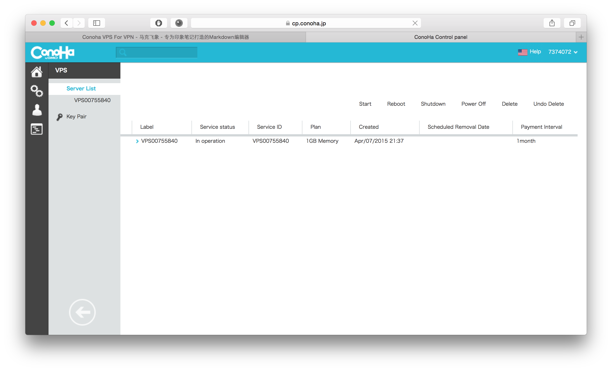

Key Pair里面是ssh登陆要用到的密匙，需要下下来。我门先点击Label栏里的才建好的VPS主机，会看到下图：

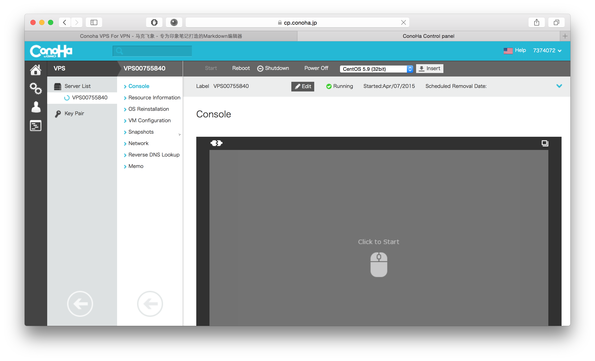

一个强大的web端管理界面，展示了非常详细的信息，你可以看到内存状态，网络状况，CPU，I/O读取，快照，在线终端，重装系统等等。

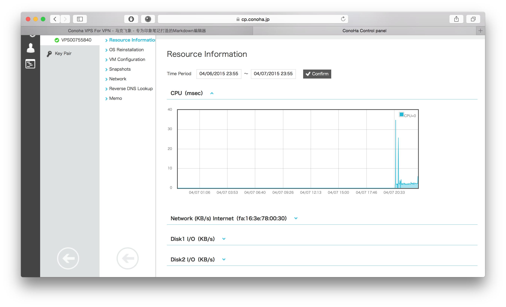

在最下面，则告诉了我们如何连接ssh，以及如何上传iso文件装自定义的系统。

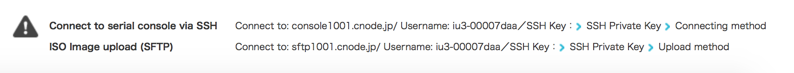

由于一开始是默认关闭使用用户名密码ssh登录的，所以我们只用使用密匙登陆。

最后要说的就是侧边栏第四个是在线log日志，可以看到最近的登陆信息：

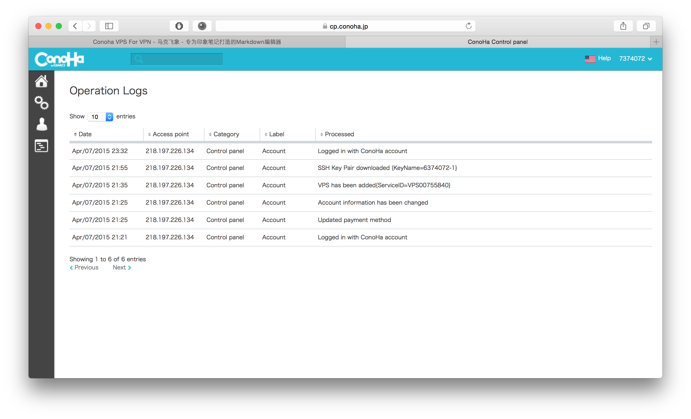

### SSH登陆
因为密匙已经下载好了，我们先用密匙登陆。
```
ssh -i 6374072-1.key iu3-00007daa@console1001.cnode.jp
```
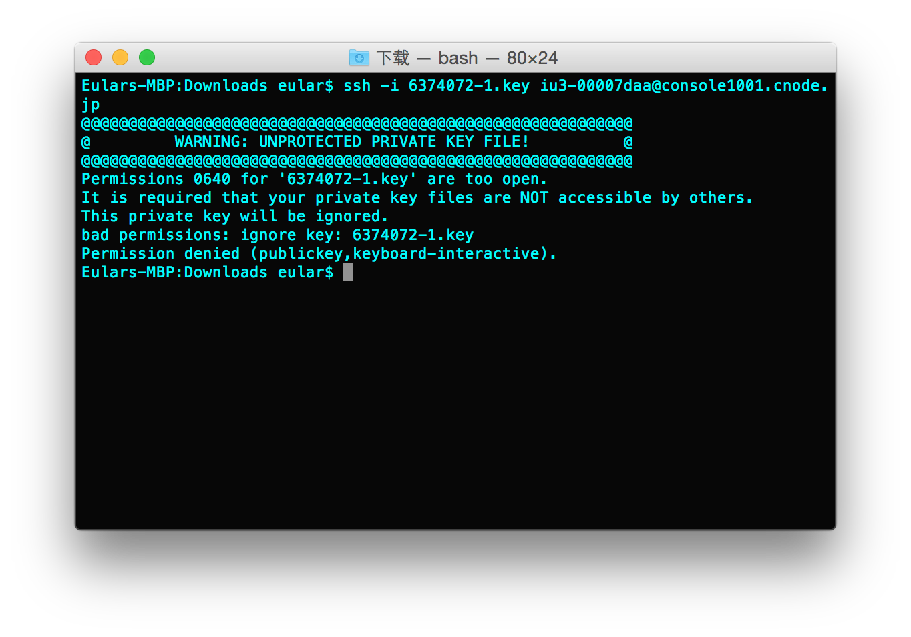

你发现会出一个错误，是因为ssh的安全机制导致的。所以我们先要
```
chmod 600 6374072-1.key
```
然后再登陆就可以了：
```
ssh -i 6374072-1.key iu3-00007daa@console1001.cnode.jp
```
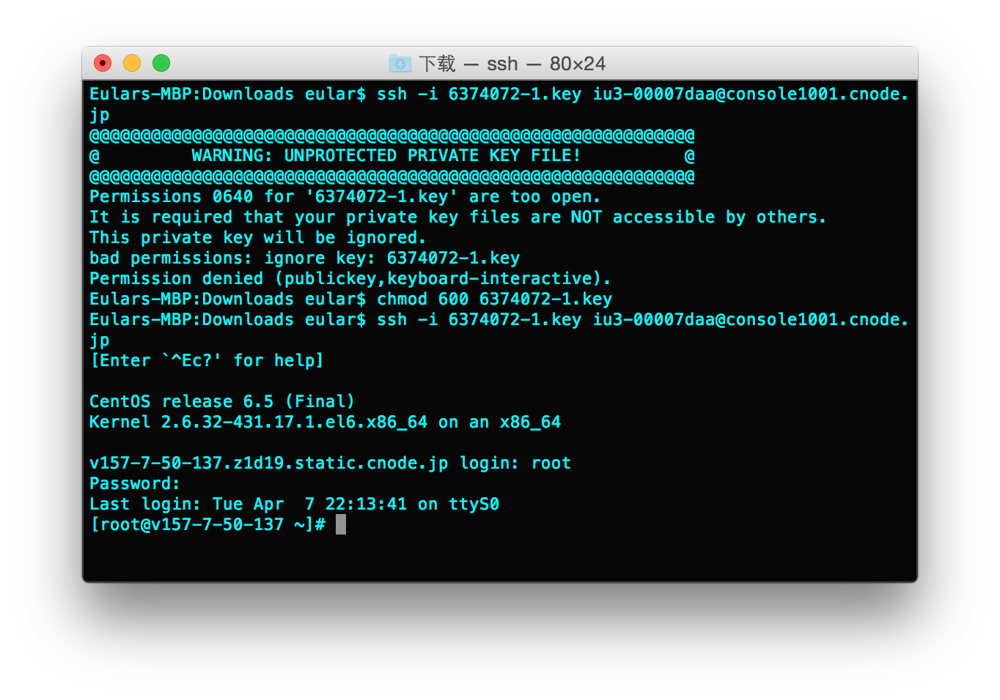

登陆进去之后你就可以随便逛逛了，反正也没什么好玩的。还有更重要的事等着我们去做呢！

要干啥呢，当务之急是改成能用密码登录呀，用密匙多不方便啊，而且其他小伙伴要想登陆还要去生成新的密匙你看多麻烦啊，所以嘛，我们要开启密码登录。

首先，打开ssh登陆配置文件
```
vi /etc/ssh/sshd_config
```

然后，设置为密码登陆方式
```
# 删除前面的#注释
PermitRootLogin yes

# no 改为 yes
PasswordAuthentication yes
```

最后，重启ssh服务或重启服务器
```
service sshd restart
```

让我们记住ip地址

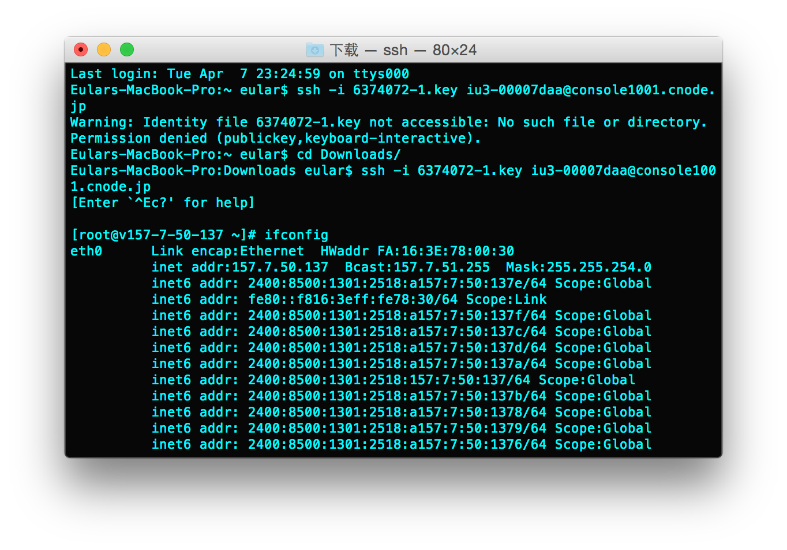

然后登陆上去

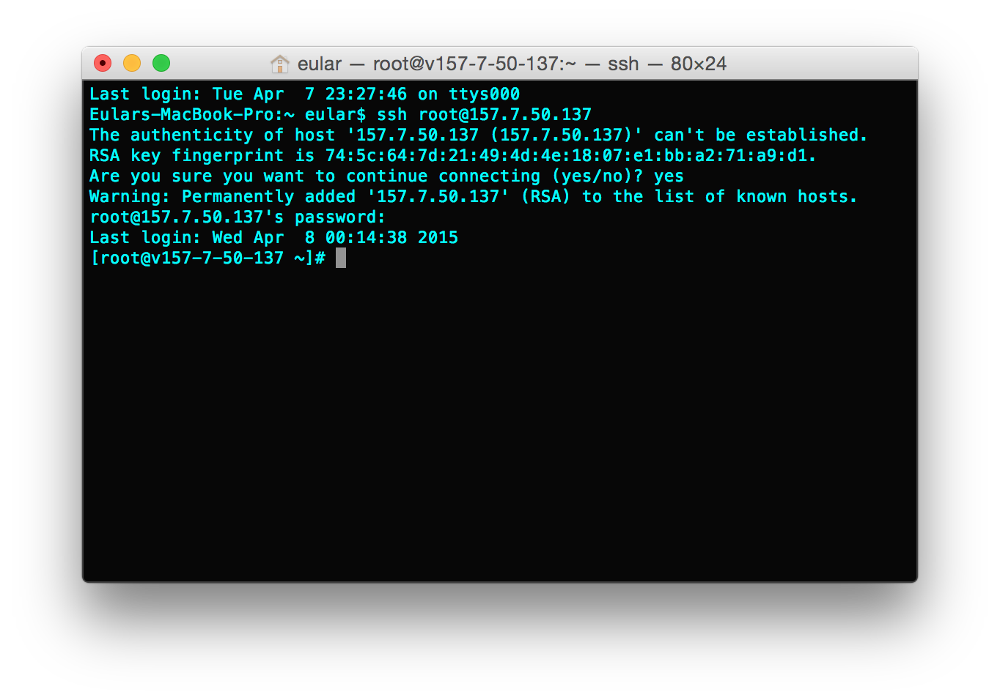

成功了不是吗，嘻嘻！

### VPN隧道协议
到了这一步，接下来要干什么也就不言而喻了，不过首先需要了解一些基础知道。

VPN虚拟专用网络发展至今已经不在是一个单纯的经过加密的访问隧道了，它已经融合了访问控制、传输管理、加密、路由选择、可用性管理等多种功能，并在全球的 信息安全体系中发挥着重要的作用。使用VPN代理时我们常常会碰到PPTP、L2TP、IPSec和SSLVPN等选项，到底这些词汇的意思是什么，它们之间有何区别呢？

首先，VPN的连接的认证和加密通常是基于PPP协议的。

**PPP（Point-to-Point Protocol）协议**
> ppp协议是数据链路层的协议，与以太网（Ethernet）协议处于同一层。IP层的数据可以通过ppp链路传输。
> 
> 一般如果电脑直接通过串口或并口或者其它方式连接在一起时，可以使用ppp协议形成一个数据链路层，供上层数据协议比如IP协议使用。
> 
> 在现在这种直接连接的方式很少见了。但如果两台连接到互联网的计算机，将ppp数据包包裹到IP或其它协议中通过互联网发送时，就可以在两台计算机直接形成一条虚拟的连接，在这条连接上又可以发送其它协议的数据，如果发送的是IP协议，那就形成了一个虚拟的网络。
> 
> 如果这个ppp连接两边是局域网，通过这条连接就将两个物理分隔的局域网连接在了一起，这应该就是虚拟局域网（VPN，Virtual Private Network）名称的由来。
> 
> 由于PPP连接是不能自动完成的，需要在其它方式的控制下完成，这就是PPTP和L2TP协议的作用了。

**PPTP(Point-to-Point Tunneling Protocol)协议**
> 是由包括微软和3Com等公司组成的PPTP论坛开发的一种点对点隧道协，基于拨号使用的PPP协议使用PAP或CHAP之类的加密算法，或者使用 Microsoft的点对点加密算法MPPE。其通过跨越基于 TCP/IP 的数据网络创建 VPN 实现了从远程客户端到专用企业服务器之间数据的安全传输。PPTP 允许加密 IP 通讯，然后在要跨越公司 IP 网络或公共 IP 网络发送的 IP 头中对其进行封装。
> 
> PPTP客户端使用TCP协议向服务器发起连接请求，PPTP服务器默认使用TCP端口1723。连接建立后使用GRE协议发送数据，但PPTP使用的GRE协议对标准的GRE协议有改动。
> 
> 为了保证传输中数据的保密性，需要加密，一般使用MPPE协议加密，而这个加密要求认证方式为MS-CHAP，所以pptp方式一般使用MS-CHAPv2认证和MPPE128加密。
> 
> 但MPPE加密协议已经被发现有漏洞，可以被破解（见文后连接）。所以在需要数据绝对安全的情况下，不推荐使用PPTP方式的VPN。但目前破解对一般普通人还是不易完成，所以如果只是用来突破防火墙的包过滤，那还是可以使用的。

**L2TP（Layer 2 Tunneling Protocol）协议**
> L2TP第 2 层隧道协议 (L2TP) 是IETF基于L2F (Cisco的第二层转发协议)开发的PPTP的后续版本。是一种工业标准 Internet 隧道协议，其可以为跨越面向数据包的媒体发送点到点协议 (PPP) 框架提供封装。PPTP和L2TP都使用PPP协议对数据进行封装，然后添加附加包头用于数据在互联网络上的传输。PPTP只能在两端点间建立单一隧道。 L2TP支持在两端点间使用多隧道，用户可以针对不同的服务质量创建不同的隧道。L2TP可以提供隧道验证，而PPTP则不支持隧道验证。但是当L2TP 或PPTP与IPSEC共同使用时，可以由IPSEC提供隧道验证，不需要在第2层协议上验证隧道使用L2TP。 PPTP要求互联网络为IP网络。L2TP只要求隧道媒介提供面向数据包的点对点的连接，L2TP可以在IP(使用UDP)，桢中继永久虚拟电路 (PVCs),X.25虚拟电路(VCs)或ATM VCs网络上使用。
> 
> L2TP使用UDP发送数据，默认使用端口1701。xl2tpd软件是L2TP的实现，xl2tpd在使用L2TP建立隧道后，通过隧道中的数据再使用PPP协议传输。虽然理论上L2TP隧道可以传输其它协议的数据，但目前xl2tpd只支持PPP协议。L2TP虽然有自己的认证方式，但方式有限，只有CHAP形式，不方便使用。PPP协议认证方式支持较多，比如PAP、CHAP、MS-CHAP、EAP等。所以xl2tpd中，推荐使用PPP协议完成认证。

**IPSEC（Internet Protocol Security）协议**
> IPSec 隧道模式是封装、路由与解封装的整个过程。隧道将原始数据包隐藏(或封装)在新的数据包内部。该新的数据包可能会有新的寻址与路由信息，从而使其能够通过网络传输。隧道与数据保密性结合使用时，在网络上窃听通讯的人将无法获取原始数据包数据(以及原始的源和目标)。封装的数据包到达目的地后，会删除封装，原始数据包头用于将数据包路由到最终目的地。
> 
> ipsec首先通过ISAKMP（internet security association and key  management protocol）协议完成安全通路的建立。ISAKMP使用UDP协议进行，UDP端口号为500。安全通道建立后，加密后的数据通过ESP（Encapsulating Security Payload）协议发送。

**SSLVPN**
> SSL协议提供了数据私密性、端点验证、信息完整性等特性。SSL协议由许多子协议组成，其中两个主要的子协议是握手协议和记录协议。握手协议允许服务器和客户端在应用协议传输第一个数据字节以前，彼此确认，协商一种加密算法和密码钥匙。在数据传输期间，记录协议利用握手协议生成的密钥加密和解密后来交换的数据。
> 
> SSL独立于应用，因此任何一个应用程序都可以享受它的安全性而不必理会执行细节。SSL置身于网络结构体系的传输层和应用层之间。此外，SSL本身就被几乎所有的Web浏览器支持。这意味着客户端不需要为了支持SSL连接安装额外的软件。这两个特征就是SSL能应用于VPN的关键点。

### 搭建VPN
在Linux系统下PPTP形式的VPN通常使用pptpd软件实现，IPSEC/L2TP形式的VPN通常使用openswan或者strongswan软件配合xl2tpd实现。

下面，我们将在CentOS6.5 64bit上手把手带领大家搭建PPTP服务。

1.检查一下该VPS可不可以做VPN
```
# cat /dev/net/tun
File descriptor in bad state
# cat /dev/ppp
No such device or address
```
出现如图所示的，就是可以的。

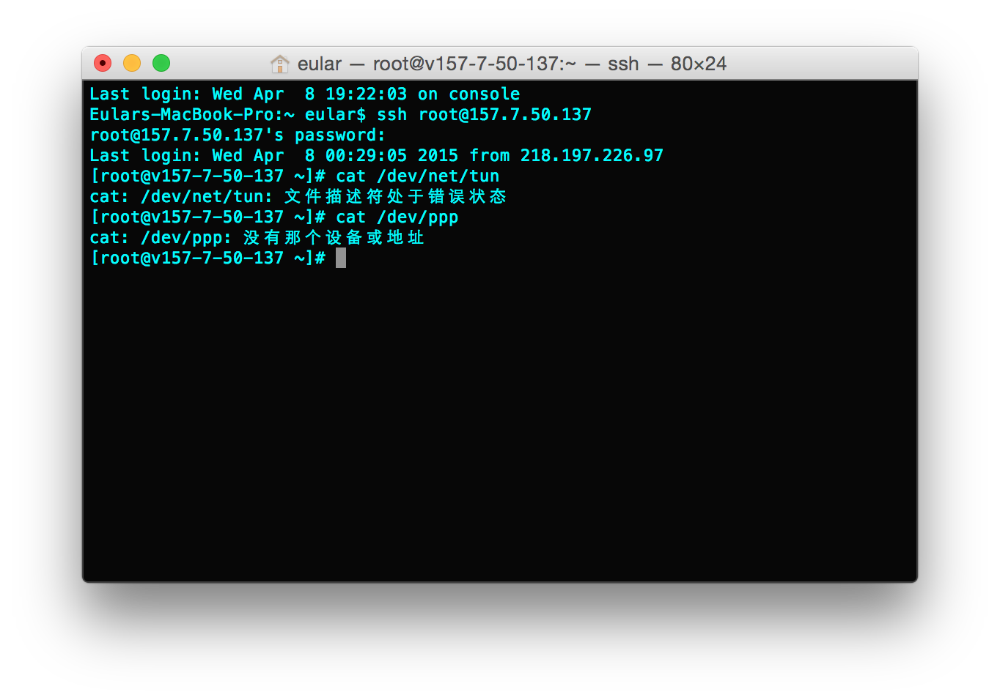

2.获取pptp的安装脚本，并执行安装
```
wget http://www.auvps.com/wp-content/uploads/files/centos6_pptpd.sh
sh screenshot/centos6_pptpd.sh
```
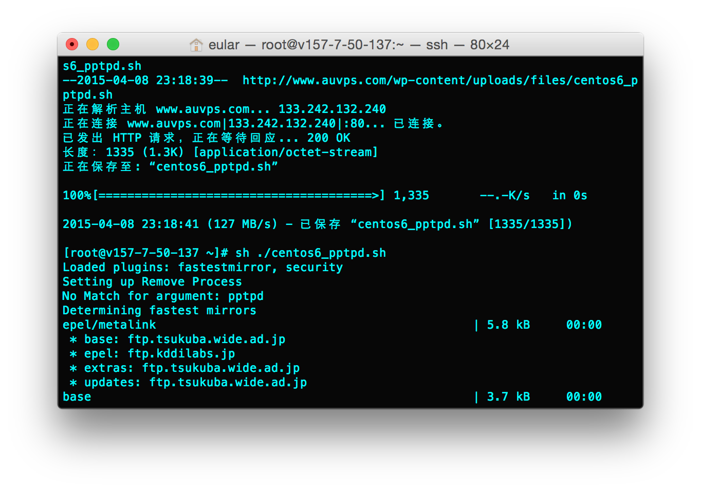

安装速度那是相当的快，不到一分钟就好了。

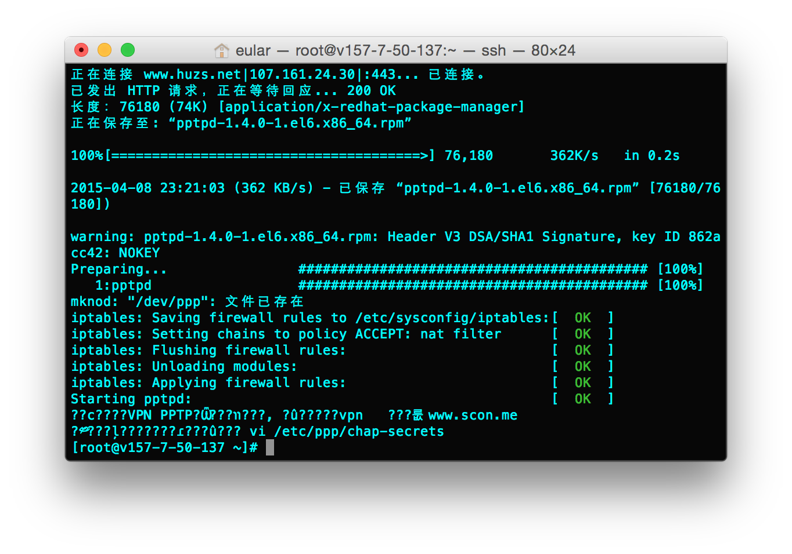

3.查看和修改VPN帐号密码
```
vi /etc/ppp/chap-secrets
```
可以看到，默认给你添加了一个`vpn`的用户，密码为`www.scon.me`。

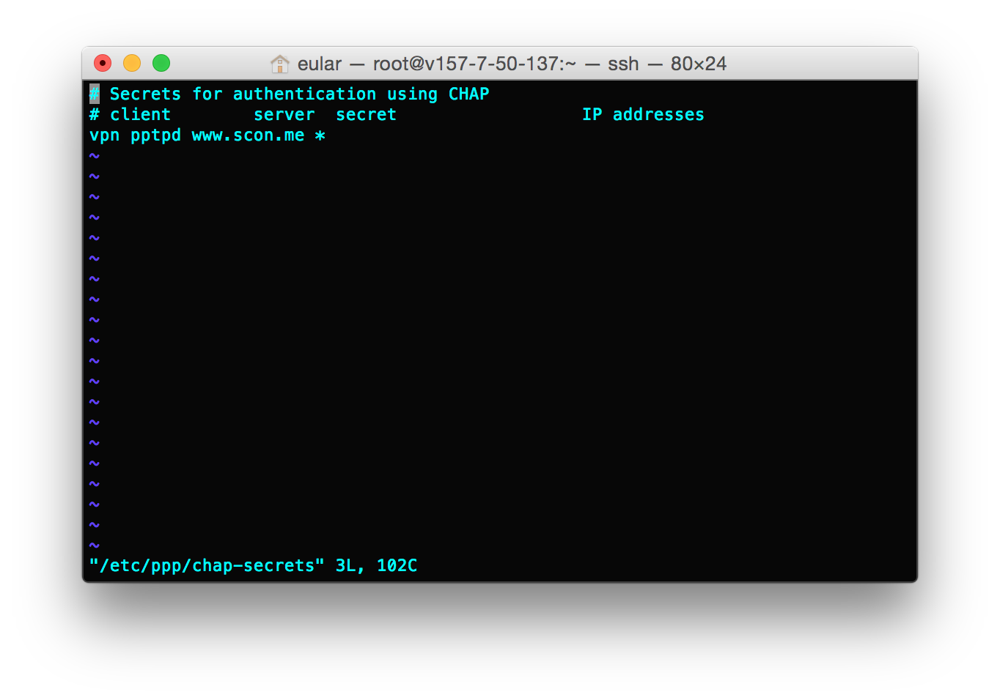

这里你按照自己的意愿改就是了。

4.开启IP转发
```
vi /etc/sysctl.conf
```
修改`net.ipv4.ip_forward = 0`为`1`。
```
sysctl -p
```
使之生效执行。


5.设置pptp
```
vi /etc/pptpd.conf
```
取消注释`locapip`和`remoteip`并编辑，其中`locapip`表示服务器的IP地址，`remoteip`表示客户端连到服务器上将会被分配的IP地址范围。如图所示：

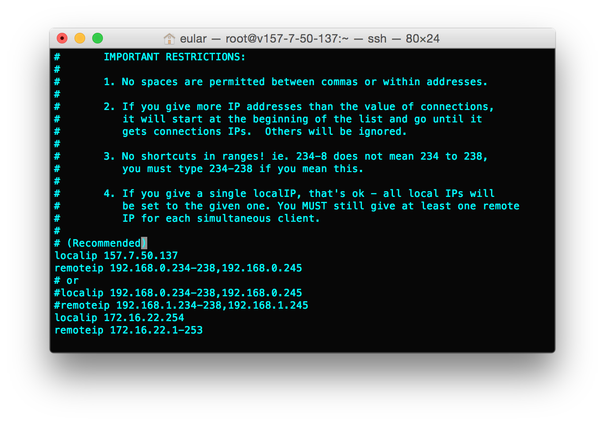

6.最后几步
```bash
# 设置网段
iptables -t nat -A POSTROUTING -s 192.168.0.0/24 -o eth0 -j MASQUERADE
# 设置开放端口
iptables -A INPUT -p tcp -m multiport --dport 1723,47 -j ACCEPT
# 保存配置
/etc/init.d/iptables save
# 重启防火墙
service iptables restart
# 重启PPTP服务
/etc/init.d/pptpd restart
# 注意查水表
```
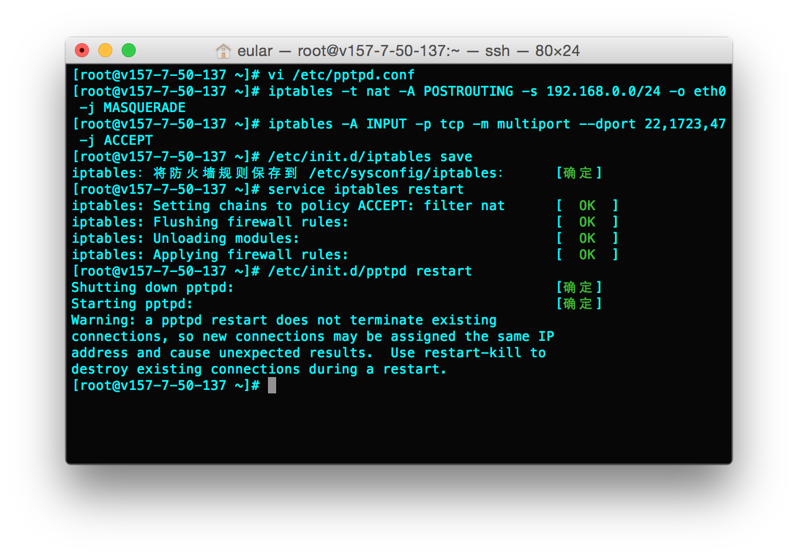

接下来连上去测试一把。

### Connect To VPN
打开设置->网路->点击＋号新建一个VPN连接：

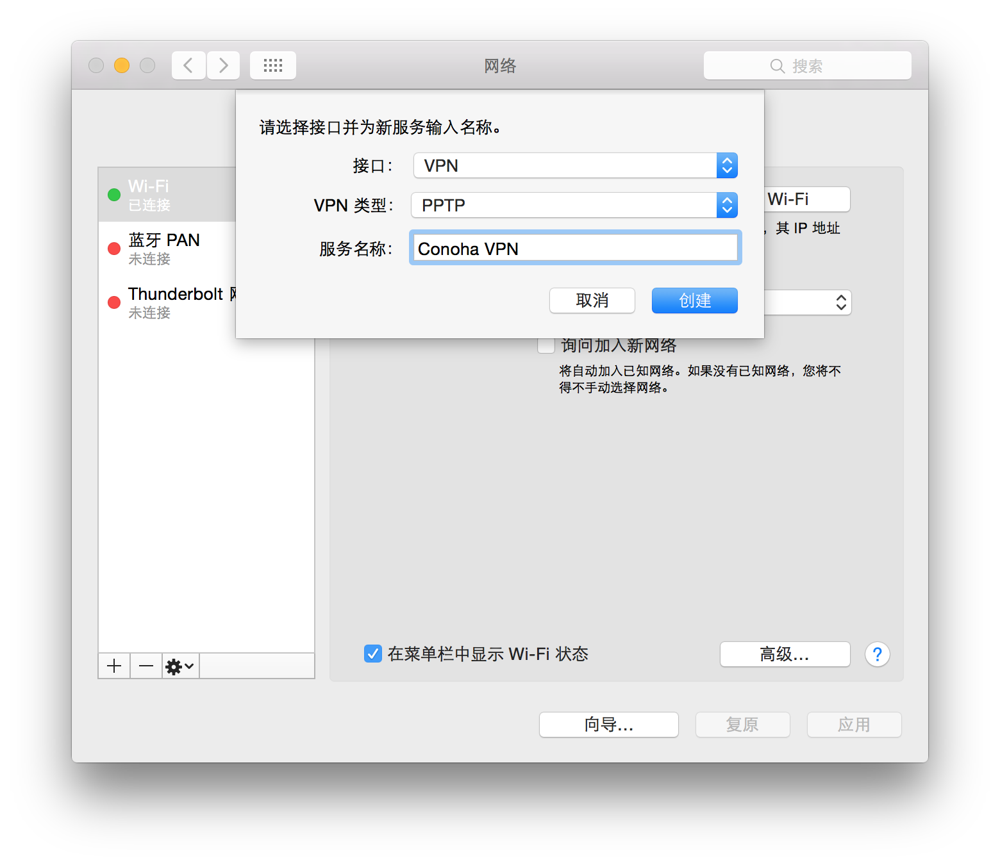

填好服务器地址和账户名称后点击鉴定设置，然后输入VPN密码：

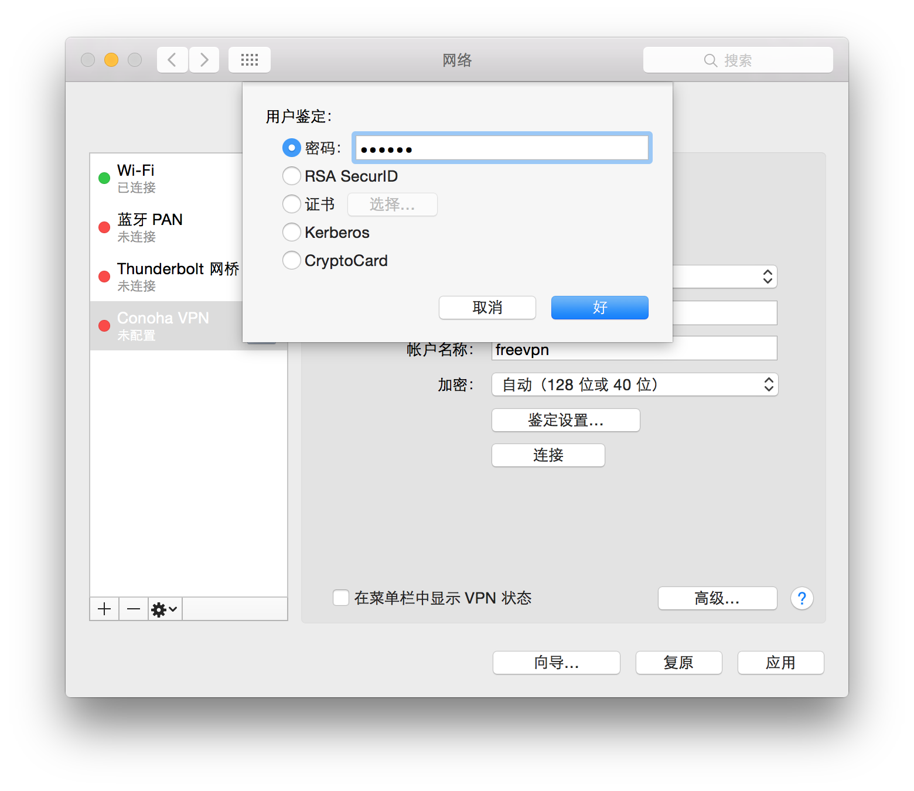

接着点击高级，勾选`通过VPN连接发送所有流量`选项：

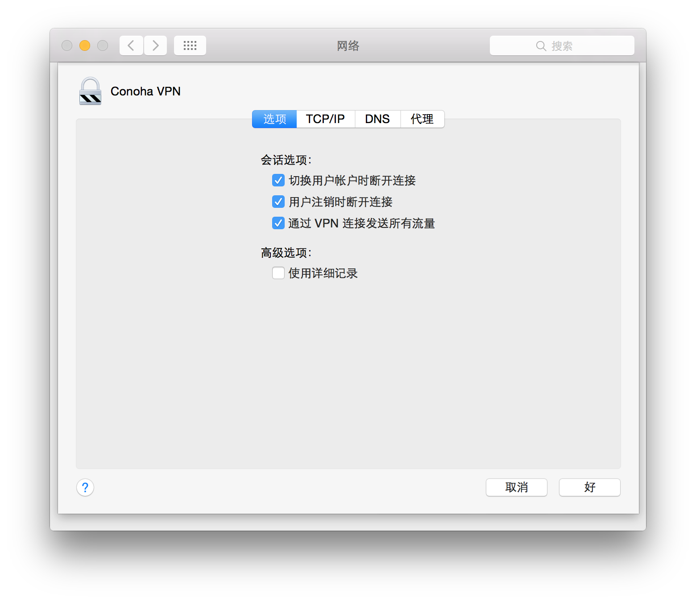

最后就开始连接了！

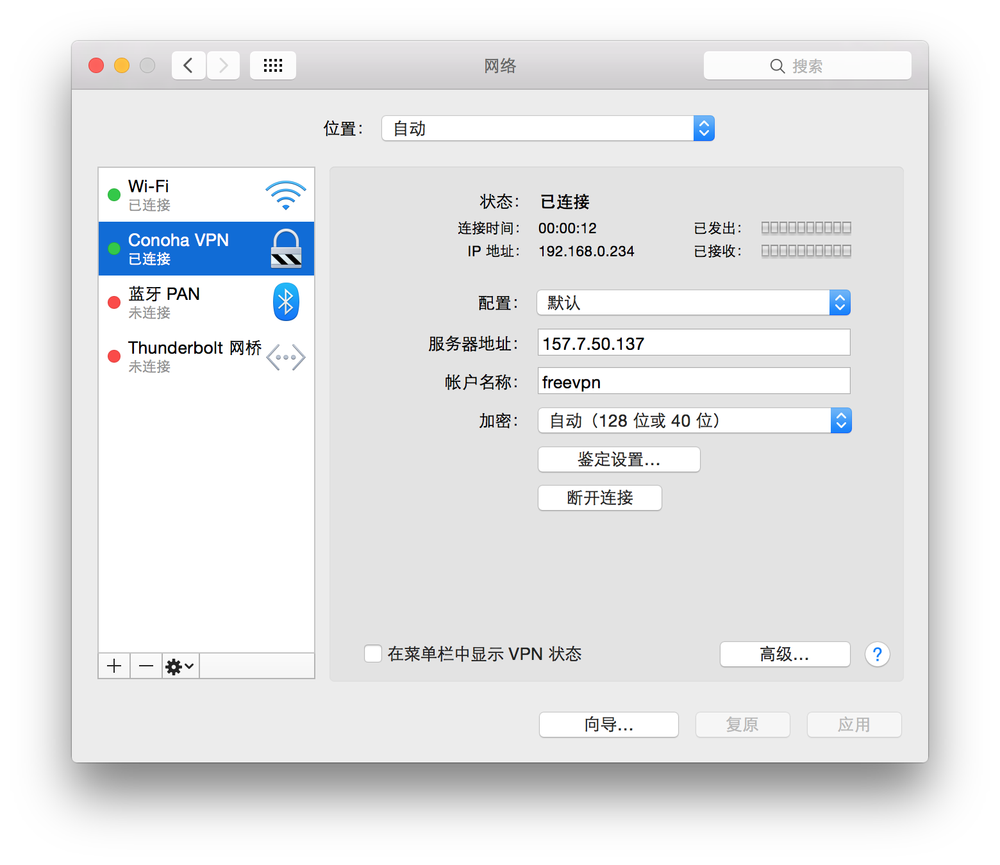

不错，上youtube看视频速度那是杠杠的！

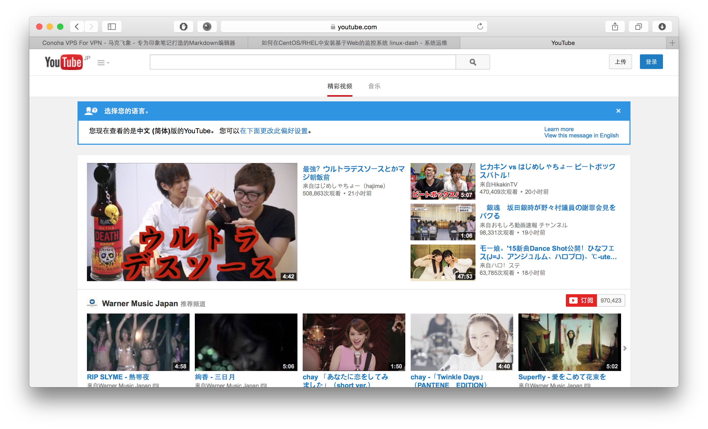

本着分享的精神，在这里我提供免费的账号密码，欢迎大家使用：
```
user: freevpn
passward: 123456
```

### Linux-dash
VPN都有了，接下来你还想干啥？鄙人表示Conoha官网连接速度简直是慢到不能忍，而且上面的dashborad丑到了极致。所以，接下来我们将要安装自己的dashborad——Linux-dash。

Linux-dash是一款为Linux设计的基于web的轻量级监控面板。这个程序会实时显示各种不同的系统属性，比如CPU负载、RAM使用率、磁盘使用率、网速、网络连接、RX/TX带宽、登录用户、运行的进程等等。它不会存储长期的统计。因为它没有后端数据库。

由于机器上自带了Apache，感觉不习惯，而这里所使用的web服务器是Nginx。

1.安装Nginx和php-fpm组件
```
yum install nginx
yum install git php-common php-fpm
```
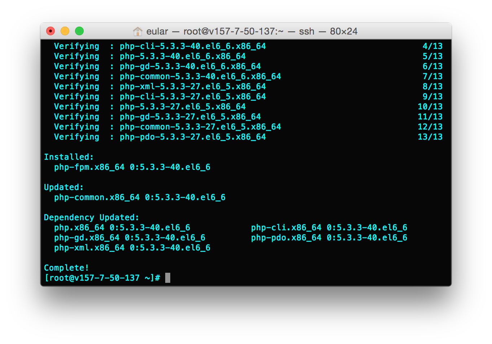

2.在nginx中配置Linux-dash
```
vi /etc/nginx/conf.d/linuxdash.conf
```
在这个空的文件中填入下面内容：
```
server {
	server_name $domain_name;
	listen 8080;
	root /var/www;
	index index.html index.php;
	access_log /var/log/nginx/access.log;
	error_log /var/log/nginx/error.log;
	location ~* \.(?:xml|ogg|mp3|mp4|ogv|svg|svgz|eot|otf|woff|ttf|css|js|jpg|jpeg|gif|png|ico)$ {
		try_files $uri =404;
		expires max;
		access_log off;
		add_header Pragma public;
		add_header Cache-Control "public, must-revalidate, proxy-revalidate";
	}

	location /linux-dash {
		index index.html index.php;
	}

	# PHP-FPM via sockets
	location ~ \.php(/|$) {
		fastcgi_param SCRIPT_FILENAME $document_root$fastcgi_script_name;
		fastcgi_split_path_info ^(.+?\.php)(/.*)$;
		fastcgi_pass unix:/var/run/php-fpm.sock;
		if (!-f $document_root$fastcgi_script_name) {
			return 404;
		}
		try_files $uri $uri/ /index.php?$args;
		include fastcgi_params;
	}
}
```
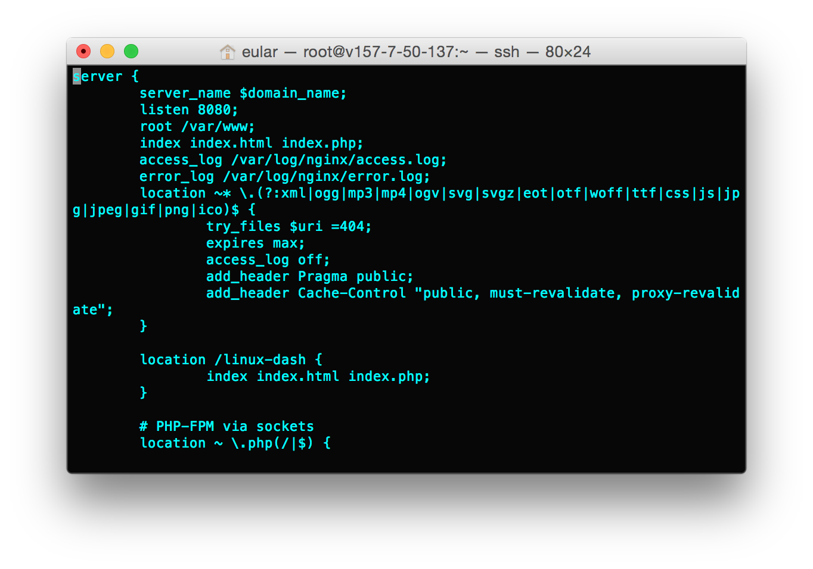

3.配置php-fpm
```
vi /etc/php-fpm.d/www.conf
```
找到`listen`，`user`和`group`字段，并修改为下：
```
...
listen = /var/run/php-fpm.sock
...
user = nginx
group = nginx
...
```
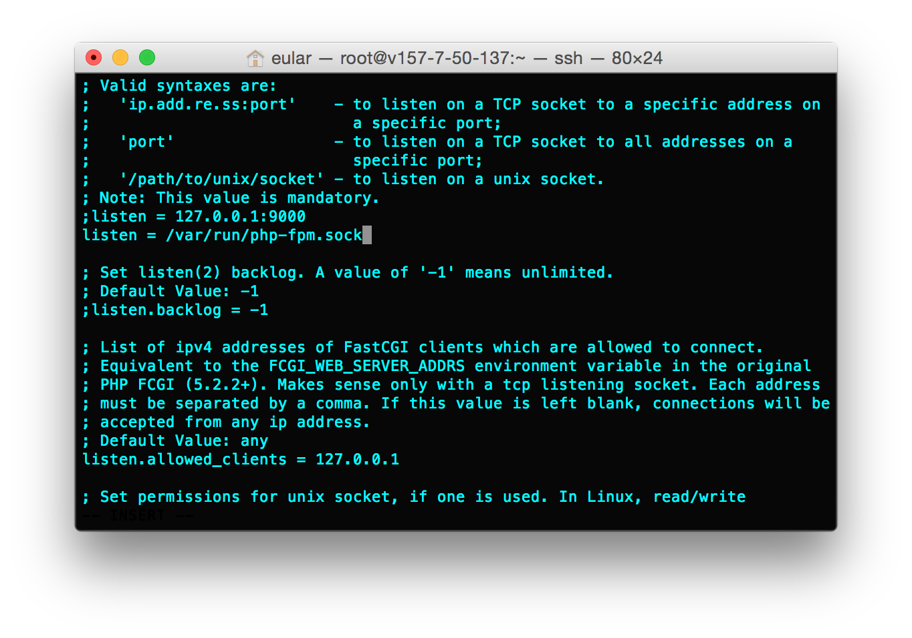

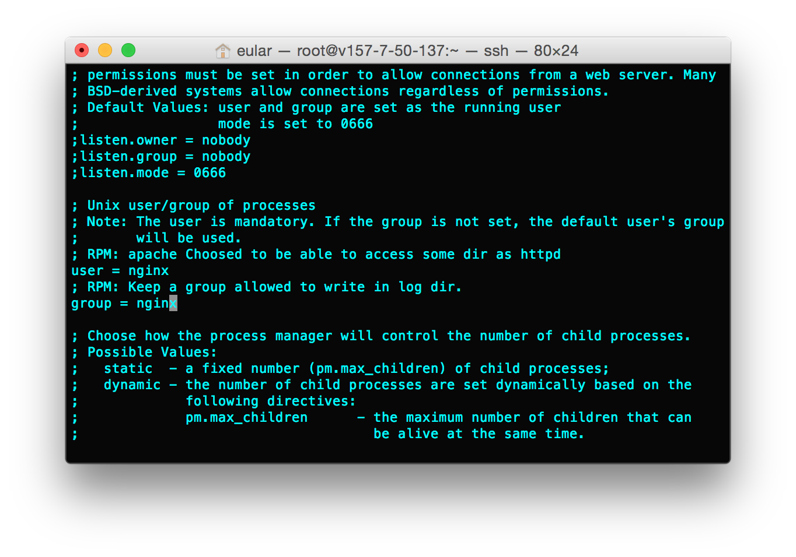

4.下载并安装linux-dash
```
git clone https://github.com/afaqurk/linux-dash.git
cp -r linux-dash/ /var/www/
chown -R nginx:nginx /var/www
```

5.开启允许对外访问的`80`和`8080`端口
```
/sbin/iptables -I INPUT -p tcp --dport 80 -j ACCEPT
/sbin/iptables -I INPUT -p tcp --dport 8080 -j ACCEPT
/etc/rc.d/init.d/iptables save
/etc/rc.d/init.d/iptables restart
```
查看端口是否已经开放，确认一下
```
/etc/init.d/iptables status
```

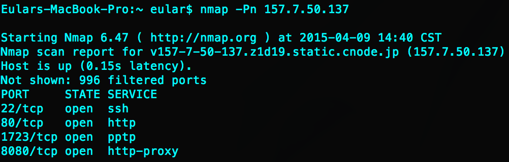

（请无视我用nmap在外网扫下）

6.重启nginx和php-fpm并设为开机自动启动
```
service nginx restart
service php-fpm restart
chkconfig nginx on
chkconfig php-fpm on
```

至此已经大功告成，在浏览器里输入`http://<IP地址>:8080/linux-dash/`来访问Linux-dash。

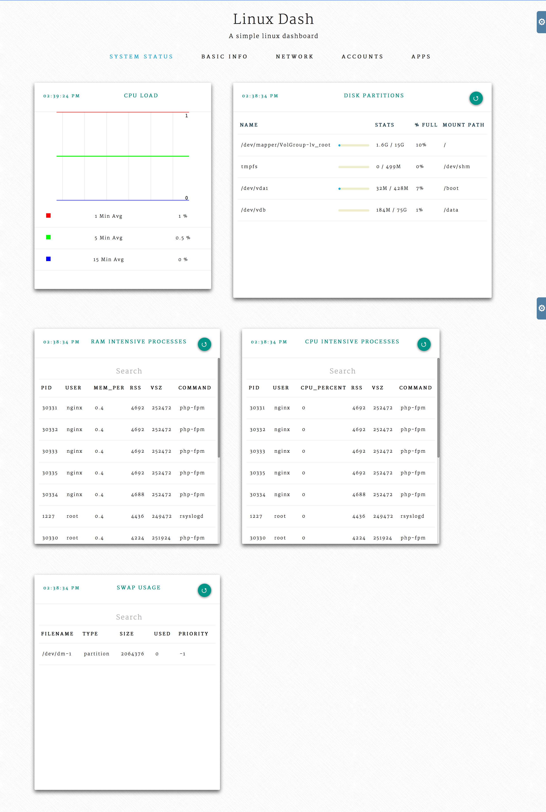

界面一目了然，简洁清新，十分耐看。

### Last
Conoha的VPS只是免费一个月，一个月后你可以考虑考虑下图的价格，土豪请任性。


总之，兄弟我只能帮到这里了，接下来就是广告时间了。

＝＝＝＝＝＝＝＝＝＝＝＝＝＝＝＝＝＝＝＝＝＝＝＝＝＝＝＝＝＝＝＝＝＝

欢迎关注我的微信公众号


微信资助


支付宝打赏


好人一生平安

### Reference
[0]. [虚拟专用服务器 - 维基百科，自由的百科全书](http://zh.wikipedia.org/wiki/VPS)<br>
[1]. [亚马逊AWS中国版,Dell云,微软Windows Azure,阿里云ECS免费VPS主机试用](http://www.freehao123.com/aws-dell-azure/)<br>
[2]. [CentOS SSH密钥登陆改为密码登陆 (Conoha)](http://www.ay22.com/2015/01/27/centos-ssh%E5%AF%86%E9%92%A5%E7%99%BB%E9%99%86%E6%94%B9%E4%B8%BA%E5%AF%86%E7%A0%81%E7%99%BB%E9%99%86-conoha/)<br>
[3]. [conoha vps搭建pptp vpn](http://romengs.com/archives/119)<br>
[4]. [利用Conoha.jp的VPS主机安装PPTP](http://mp.weixin.qq.com/s?__biz=MzA5MzYwMjgyMQ==&mid=204530812&idx=2&sn=2b0418551282e33fa034466ca511a0f2&3rd=MzA3MDU4NTYzMw==&scene=6#rd)<br>
[5]. [PPTP和IPSEC/L2TP的VPN笔记](http://my.oschina.net/u/1382972/blog/326813)<br>
[6]. [VPN隧道协议PPTP、L2TP、IPSec和SSLVPN介绍及区别](http://www.wphostz.net/members/knowledgebase.php?action=displayarticle&id=126)<br>
[7]. [如何在CentOS/RHEL中安装基于Web的监控系统 linux-dash](http://linux.cn/article-5199-1.html)