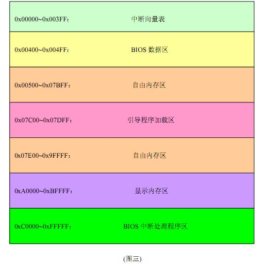
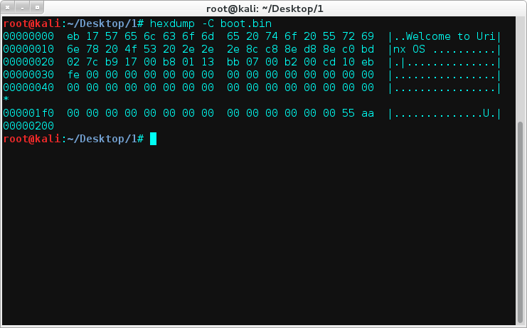
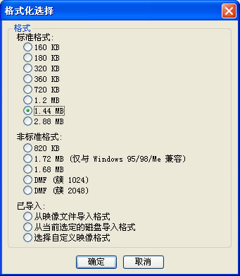
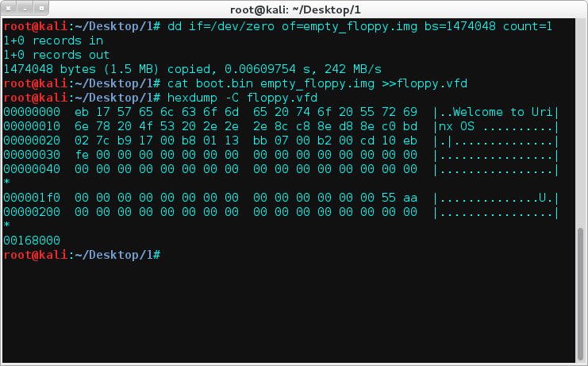
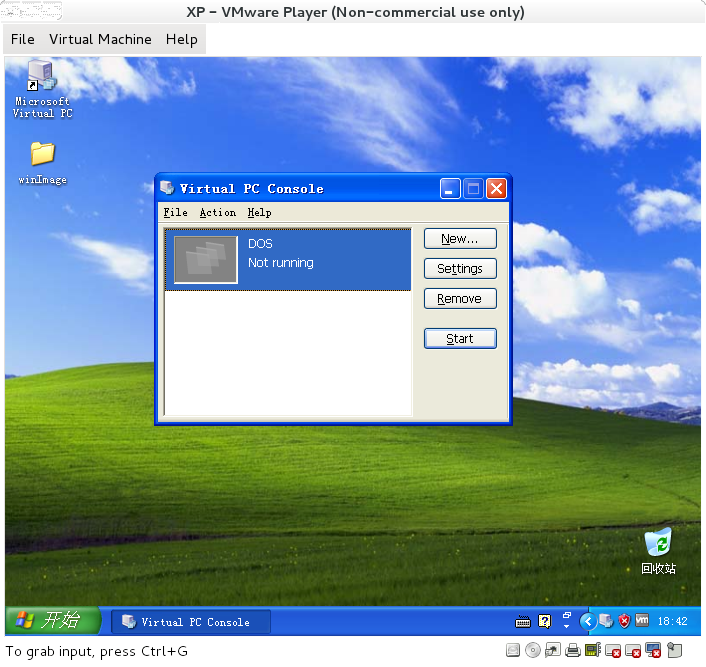
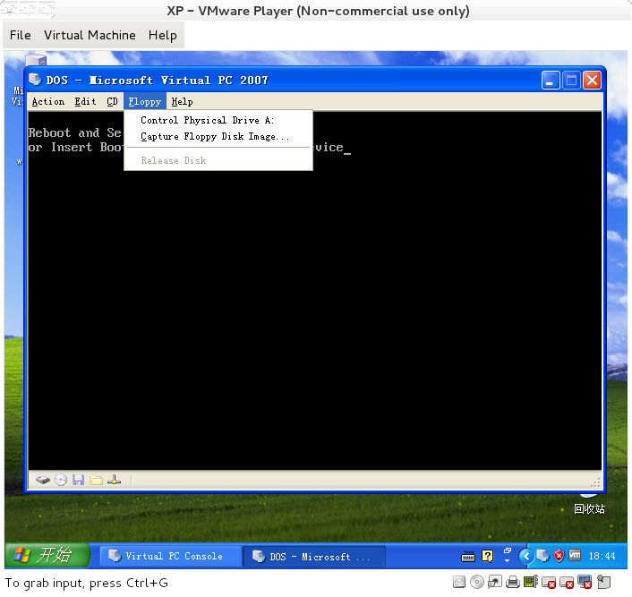
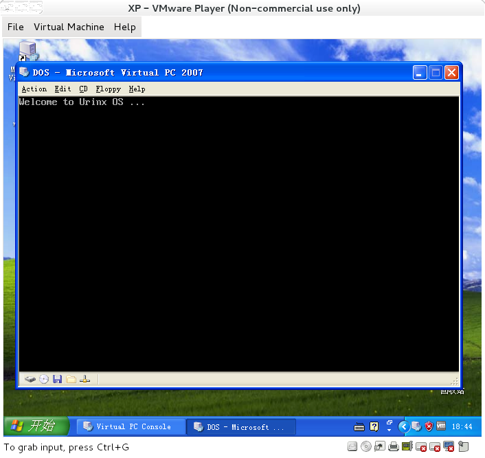

软盘引导程序初探
==================

### 前言
通过本文，你将了解计算机的启动过程及本质。通过写一个最简单的软盘引导程序（仅仅是在屏幕上打印一行字符串）来加深对操作系统引导过程的印象和理解。本文中的汇编采用的是Interl系的nasm语法。

### 引导程序
何为引导程序？<br>
引导程序(Boot Loader)位于电脑或其他计算机应用上，是指引导操作系统启动的程序。引导程序启动方式及程序视应用机型种类而不同。例如在普通的个人电脑上，引导程序通常分为两部分：第一阶段引导程序位于主引导记录（MBR），用以引导位于某个分区上的第二阶段引导程序，如NTLDR、BOOTMGR和GNU GRUB等。<br>
我们今天关注的是软盘引导程序。

### 操作系统引导过程
这里粗略的说一说操作系统的引导过程。（想要详细深入了解推荐看《Linux内核设计的艺术》）<br>
所谓操作系统的引导过程是将存放在硬盘上的静态的操作系统装载到内存中，并开始执行操作系统的过程。操作系统的整个引导过程应该从计算机上电开始，分为以下几个大步骤：
- 上电
- 自检
- 加载引导扇区
- 加载操作系统
- 运行操作系统

**上电**
上电是指按下计算机的电源按钮让计算机开始加电运行。这个过程与计算机的硬件电路关系非常密切，因为计算机加电的第一个状态是由硬件电路决定的，加电后第一个状态主要由计算机处理器(CPU)生产商决定，对于x86系列的CPU，一加电就将指令寄存器设置为：0ffff:0000，表示CPU开始从0ffff:0000这个内存中取出一条指令执行，通常在0ffff:0000处是一条地址转跳指令，转向BIOS的入口。由于BIOS是固化在内存中的，所以，一加电后，CPU可以直接读取BIOS中的指令。

**自检**
进入BIOS后，BIOS的主要功能包括以下两项：第一项功能是进行计算机自检，第二项功能是加载引导扇区。BIOS进行自检的工作主要是检查计算机是否出现异常，是否可以继续运行下去，这一部分与引导过程本身关系不大，它只是引导过程中的一个步骤，BIOS中与引导关系密切的是上面提到的BIOS的第二项功能，即加载引导扇区，这一项工作的主要内容是把磁盘的引导扇区的内容加载到内存中来，并且转跳到引导程序的第一条指令。
  
**加载引导扇区**
硬盘与软盘都有引导扇区，引导扇区就是软盘或硬盘的第一个逻辑扇区，即软盘或硬盘的第0个磁头第0个磁道第1个扇区。软盘的结构比硬盘简单，在软盘上，一般只有一个分区，也就是可以装载一个操作系统，所以在软盘的第一个逻辑扇区就可以把操作系统加载到内存中，而硬盘则不同，由于硬盘的总容量比较大，所以硬盘被分为几个分区，理论上讲每个分区都可以安装一个操作系统，所以在每个分区上都有一个用于加载本分区的引导扇区，因此硬盘的引导扇区比软盘复杂，它不是立即加载操作系统而是加载分区上的引导扇区，然后由分区上的引导扇区加载本分区上的操作系统。在本文以软盘的引导扇区为例来介绍。
 
软盘的引导扇区是软盘的第一个逻辑扇区，当BIOS的自检过程结束以后，根据BIOS的规范，它下一步要做的工作就是把指定的引导设备（软盘、硬盘、光盘等）上的第一个扇区的内容加载到内存中，并且转跳到加载后的引导扇区的第一条指令。因此我们在开发操作系统引导程序的时候，只要将引导程序直接写如第一个逻辑扇区就可以了，BIOS会自动把它加载到内存中。
  
**加载操作系统**
对于软盘来讲，引导扇区中的引导程序就是用于加载操作系统。所谓加载操作系统，也就是把操作系统从磁盘拷贝到内存。因此引导程序首先必须知道操作系统在磁盘的位置，由于此时还没有文件系统，这时引导程序必须通过绝对位置来访问，也就是操作系统在磁盘的开始扇区和结束扇区。操作系统在磁盘的位置与操作系统的安装程序有关，操作系统的安装程序把操作系统从安装盘拷贝到计算机的磁盘上，引导程序把操作系统从磁盘拷贝到内存。
 
**运行操作系统**
引导程序把操作系统拷贝到内存后所要做的第一件事就是转跳到操作系统的第一条指令，这样，操作系统就开始运行了。

### 编写自己的软盘引导程序
当BIOS自检结束，接下来就是将引导设备上的第一个扇区的内容加载到内存中，并开始执行加载后的第一条指令。



从图中可以看到，引导程序被加载到`0x07c00`处。<br>
下面给出汇编代码并标出详细注释：
```asm
;Boot Loader  - Beta 0.0
;Func:
;    Print a string into the center of screen.

;设置程序开始地址->0x7c00（原始地址为0x0000）
;因为BIOS在搜索引导扇区的时候，会把有效的启动扇区(512B)加载到07c00h处
org 07c00h
    jmp start
    msg db 'Welcome to Urinx OS ...'
    len equ $-msg
start:
    mov ax,cs
    mov ds,ax
    mov es,ax
    
    mov bp,msg      ;要输出的字符串
    mov cx,len      ;字符串长度
    mov ax,0x1301   ;显示的串结构
    mov bx,0x7      ;字符属性,这里设置的是黑底白字
    mov dl,0        ;dx->行号 列号
    int 10h         ;调用10h中断打印字符串

    jmp $           ;无限循环当前指令，目的跟getch()一样
    times 510-($-$$) db 0   ;重复填充数值0
    dw 0xaa55       ;结束标志最后两个字节，为55AA
```
多说几句：<br>
`jmp $`，它的作用是跳转到自己的行中，`$`表示汇编后的当前行地址，也就是死循环。因为这里只是一个简单的引导程序，所以到这里就可以结束了，即BIOS引导系统后显示字符串系统就死掉了。
 
`times 510-($-$$) db 0`的作用是将代码结束后一直到510的空间中填充为0，`times`是表示重复的关键字(NASM伪代码)，`\$$`表示汇编后的此节的首地址。

`0xaa55`是引导结束标志，低高字节方式存储，BIOS将根据此标志来验证引导扇区的有效性。

然后将上述代码汇编为二进制代码：<br>
`nasm -o boot.bin boot.asm`<br>
我们得到boot.bin二进制代码文件，如下图：



接下来的任务就是制作软盘镜像了。

### 制作软盘镜像
现在我们需要将boot.bin这个文件拷贝到软盘的0磁头0柱面1扇区中去，然后就可以用它来引导系统。

如何制作软盘镜像，这里给出两种方法：

**1.Windows下**
首先用WinImage生成空白的软盘镜像文件。



保存的时候注意选择虚拟镜像文件（.vfd）。<br>
然后就是将boot.bin写进去，这里用C写的工具。
```c
/*
File:write_image.c
*/
#include <stdio.h>
#include <fcntl.h>
#include <sys/types.h>
#include <sys/stat.h>
#define SIZE 512

int main(int argc,char *argv[]){
    int f_in;
    int f_out;
    int count;
    char buffer[SIZE];

    f_in=open("boot.bin",O_RDONLY);
    if(f_in<0){
        perror("open boot.bin error:");
        return 0;
    }
    f_out=open("floppy.vfd",O_WRONLY);
    if(f_out<0){
        perror("open floppy.vfd error:");
        return 0;
    }

    while( (count=read(f_in,buffer,SIZE))>0 ){
        write(f_out,buffer,count);
        memset(buffer,0,512);
    }
    
    printf("Write image ok!\n");
    return 1;
}

```
文件名写死了，自己修改啊。<br>
当然你也可以用那啥软件直接复制修改软盘的16进制数据。

**2.Linux下**
这个就比较简单了。<br>
如果想要创建一个空白的镜像可以使用这条命令：<br>
`dd if=/dev/zero of=floppy.img bs=1474560 count=1`<br>
注：3.5寸1.44M软盘存储容量= 512字节/扇区X  2880扇区 =  1440 KB =1474560B

我们知道，boot.bin的大小是512B。于是乎，我们可以这样：
```
dd if=/dev/zero of=empty_floppy.img bs=1474048 count=1
cat boot.bin empty_floppy.img >>floppy.vfd
```


### 引导软盘
现在我们来测试编写的引导程序。呃，到了这一步你终于意识到你的电脑上没有软驱。。<br>
果断的开虚拟机啊，不过这回我们既不用VMWare也不用VirtrulBox，而是用微软官方的Vitual PC 2007，为啥，简单粗暴行之有效。<br>
在这里不得不吐槽几句：不管是64位的还是32位的Vitual PC 2007貌似不兼容Win7及以上的系统（Win8.1和Win10亲测不行），大哥我在虚拟机里装xp再在xp里装虚拟机，逗比。。



在`Capture Floppy Disk Image...`中选择自己的软盘镜像。



重启后就可以看到关键字`Urinx`了，啊哈哈。



### 话在最后
本文已完，但全剧未终。更多精彩，敬请待续。

### Reference
[0]. [引导程序 - 维基百科，自由的百科全书](http://zh.wikipedia.org/wiki/%E5%95%9F%E5%8B%95%E7%A8%8B%E5%BC%8F)<br>
[1]. [操作系统引导程序](http://blog.chinaunix.net/uid-7178083-id-2678272.html)<br>
[2]. [操作系统引导的那点事](http://blog.csdn.net/hellochina15/article/details/7015905)<br>
[3]. [FAT12格式的引导程序](http://blog.sina.com.cn/s/blog_3edcf6b80100crl4.html)<br>