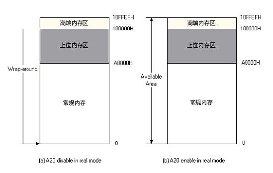
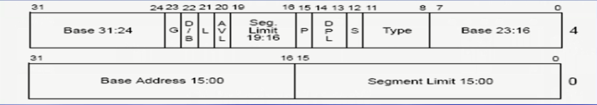
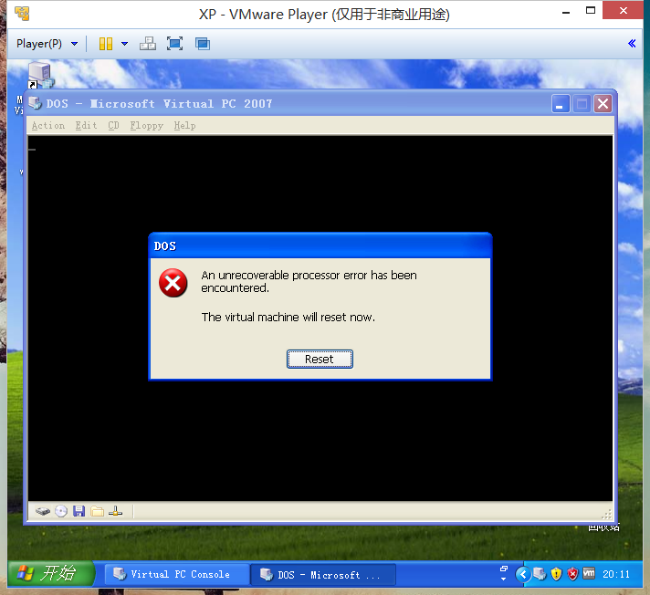
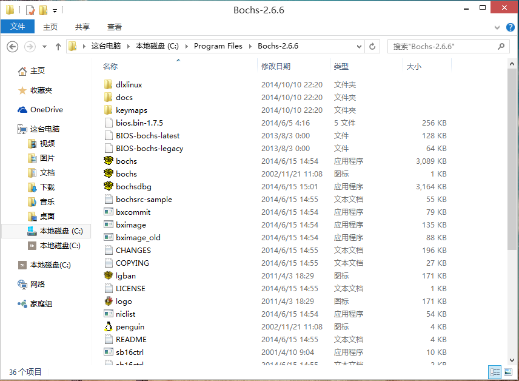
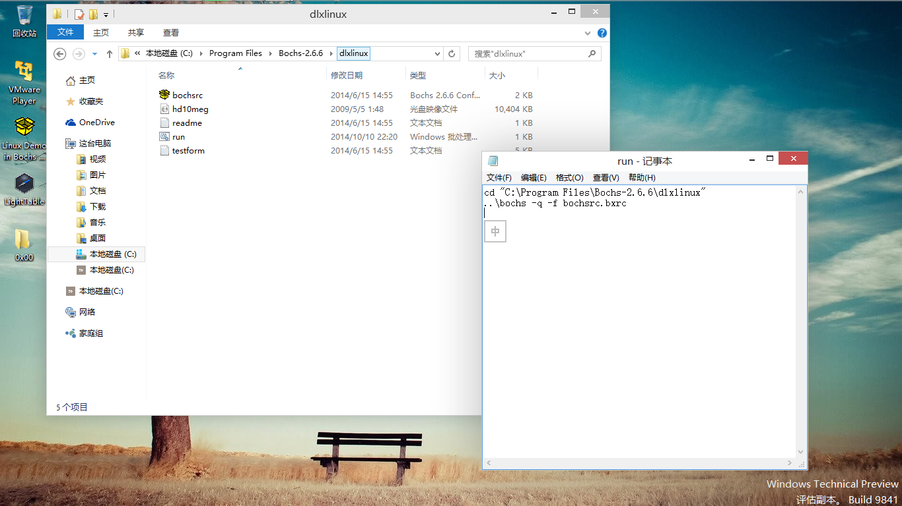
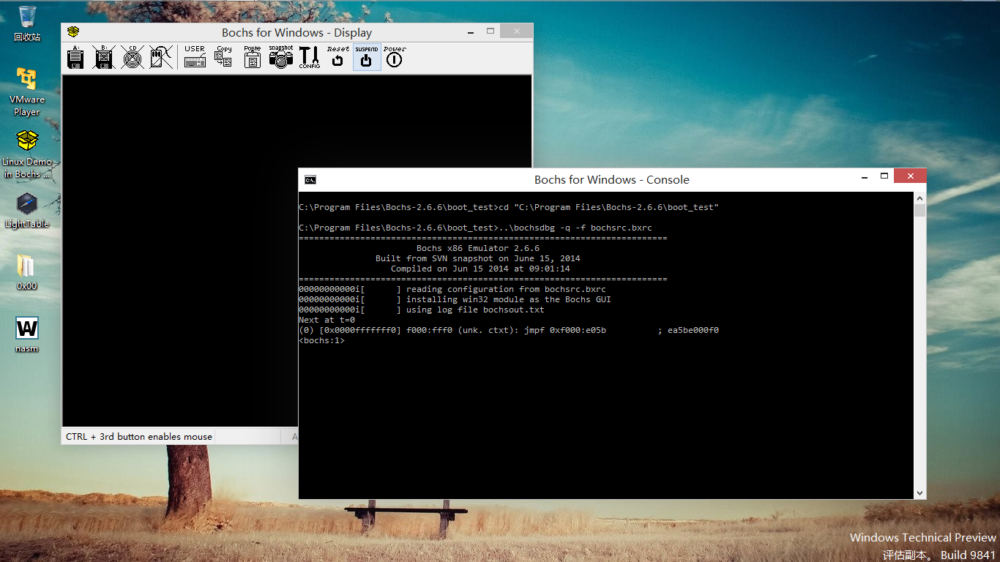
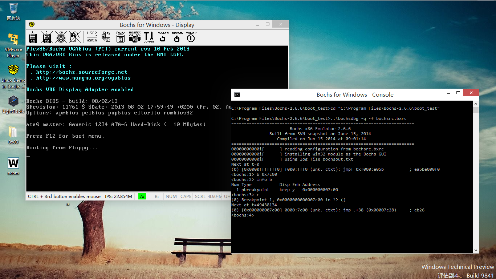
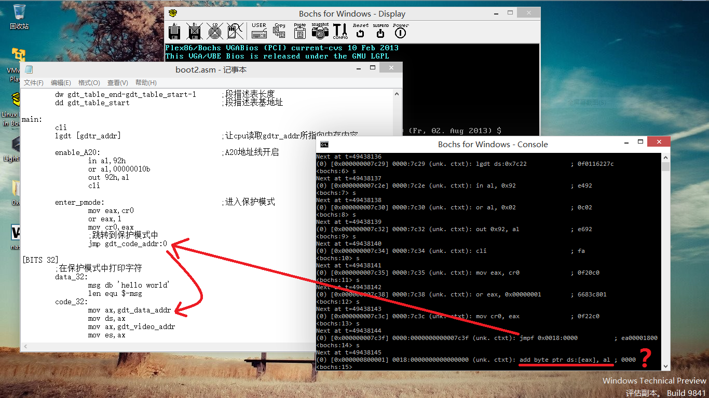
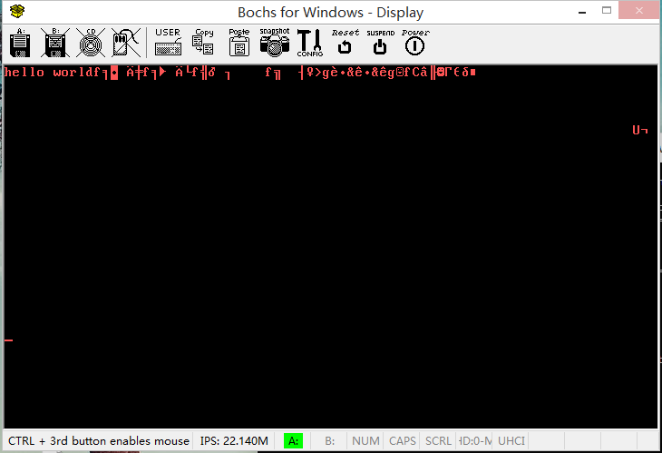

进入你的保护模式
================

@(asm)[引导程序|汇编|保护模式|Markdown]

### Preface
本文文段未经优化，杂乱无章。看完本文，会减少你本来就不多的头发的残留量，浪费你宝贵的时间和珍贵的脑细胞，对此作者表示不负任何责任。<br>
如果你也怀有一颗不作死不罢休的心，拯救全人类的情怀，欢迎投稿，吐槽也发表。我们的口号是“推翻人类暴政，世界属于三体”。

### 保护模式
**保护模式**（Protected Mode，或有时简写为pmode）是一种80286系列和之后的x86兼容CPU的运行模式。保护模式有一些新的特性，设计用来增强多任务和系统稳定度，像是存储器保护，分页系统，以及硬件支持的虚拟内存。大部分的现今x86操作系统都在保护模式下运行，包含Linux、FreeBSD、以及微软Windows 2.0和之后版本。

另外一种286和其之后CPU的运行模式是**实模式**，一种向前兼容且关闭了保护模式这些特性的CPU运行模式。用来让新的芯片可以运行旧的软件。依照设计的规格，所有的x86 CPU都是在实模式下开机，来确保传统操作系统的向前兼容性。在任何保护模式的特性可用前，他们必须要由某些程序手动地切换到保护模式。在现今的计算机，这种切换通常是由操作系统在开机时候必须完成的第一件任务的一个。它也可能当CPU在保护模式下运行时，使用虚拟86模式来运行设计运行在实模式下的代码。

保护模式出现的原因是：保护进程地址空间。这样，就产生了一个结果：两种模式下程序的寻址方式发生了变化。

从80386开始，cpu有三种工作方式：实模式，保护模式和虚拟8086模式。只有在刚刚启动的时候是real-mode，等到linux操作系统运行起来以后就运行在保护模式。虚拟8086模式是运行在保护模式中的实模式，为了在32位保护模式下执行纯16位程序。它不是一个真正的CPU模式，还属于保护模式。CPU启动环境为16位实模式，之后可以切换到保护模式。但从保护模式无法切换回实模式。

### 寻址方式
**实模式寻址**<br>
8086是16位的cpu，只能访问地址在1M以下的内存称为常规内存，我们把地址在1M以上的内存称为扩展内存。实模式下有着16位的寄存器/16位数据总线/20位地址总线。一个地址有段和偏移两部分组成，物理地址的计算公式为：<br>
`physicaladdress=segment * 16 + offset`<br>
其中，segment和offset都是16位的。<br>
通过上述分段技术模式，能够表示的最大内存为：<br>
`FFFFh:FFFFh=FFFF0h+FFFFh=10FFEFh=1M+64K-16Bytes`<br>
（1M多余出来的部分被称做高端内存区HMA）。

但8086/8088只有20位地址线，只能够访问1M地址范围的数据，所以如果访问`100000h~10FFEFh`之间的内存（大于1M空间），则必须有第21根地址线来参与寻址（8086/8088没有）。因此，当程序给出超过1M的地址时，因为逻辑上正常，系统并不认为其访问越界而产生异常，而是自动从0开始计算，也就是说系统计算实际地址的时候是按照对1M求模的方式进行的，这种技术被称为`地址回绕(wrap-around)`。



**保护模式寻址**<br>
从80386开始，进入32位cpu时代，有32位地址总线。但是，地址并没有用寄存器直接指定，仍然采用了“段+偏移”的模式。虽然段值仍然由原来的16位cs/ds等寄存器指定，但此时这些寄存器中存放的不再是段基址，而是一个索引：从这个索引，可以找到一个表项，里面存放了段基址等很多属性，这个表项称为段描述符，这个表就称为GDT。

### A20地址线
技术发展到了80286，系统的地址总线发展为24根，这样能够访问的内存可以达到2^24=16M。Intel在设计80286时提出的目标是，在实模式下，系统所表现的行为应该和8086/8088所表现的完全一样，也就是说，在实模式下，80286以及后续系列，应该和8086/8088完全兼容。但最终，80286芯片却存在一个BUG：如果程序员访问100000H-10FFEFH之间的内存，系统将实际访问这块内存，而不是象过去一样重新从0开始。

为了解决上述问题，IBM使用键盘控制器上剩余的一些输出线来管理第21根地址线（从0开始数是第20根），被称为A20Gate。如果A20 Gate被打开，则当程序给出`100000H-10FFEFH`之间的地址的时候，系统将真正访问这块内存区域；如果A20 Gate被禁止，系统仍然使用8086/8088的方式。绝大多数IBM PC兼容机默认的A20 Gate是被禁止的。由于在当时没有更好的方法来解决这个问题，所以IBM使用了键盘控制器来操作A20 Gate，但这只是一种黑客行为，毕竟A20 Gate和键盘操作没有任何关系。在许多新型PC上存在着一种通过芯片来直接控制A20 Gate的BIOS功能。从性能上，这种方法比通过键盘控制器来控制A20 Gate要稍微高一点。

上面所述的内存访问模式都是实模式，在80286以及更高系列的PC中，即使A20Gate被打开，在实模式下所能够访问的内存最大也只能为10FFEFH，尽管它们的地址总线所能够访问的能力都大大超过这个限制。为了能够访问10FFEFH以上的内存，则必须进入保护模式。

从80286开始，系统出现了一种新的机制，被称为保护模式。到了80386，保护模式得到了进一步的完善和发展，并且对于80386以后的芯片，保护模式的变化就非常小了。

A20，从它的名字就可以看出来，其实它就是对于20-bit的特殊处理(也就是对第21根地址线的处理)。如果A20Gate被禁止，对于80286来说，其地址为24bit，其地址表示为EFFFFF；对于80386极其随后的32-bit芯片来说，其地址表示为FFEFFFFF。如果A20Gate被禁止，则其第20-bit在CPU做地址访问的时候是无效的，永远只能被作为0；如果A20 Gate被打开，则其第20-bit是有效的。

所以，在保护模式下，如果A20Gate被禁止，则可以访问的内存只能是奇数1M段，即1M,3M,5M…，也就是00000-FFFFF,200000-2FFFFF,300000-3FFFFF…。如果A20 Gate被打开，则可以访问的内存则是连续的。

### GDT
GDT(Global Descriptor Table)，全局描述符表。<br>
当我们按下开机按钮以后，CPU是工作在实模式下的，经过某种机制以后才进入保护模式。80386有32位地址线，寻址空间达到4G。保护模式并没有抛弃实模式下Seg：Offset这样的寻址方式，只是对Seg的解释发生了变化。实模式下段值可以看作是地址的一部分，而保护模式下，段寄存器还是原来的16位，但它仅仅只是一个索引，它指向一个数据结构的一个表项，这个数据结构就是大名鼎鼎的GDT，GDT定义了段的起始地址、界限和属性。

简而言之，GDT的作用是用来提供段式存储机制，这种机制是通过寄存器和GDT中的描述符共同提供的。下面详细分析GDT的结构，GDT中的一个描述符一共有8个字节组成：



下面对其中一些关键位简要说明：
- P: 存在(Present)位。
1表示描述符对地址转换是有效的，或者说该描述符所描述的段存在，即在内存中；
0表示描述符对地址转换无效，即该段不存在。使用该描述符进行内存访问时会引起异常。
- DPL: 表示描述符特权级(Descriptor Privilege level)，共2位。它规定了所描述段的特权级，用于特权检查，以决定对该段能否访问。 
- S: 说明描述符的类型。
对于存储段描述符而言，S=1，以区别与系统段描述符和门描述符(S=0)。 
- TYPE: 说明存储段描述符所描述的存储段的具体属性。
- G: 段界限粒度(Granularity)位。
G=0 表示界限粒度为字节；
G=1 表示界限粒度为4K字节。
注意，界限粒度只对段界限有效，对段基地址无效，段基地址总是以字节为单位。 
- D: D位是一个很特殊的位，在描述可执行段、向下扩展数据段或由SS寄存器寻址的段(通常是堆栈段)的三种描述符中的意义各不相同。 
- AVL: 软件可利用位。80386对该位的使用未左规定，Intel公司也保证今后开发生产的处理器只要与80386兼容，就不会对该位的使用做任何定义或规定。 

### 保护模式引导程序
根据上面的铺垫，下面再来看汇编代码：
```asm
[BITS 16]
org 0x7c00
jmp main

gdt_table_start:
	;Intel规定段描述表的第一个描述符必须为空0
	gdt_null:
		dd 0h
		dd 0h
	gdt_data_addr equ $-gdt_table_start
	gdt_data:
		dw 07ffh	;段界限
		dw 0h		;段基地址0-18位
		db 0h		;段基地址19-23位
		db 10010010b	;段描述符的第六个字节属性（数据段可读可写）
		db 11000000b	;段描述符的第七个字节属性
		db 0		;段描述符的最后一个字节，也就是段基地址的第二部分
	gdt_video_addr equ $-gdt_table_start
	gdt_video:
		dw 0ffh		;显存段界限1M
		dw 8000h
		db 0bh
		db 10010010b
		db 11000000b
		db 0
	gdt_code_addr equ $-gdt_table_start
	gdt_code:
		dw 07ffh	;段界限
		dw 1h		;段基地址0-18位
		db 80h		;段基地址19-23位
		db 10011010b	;段描述符的第六个字节属性（代码段可读可执行）
		db 11000000b	;段描述符的第七个字节属性
		db 0		;段基地址的第二部分
gdt_table_end:

gdtr_addr:
	dw gdt_table_end-gdt_table_start-1	;段描述表长度
	dd gdt_table_start			;段描述表基地址

main:
	cli
	lgdt [gdtr_addr]			;让cpu读取gdtr_addr所指向内存内容

	enable_A20:				;A20地址线开启
		in al,92h
		or al,00000010b
		out 92h,al
		cli

	enter_pmode:				;进入保护模式
		mov eax,cr0
		or eax,1
		mov cr0,eax
		;跳转到保护模式中
		jmp gdt_code_addr:0

[BITS 32]
	;在保护模式中打印字符
	data_32:
		msg db 'hello world'
		len equ $-msg
	code_32:
		mov ax,gdt_data_addr
		mov ds,ax
		mov ax,gdt_video_addr
		mov es,ax
		mov cx,len
		mov edi,0
		mov bx,0
		mov ah,0ch
	s:	mov al,[ds:bx]
		mov [es:edi],al
		mov [es:edi+1],ah
		inc bx
		add edi,2
		loop s

		jmp $
		times 510-($-$$) db 0
		dw 0xaa55
```
定义了三个段：数据段，显存段，代码段。然后就是开启A20地址线，进入保护模式。打印字符的代码与之前相同。
```
nasm boot.asm -o boot.bin
dd if=/dev/zero of=empty_floppy.img bs=1474048 count=1
cat boot.bin empty_floppy.img >>boot.img
```
然后生成引导镜像,用virtrul pc 2007虚拟机载入。



出错了，而且还是无限重启，啊哈哈。<br>
肿么办，都不知道如何调试好么。。

### Bochs
Bochs是一个以LGPL许可证发放的开放源代码的x86、x86-64IBM PC兼容机模拟器和调试工具。它支持处理器（包括保护模式），内存，硬盘，显示器，以太网，BIOS，IBM PC兼容机的常见硬件外设的仿真。

许多客户操作系统能通过该仿真器运行，包括DOS，Microsoft Windows的一些版本, AmigaOS 4, BSD, Linux, MorphOS, Xenix和Rhapsody (Mac OS X的前身)。Bochs能在许多主机操作系统运行, 例如Windows, Windows Mobile, Linux, Mac OS X, iOS, PlayStation 2。

Bochs主要用于操作系统开发（当一个模拟操作系统崩溃,它不崩溃主机操作系统,所以可以调试仿真操作系统）和在主机操作系统运行其他来宾操作系统。它也可以用来运行不兼容的旧的软件。

它的优点在于能够模拟跟主机不同的机种，例如在Sparc系统里模拟x86，但缺点是它的速度却慢得多。

这次我们在Windows下使用，首先看看程序目录。



注意：bochsdbg可执行文件就是后面要用的调试工具，dlxlinux文件夹是自带的一个小linux系统。



每次我们双击图标启动应用程序时执行的都是这个run.bat文件：
```bat
cd "C:\Program Files\Bochs-2.6.6\dlxlinux"
..\bochs -q -f bochsrc.bxrc
```
其中bochsrc.bxrc是虚拟机配置文件：
```
###############################################################
# bochsrc.txt file for DLX Linux disk image.
###############################################################

# how much memory the emulated machine will have
megs: 32

# filename of ROM images
romimage: file=../BIOS-bochs-latest
vgaromimage: file=../VGABIOS-lgpl-latest

# what disk images will be used 
floppya: 1_44=floppya.img, status=inserted
floppyb: 1_44=floppyb.img, status=inserted

# hard disk
ata0: enabled=1, ioaddr1=0x1f0, ioaddr2=0x3f0, irq=14
ata0-master: type=disk, path="hd10meg.img", cylinders=306, heads=4, spt=17

# choose the boot disk.
boot: c

# default config interface is textconfig.
#config_interface: textconfig
#config_interface: wx

#display_library: x
# other choices: win32 sdl wx carbon amigaos beos macintosh nogui rfb term svga

# where do we send log messages?
log: bochsout.txt

# disable the mouse, since DLX is text only
mouse: enabled=0

# set up IPS value and clock sync
cpu: ips=15000000
clock: sync=both

# enable key mapping, using US layout as default.
#
# NOTE: In Bochs 1.4, keyboard mapping is only 100% implemented on X windows.
# However, the key mapping tables are used in the paste function, so 
# in the DLX Linux example I'm enabling keyboard_mapping so that paste 
# will work.  Cut&Paste is currently implemented on win32 and X windows only.

keyboard: keymap=../keymaps/x11-pc-us.map
#keyboard: keymap=../keymaps/x11-pc-fr.map
#keyboard: keymap=../keymaps/x11-pc-de.map
#keyboard: keymap=../keymaps/x11-pc-es.map
```

### 调试
这里我们用Bochs来调试问题代码。<br>
改动bochsrc.bxrc:<br>
`floppya: 1_44=floppya.img, status=inserted`<br>
改为<br>
`floppya: 1_44=boot.img, status=inserted`<br>
另外`boot: c`改为`boot: a`<br>
修改run.bat:<br>
将`..\bochs -q -f bochsrc.bxrc`改为<br>
`..\bochsdbg -q -f bochsrc.bxrc`<br>
双击运行！



此时屏幕空白，表示还没有执行。我们先设置断点，就设置在程序入口处`0x7c00`。
然后输入`c`继续运行：



下面我们单步执行，看到底哪一步出错：



咦，原来是跳错位置了。问题就出在下面这里：
```asm
gdt_code:
		dw 07ffh	;段界限
		dw 1h		;段基地址0-18位
		db 80h		;段基地址19-23位
		db 10011010b	;段描述符的第六个字节属性（代码段可读可执行）
		db 11000000b	;段描述符的第七个字节属性
		db 0		;段基地址的第二部分
```
段基地址没有设成代码段的地址。同样的，数据段也有该问题。

### 测试
下面是修改后的：
```asm
[BITS 16]
org 0x7c00
jmp main

gdt_table_start:
	;Intel规定段描述表的第一个描述符必须为空0
	gdt_null:
		dd 0h
		dd 0h
	gdt_data_addr equ $-gdt_table_start
	gdt_data:
		dw 07ffh	;段界限
		dw 0h		;段基地址0-18位
		db 0h		;段基地址19-23位
		db 10010010b	;段描述符的第六个字节属性（数据段可读可写）
		db 11000000b	;段描述符的第七个字节属性
		db 0		;段描述符的最后一个字节，也就是段基地址的第二部分
	gdt_video_addr equ $-gdt_table_start
	gdt_video:
		dw 0ffh		;显存段界限1M
		dw 8000h
		db 0bh
		db 10010010b
		db 11000000b
		db 0
	gdt_code_addr equ $-gdt_table_start
	gdt_code:
		dw 07ffh	;段界限
		dw 1h		;段基地址0-18位
		db 80h		;段基地址19-23位
		db 10011010b	;段描述符的第六个字节属性（代码段可读可执行）
		db 11000000b	;段描述符的第七个字节属性
		db 0		;段基地址的第二部分
gdt_table_end:

gdtr_addr:
	dw gdt_table_end-gdt_table_start-1	;段描述表长度
	dd gdt_table_start			;段描述表基地址

main:
	xor eax,eax				;初始化数据段描述符的基地址
	add eax,data_32
	mov word [gdt_data+2],ax
	shr eax,16
	mov byte [gdt_data+4],al
	mov byte [gdt_data+7],ah

	xor eax,eax				;初始化代码段描述符的基地址
	add eax,code_32
	mov word [gdt_code+2],ax
	shr eax,16
	mov byte [gdt_code+4],al
	mov byte [gdt_code+7],ah

	cli
	lgdt [gdtr_addr]			;让cpu读取gdtr_addr所指向内存内容

	enable_A20:				;A20地址线开启
		in al,92h
		or al,00000010b
		out 92h,al
		

	enter_pmode:				;进入保护模式
		mov eax,cr0
		or eax,1
		mov cr0,eax
		;跳转到保护模式中
		jmp gdt_code_addr:0

[BITS 32]
	;在保护模式中打印字符
	data_32:
		msg db 'hello world'
		len equ $-msg
	code_32:
		mov ax,gdt_data_addr
		mov ds,ax
		mov ax,gdt_video_addr
		mov es,ax
		mov cx,len
		mov edi,0
		mov bx,0
		mov ah,0ch
	s:	mov al,[ds:bx]
		mov [es:edi],al
		mov [es:edi+1],ah
		inc bx
		add edi,2
		loop s

		jmp $
		times 510-($-$$) db 0
		dw 0xaa55
```
这回就没有大问题了吧，乱码啥的我真的什么也不知道。。。



### 话在最后
人生不过900个月，换个角度来看并不算长。如果现在还不努力，以后拿什么吹牛逼。<br>
也许会不甘心，在最美的年龄没有遇见最美的你，可还是能够，看看背影，不是吗。

### Reference
[0]. [保护模式 - 维基百科，自由的百科全书](http://zh.wikipedia.org/wiki/%E4%BF%9D%E8%AD%B7%E6%A8%A1%E5%BC%8F)
[1]. [实模式与保护模式解惑之（一）——二者的起源与区别](http://blog.csdn.net/trochiluses/article/details/8954527)
[2]. [A20地址线](http://blog.csdn.net/ruyanhai/article/details/7181842)
[3]. [GDT(Global Descriptor Table)全局描述符表](http://www.cnblogs.com/starlitnext/archive/2013/03/07/2948929.html)
[4]. [Bochs - 维基百科，自由的百科全书](http://zh.wikipedia.org/wiki/Bochs)
[5]. [bochs 的使用](http://www.mouseos.com/os/tools/bochs.html)