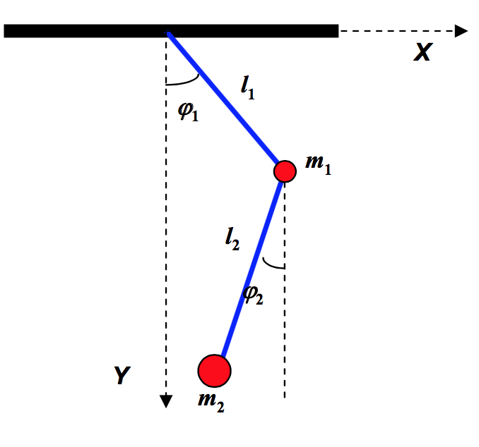
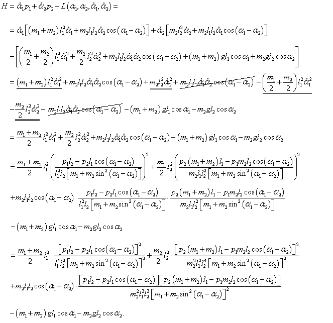
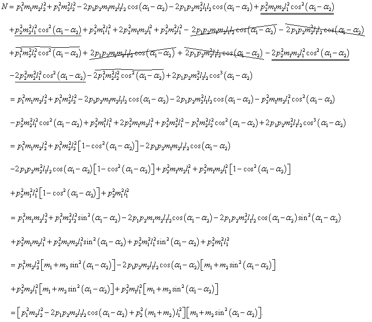
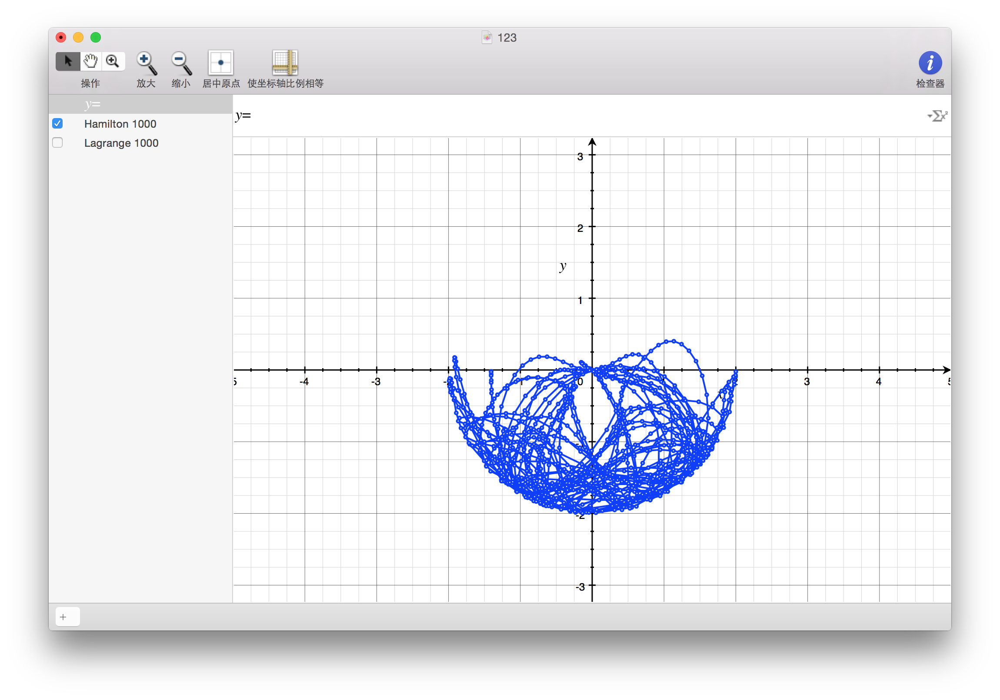
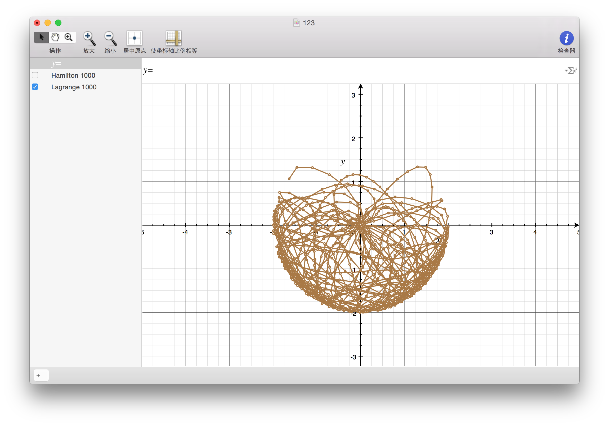
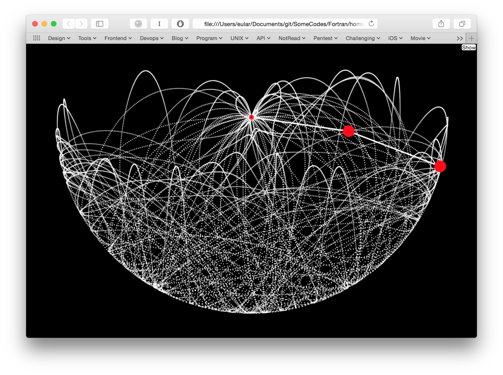
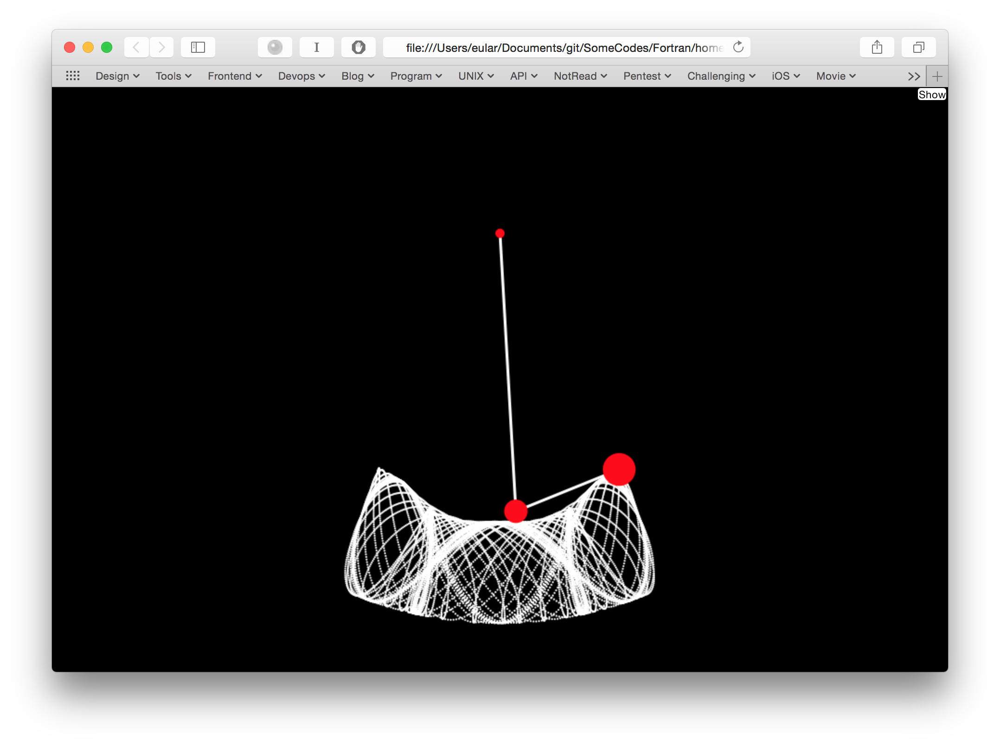
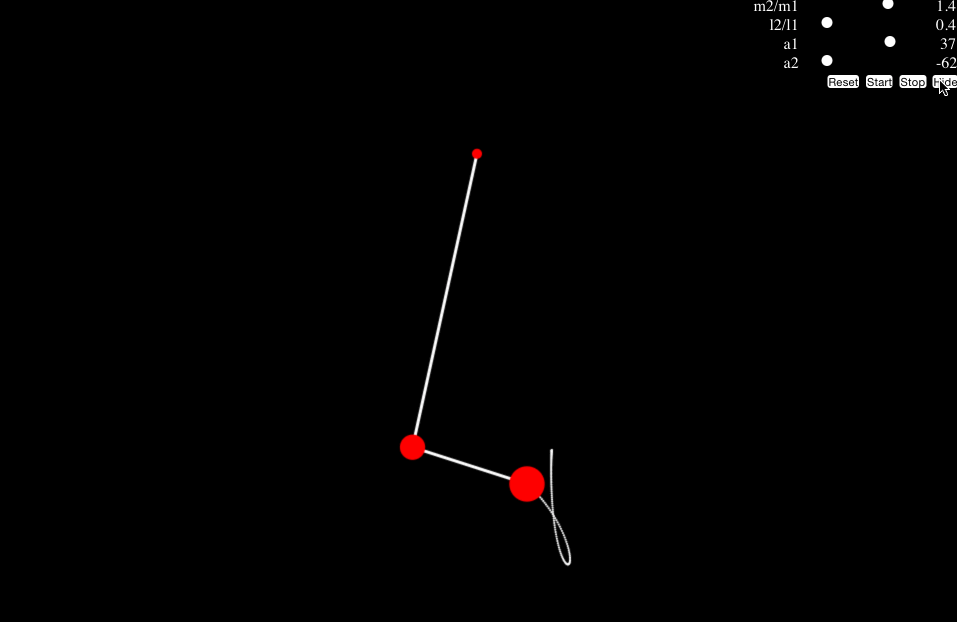

Double Pendulum
===============

注：本文已经放到简书上了哟，欢迎大家关注我的简书哦。看[这里](http://www.jianshu.com/p/a57bfd91e0a1)。

### Preface
小幽表示三体问题被同学玩坏后（才知道三体运动轨迹是如此的美妙-_-||），只能从为数不多剩下很多的几个问题中选了，好吧，就是这个了——《双摆问题》，别看只有两个摆，可毕竟也是混沌运动啊，跟三体一样炫酷哟！

### Physics Model



A simplified model of the double pendulum is shown in Figure. We assume that the rods are massless. Their lengths are `l1` and `l2`. The point masses (they are represented by the balls of finite radius) are `m1` and `m2`. All pivots are assumed to be frictionless.

### Lagrange Equations
问题很简单，但是我们用简单的牛顿力学那套动力学方法来解这个问题的话就显得相当的复杂，毕竟理论力学也不是白学的，（我勒个去，理论力学和计算物理都是他教），现在就看我分分钟搞定。

> The coordinates
> ![][1]
> 
> The kinetic and potential energy
> ![][2]
> 
> The Lagrangian of the system
> ![][3]

有了上面这些基本条件，下面我们就来解拉格朗日方程：
> The Lagrangian can be written in the following form
> ![][4]
> 
> Lagrange equations
> ![][5]
> 
> The partial derivatives
> ![][6]
> 
> Hence, we get the equations
> ![][7]

### Numerical Solution
至此，可以舒一口气了，理论力学部分到此结束，因为对于这个微分方程组想解出`a1`和`a2`的解析解来就连数学物理方法都表示无力。没办法，只好搬出大招了——数值解。

对于这类问题，不管三七二十一，一上来直接用`4阶Runge-Kutta`方法。

由于`Runge-Kutta`方法适用于一阶微分方程，而上面我们得到的是两个二阶微分方程组，所以首先要转换成四个一阶微分方程组。
> Define the first derivatives as separate variables
> ![][8]
> 
> Four 1st order equations
> ![][9]

**Four Order Runge-Kutta Method**：
![][10]

四阶龙格库塔法的公式很简单，其原理这里就不在啰嗦。可是，总感觉某些地方怪怪的，上面的公式是单变量的不知你发现没，而我们要求的是方程组，所以嘛，下面引入多变量龙格库塔方法。

**Multi-variable Runge-Kutta Algorithm**:
![][11]

接下来呢，就把上面的公式转化成代码咯，这里采用`Fortran`语言，代码如下：
```
module Double_Pendulum
    implicit none
    private
    public :: init,test
    real :: m1,m2,l1,l2,xo,yo,g,tau
    integer :: n

contains

    subroutine init(m1_,m2_,l1_,l2_)
        implicit none
        real :: m1_,m2_,l1_,l2_
        m1=m1_ !球1质量
        m2=m2_ !球2质量
        l1=l1_ !杆1长度
        l2=l2_ !杆2长度
        !原点坐标
        xo=0.0
        yo=0.0
        g=0.005 !重力加速度
        tau=3.0
        n=1
    end subroutine init

    ! Lagrange equations
    function L_p1(p1,p2,w1,w2)
        implicit none
        real :: L_p1,p1,p2,w1,w2
        L_p1=w1
    end function L_p1

    function L_p2(p1,p2,w1,w2)
        implicit none
        real :: L_p2,p1,p2,w1,w2
        L_p2=w2
    end function L_p2

    function L_w1(p1,p2,w1,w2)
        implicit none
        real :: L_w1,p1,p2,w1,w2,tmp
        tmp=l1*(2*m1+m2-m2*cos(2*p2-2*p1))
        L_w1=(-g*(2*m1+m2)*sin(p1)+m2*g*sin(p1-2*p2)-2*sin(p1-p2)*m2*(w2*w2*l2+w1*w1*l1*cos(p1-p2)))/tmp
    end function L_w1

    function L_w2(p1,p2,w1,w2)
        implicit none
        real :: L_w2,p1,p2,w1,w2
        L_w2=(2*sin(p1-p2)*(w1*w1*l1*(m1+m2)+g*(m1+m2)*cos(p1)+w2*w2*l2*m2*cos(p1-p2)))/(l2*(2*m1+m2-m2*cos(2*p2-2*p1)))
    end function L_w2

    ! Hamilton Equations
    function H_a1(a1,a2,p1,p2)
        implicit none
        real :: H_a1,a1,a2,p1,p2
        H_a1=(p1*l2-p2*l1*cos(a1-a2))/(l1*l1*l2*(m1+m2*sin(a1-a2)*sin(a1-a2)))
    end function H_a1

    function H_a2(a1,a2,p1,p2)
        implicit none
        real :: H_a2,a1,a2,p1,p2
        H_a2=(p2*(m1+m2)*l1-p1*m2*l2*cos(a1-a2))/(m2*l1*l2*l2*(m1+m2*sin(a1-a2)*sin(a1-a2)))
    end function H_a2

    function H_p1(a1,a2,p1,p2)
        implicit none
        real :: H_p1,a1,a2,p1,p2,A_1,A_2,tmp
        A_1=(p1*p2*sin(a1-a2))/(l1*l2*(m1+m2*sin(a1-a2)*sin(a1-a2)))
        tmp=2*l1*l1*l2*l2*(m1+m2*sin(a1-a2)*sin(a1-a2))*(m1+m2*sin(a1-a2)*sin(a1-a2))
        A_2=(p1*p1*m2*l2*l2-2*p1*p2*m2*l1*l2*cos(a1-a2)+p2*p2*(m1+m2)*l1*l1)*sin(2*a1-2*a2)/tmp
        H_p1=-(m1+m2)*g*l1*sin(a1)-A_1+A_2
    end function H_p1

    function H_p2(a1,a2,p1,p2)
        implicit none
        real :: H_p2,a1,a2,p1,p2,A_1,A_2,tmp
        A_1=(p1*p2*sin(a1-a2))/(l1*l2*(m1+m2*sin(a1-a2)*sin(a1-a2)))
        tmp=2*l1*l1*l2*l2*(m1+m2*sin(a1-a2)*sin(a1-a2))*(m1+m2*sin(a1-a2)*sin(a1-a2))
        A_2=(p1*p1*m2*l2*l2-2*p1*p2*m2*l1*l2*cos(a1-a2)+p2*p2*(m1+m2)*l1*l1)*sin(2*a1-2*a2)/tmp
        H_p2=-m2*g*l2*sin(a2)+A_1-A_2
    end function H_p2

    function Hamiltonian(a1,a2,p1,p2)
        implicit none
        real :: Hamiltonian,a1,a2,p1,p2,T,V
        T=(p1*p1*m2*l2*l2-2*p1*p2*m2*l1*l2*cos(a1-a2)+p2*p2*(m1+m2)*l1*l1)/(2*m2*l1*l1*l2*l2*(m1+m2*sin(a1-a2)*sin(a1-a2)))
        V=-(m1+m2)*g*l1*cos(a1)-m2*g*l2*cos(a2)
        Hamiltonian=T+V
    end function Hamiltonian

    ! Four Order Runge-Kutta Method
    function rk4(z,f1,f2,f3,f4)
        implicit none
        real :: f1,f2,f3,f4
        real :: rk4(0:3),z(0:3),K1(0:3),K2(0:3),K3(0:3),K4(0:3),a,b,c,d
        integer :: i
        a=z(0)
        b=z(1)
        c=z(2)
        d=z(3)
        do i=1,n
            K1(0)=f1(a,b,c,d)*tau
            K1(1)=f2(a,b,c,d)*tau
            K1(2)=f3(a,b,c,d)*tau
            K1(3)=f4(a,b,c,d)*tau
            K2(0)=f1(a+K1(0)/2,b+K1(1)/2,c+K1(2)/2,d+K1(3)/2)*tau
            K2(1)=f2(a+K1(0)/2,b+K1(1)/2,c+K1(2)/2,d+K1(3)/2)*tau
            K2(2)=f3(a+K1(0)/2,b+K1(1)/2,c+K1(2)/2,d+K1(3)/2)*tau
            K2(3)=f4(a+K1(0)/2,b+K1(1)/2,c+K1(2)/2,d+K1(3)/2)*tau
            K3(0)=f1(a+K2(0)/2,b+K2(1)/2,c+K2(2)/2,d+K2(3)/2)*tau
            K3(1)=f2(a+K2(0)/2,b+K2(1)/2,c+K2(2)/2,d+K2(3)/2)*tau
            K3(2)=f3(a+K2(0)/2,b+K2(1)/2,c+K2(2)/2,d+K2(3)/2)*tau
            K3(3)=f4(a+K2(0)/2,b+K2(1)/2,c+K2(2)/2,d+K2(3)/2)*tau
            K4(0)=f1(a+K3(0),b+K3(1),c+K3(2),d+K3(3))*tau
            K4(1)=f2(a+K3(0),b+K3(1),c+K3(2),d+K3(3))*tau
            K4(2)=f3(a+K3(0),b+K3(1),c+K3(2),d+K3(3))*tau
            K4(3)=f4(a+K3(0),b+K3(1),c+K3(2),d+K3(3))*tau
            a=a+(K1(0)+2*K2(0)+2*K3(0)+K4(0))/6
            b=b+(K1(1)+2*K2(1)+2*K3(1)+K4(1))/6
            c=c+(K1(2)+2*K2(2)+2*K3(2)+K4(2))/6
            d=d+(K1(3)+2*K2(3)+2*K3(3)+K4(3))/6
        end do
        rk4=(/ a,b,c,d /)
    end function rk4

    ! 角度转弧度
    function angle2rad(a) result(r)
        implicit none
        real :: r,a
        r=a/180.0*3.1415926
    end function angle2rad

    ! 弧度转角度
    function rad2angle(r) result(a)
        implicit none
        real :: r,a
        a=r/3.1415926*180.0
    end function rad2angle

    ! 获取小球位置
    function get_position(a1,a2) result(p)
        implicit none
        real :: a1,a2,p(0:3)
        !球1坐标
        p(0)=xo+l1*sin(a1)
        p(1)=yo-l1*cos(a1)
        !球2坐标
        p(2)=p(0)+l2*sin(a2)
        p(3)=p(1)-l2*cos(a2)
    end function get_position

    subroutine test()
        implicit none
        real :: z(0:3),p(0:3)
        integer :: i
        z=(/ angle2rad(90.0),angle2rad(90.0),0.0,0.0 /)

        open(101,file='data.txt')
        print '(5x,a,12x,a,10x,a)','a1','a2','H'
        do i=1,1000
            z=rk4(z,H_a1,H_a2,H_p1,H_p2)
            !z=rk4(z,L_p1,L_p2,L_w1,L_w2)
            p=get_position(z(0),z(1))
            write(101,'(f7.3,f7.3,i4,f10.6)') p(2),p(3),i,Hamiltonian(z(0),z(1),z(2),z(3))
            
            if (i<10) then
                print '(f9.6,5x,f10.6,5x,f9.6)',z(0),z(1),Hamiltonian(z(0),z(1),z(2),z(3))
            else if (i==990) then
                print *,'...'
            else if (i>990) then
                print '(f9.6,5x,f10.6,5x,f9.6)',z(0),z(1),Hamiltonian(z(0),z(1),z(2),z(3))
            end if
        end do
        close(101)
        print *
        print *,'Save data in data.txt'
    end subroutine test

end module Double_Pendulum

program main
    use Double_Pendulum
    implicit none

    call init(1.0,1.0,1.0,1.0)
    call test()
end program main
```
代码老长老长的，没办法。

### Hamilton Equations
如果看的仔细的同学就会发现，上面的代码中混入了奇怪的东西，也就是接下面要说的，用来提升逼格的——哈密顿方程。

拉格朗日方程已经够炫酷了，奈何哈密顿方程更是炫酷到没朋友。

在最上面，我们得到了两个二阶微分方程组：
![][12]

这次，我们通过`Legendre`变换将其转化为哈密顿方程。

> Generalized momenta
> ![][13]
> 
> Lagrangian to the Hamiltonian ( by Legendre transformation )
> ![][14]
> 
> Then, Lagrange equation becomes two Hamilton's equations
> ![][15]

由
![][16]

我们可以得到
![][17]

下面我们再计算哈密顿算子(Hamiltonian)，那过程是相当的复杂。。可以看别人家的图：





这里我们直接附上化简后的结果
> ![][18]
> 
> Then define the Hamiltonian H as
> ![][19]
> 
> Generalized kinetic energy T
> ![][20]
> 
> Potential energy V
> ![][21]

最后我们求出动量p的方程
> ![][22]
> 
> where
> ![][23]

OK，四个一阶微分方程组我们已经有了，现在把它们写在一起。
![][24]

然后还是像之前的那样用四阶龙哥库塔方法求解就可以了。

### Result
我们分别用两种方法计算出`a1`和`a2`，画出第二个小球的轨迹，如下图：



这个是哈密顿方程得到的结果



这个是拉格朗日方程得到的结果

下面是两张模拟双摆运动的轨迹截图





很明显的可以看出，双摆系统是一个混沌系统，其对初始值非常敏感，一个微小的变化也会引起后面巨大的差别。

### Simulation
为了能让这些图表数据有更加直观强大感受的话，最好能把其运动模拟出来。于是又用`Javascript`重写一遍给大家体验。

杆长相等，小球质量相同，两个初始角度均为90度的情况：


杆长不等，小球质量不同，两个初始角度不同的情况：




效果还是挺不错的，链接在[这里](http://urinx.github.io/app/double-pendulum/)。

### References
\[0\]. [Double Pendulum Physics Simulation](http://www.myphysicslab.com/dbl_pendulum.html)<br>
\[1\]. [Double Pendulum](http://www.math24.net/double-pendulum.html)<br>

[1]: http://latex.codecogs.com/gif.latex?\\begin{aligned}%20x_1%20&=l_1sin\\varphi_1%20\\\\%20x_2%20&=x_1+l_2sin\\varphi_2%20\\\\%20y_1%20&=-l_1cos\\varphi_1%20\\\\%20y_2%20&=y_1-l_2cos\\varphi_2%20\\end{aligned}

[2]: http://latex.codecogs.com/gif.latex?\\begin{aligned}%20T%20&=\\frac{m_1^2v_1^2}{2}+\\frac{m_2^2v_2^2}{2}=\\frac{m_1(\\dot%20x_1^2+\\dot%20y_1^2)}{2}+\\frac{m_2(\\dot%20x_2^2+\\dot%20y_2^2)}{2}%20\\\\%20V%20&=m_1gy_1+m_2gy_2%20\\end{aligned}

[3]: http://latex.codecogs.com/gif.latex?\\begin{aligned}%20L%20&=%20T-V=T_1+T_2-(V_1+V_2)%20\\\\%20&=%20\\frac{m_1(\\dot%20x_1^2+\\dot%20y_1^2)}{2}+\\frac{m_2(\\dot%20x_2^2+\\dot%20y_2^2)}{2}-m_1gy_1+m_2gy_2%20\\end{aligned}

[4]: http://latex.codecogs.com/gif.latex?L=(\\frac{m_1}{2}+\\frac{m_2}{2})+l_1^2\\dot\\varphi_1^2+\\frac{m_2}{2}l_2^2\\dot\\varphi_2^2+m_2l_1l_2\\dot%20\\varphi_1\\dot%20\\varphi_2cos(\\varphi_1-\\varphi_2)+(m_1+m_2)gl_1cos\\varphi_1+m_2gl_2cos\\varphi_2

[5]: http://latex.codecogs.com/gif.latex?\\frac{d}{dt}(\\frac{\\partial%20L}{\\partial%20\\dot\\varphi_i})-\\frac{\\partial%20L}{\\partial%20\\varphi_i}=0,i=1,2

[6]: http://latex.codecogs.com/gif.latex?\\begin{aligned}%20\\frac{\\partial%20L}{\\partial%20\\dot\\varphi_1}%20&=%20(m_1+m_2)l_1^2\\dot\\varphi_1+m_2l_1l_2\\dot\\varphi_2cos(\\varphi_1-\\varphi_2)%20\\\\%20\\frac{\\partial%20L}{\\partial%20\\dot\\varphi_2}%20&=%20m_2l_2^2\\dot\\varphi_2+m_2l_1l_2\\dot\\varphi_1cos(\\varphi_1-\\varphi_2)%20\\\\%20\\frac{\\partial%20L}{\\partial%20\\varphi_1}%20&=%20-m_2l_1l_2\\dot\\varphi_1\\dot\\varphi_2sin(\\varphi_1-\\varphi_2)-(m_1+m_2)gl_1sin\\varphi_1%20\\\\%20\\frac{\\partial%20L}{\\partial%20\\varphi_2}%20&=%20m_2l_1l_2\\dot\\varphi_1\\dot\\varphi_2sin(\\varphi_1-\\varphi_2)-m_2gl_2sin\\varphi_2%20\\end{aligned}

[7]: http://latex.codecogs.com/gif.latex?(m_1+m_2)l_1\\ddot\\varphi_1+m_2l_2sin(\\varphi_1-\\varphi_2)\\dot\\varphi_2^2+m_2l_2cos(\\varphi_1-\\varphi_2)\\ddot\\varphi_2+(m_1+m_2)gsin\\varphi_1=0%20\\\\%20l_2\\ddot\\varphi_2-l_1sin(\\varphi_1-\\varphi_2)\\dot\\varphi_1^2+l_1cos(\\varphi_1-\\varphi_2)\\ddot\\varphi_1+gsin\\varphi_2=0

[8]: http://latex.codecogs.com/gif.latex?\\begin{aligned}%20\\frac{d\\varphi_1}{dt}%20&=%20\\omega_1%20\\\\%20\\frac{d\\varphi_2}{dt}%20&=%20\\omega_2%20\\end{aligned}

[9]: http://latex.codecogs.com/gif.latex?\\dot\\varphi_1=\\omega_1%20\\\\%20\\dot\\varphi_2=\\omega_2%20\\\\%20\\dot\\omega_1=\\frac{-g(2m_1+m_2)sin\\varphi_1+m_2gsin(\\varphi_1-2\\varphi_2)-2sin(\\varphi_1-\\varphi_2)m_2(\\omega_2^2l_2+\\omega_1^2l_1cos(\\varphi_1-\\varphi_2))}{l_1(2m_1+m_2-m_2cos(2\\varphi_1-2\\varphi_2))}%20\\\\%20\\dot\\omega_2=\\frac{2sin(\\varphi_1-\\varphi_2)(\\omega_1^2l_1(m_1+m_2)+g(m_1+m_2)cos\\varphi_1+\\omega_2^2l_2m_2cos(\\varphi_1-\\varphi_2))}{l_2(2m_1+m_2-m_2cos(2\\varphi_1-2\\varphi_2))}

[10]: http://latex.codecogs.com/gif.latex?\\begin{cases}%20y_{n+1}=y_n+\\frac{h}{6}(K_1+2K_2+2K_3+K_4)%20\\\\%20K_1=f(x_n,y_n)%20\\\\%20K_2=f(x_n+\\frac{h}{2},y_n+\\frac{h}{2}K_1)%20\\\\%20K_3=f(x_n+\\frac{h}{2},y_n+\\frac{h}{2}K_2)%20\\\\%20K_4=f(x_n+h,y_n+hK_3)%20\\end{cases}

[11]: http://latex.codecogs.com/gif.latex?\\begin{cases}%20\\bar%20a_n=\\bar%20f(\\bar%20x_n)%20\\\\%20\\bar%20b_n=\\bar%20f(\\bar%20x_n+\\frac{h}{2}\\bar%20a_n)%20\\\\%20\\bar%20c_n=\\bar%20f(\\bar%20x_n+\\frac{h}{2}\\bar%20b_n)%20\\\\%20\\bar%20d_n=\\bar%20f(\\bar%20x_n+h\\bar%20c_n)%20\\\\%20\\bar%20x_{n+1}=\\bar%20x_n+\\frac{h}{6}(\\bar%20a_n+2\\bar%20b_n+2\\bar%20c_n+\\bar%20d_n)%20\\end{cases}

[12]: http://latex.codecogs.com/gif.latex?\\begin{cases}%20(m_1+m_2)l_1\\ddot\\varphi_1+m_2l_2sin(\\varphi_1-\\varphi_2)\\dot\\varphi_2^2+m_2l_2cos(\\varphi_1-\\varphi_2)\\ddot\\varphi_2+(m_1+m_2)gsin\\varphi_1=0%20\\\\%20l_2\\ddot\\varphi_2-l_1sin(\\varphi_1-\\varphi_2)\\dot\\varphi_1^2+l_1cos(\\varphi_1-\\varphi_2)\\ddot\\varphi_1+gsin\\varphi_2=0%20\\end{cases}

[13]: http://latex.codecogs.com/gif.latex?p_i=\\frac{\\partial%20L}{\\partial%20\\dot%20\\varphi_i}%20,%20i=1,2

[14]: http://latex.codecogs.com/gif.latex?H(\\varphi_1,\\varphi_2,p_1,p_2)=\\dot%20\\varphi_1p_1+\\dot%20\\varphi_2p_2-L(\\varphi_1,\\varphi_2,\\dot%20\\varphi_1,\\dot%20\\varphi_2)

[15]: http://latex.codecogs.com/gif.latex?\\frac{d}{dt}\\frac{\\partial%20L}{\\partial%20\\dot\\varphi_i}=\\frac{\\partial%20L}{\\partial%20\\varphi_i}%20\\Rightarrow%20\\begin{cases}%20\\dot%20p_i=-\\frac{\\partial%20H}{\\partial%20\\varphi_i}%20\\\\%20\\dot%20\\varphi_i=\\frac{\\partial%20H}{\\partial%20p_i}%20\\end{cases}

[16]: http://latex.codecogs.com/gif.latex?\\begin{cases}%20p_1=\\frac{\\partial%20L}{\\partial%20\\dot\\varphi_1}=(m_1+m_2)l_1^2\\dot\\varphi_1+m_2l_1l_2\\dot\\varphi_2cos(\\varphi_1-\\varphi_2)%20\\\\%20p_2=\\frac{\\partial%20L}{\\partial%20\\dot\\varphi_2}=m_2l_2^2\\dot\\varphi_2+m_2l_1l_2\\dot\\varphi_1cos(\\varphi_1-\\varphi_2)%20\\end{cases}

[17]: http://latex.codecogs.com/gif.latex?\\begin{cases}%20\\dot\\varphi_1=\\frac{p_1l_2-p_2l_1cos(\\varphi_1-\\varphi_2)}{l_1^2l_2[m_1+m_2sin^2(\\varphi_1-\\varphi_2)]}%20\\\\%20\\dot\\varphi_2=\\frac{p_2(m_1+m_2)l_1-p_1m_2l_2cos(\\varphi_1-\\varphi_2)}{m_2l_1l_2^2[m_1+m_2sin^2(\\varphi_1-\\varphi_2)]}%20\\end{cases}

[18]: http://latex.codecogs.com/gif.latex?H=\\frac{p_1^2m_2l_2^2-2p_1p_2m_2l_1l_2cos(\\varphi_1-\\varphi_2)+p_2^2(m_1+m_2)l_1^2}{2m_2l_1^2l_2^2[m_1+m_2sin^2(\\varphi_1-\\varphi_2)]}-(m_1+m_2)gl_1cos\\varphi_1-m_2gl_2cos\\varphi_2

[19]: http://latex.codecogs.com/gif.latex?H=T-V

[20]: http://latex.codecogs.com/gif.latex?T=\\frac{p_1^2m_2l_2^2-2p_1p_2m_2l_1l_2cos(\\varphi_1-\\varphi_2)+p_2^2(m_1+m_2)l_1^2}{2m_2l_1^2l_2^2[m_1+m_2sin^2(\\varphi_1-\\varphi_2)]}

[21]: http://latex.codecogs.com/gif.latex?V=(m_1+m_2)gl_1cos\\varphi_1-m_2gl_2cos\\varphi_2

[22]: http://latex.codecogs.com/gif.latex?\\begin{cases}%20\\dot%20p_1=-\\frac{\\partial%20H}{\\partial%20\\varphi_1}=-\\frac{\\partial%20T}{\\partial%20\\varphi_1}-\\frac{\\partial%20V}{\\partial%20\\varphi_1}=-A_1+A_2-(m_1+m_2)gl_1sin\\varphi_1%20\\\\%20\\dot%20p_2=-\\frac{\\partial%20H}{\\partial%20\\varphi_2}=-\\frac{\\partial%20T}{\\partial%20\\varphi_2}-\\frac{\\partial%20V}{\\partial%20\\varphi_2}=A_1-A_2-m_2gl_2sin\\varphi_2%20\\end{cases}

[23]: http://latex.codecogs.com/gif.latex?\\begin{cases}%20A_1=\\frac{p_1p_2sin(\\varphi_1-\\varphi_2)}{l_1l_2[m_1+m_2sin^2(\\varphi_1-\\varphi_2)]}%20\\\\%20A_2=\\frac{[p_1^2m_2l_2^2-2p_1p_2m_2l_1l_2cos(\\varphi_1-\\varphi_2)+p_2^2(m_1+m_2)l_1^2]sin[2(\\varphi_1-\\varphi_2)]}{sl_1^2l_2^2[m_1+m_2sin^2(\\varphi_1-\\varphi_2)]^2}%20\\end{cases}

[24]: http://latex.codecogs.com/gif.latex?\\begin{cases}%20\\dot\\varphi_1=\\frac{p_1l_2-p_2l_1cos(\\varphi_1-\\varphi_2)}{l_1^2l_2[m_1+m_2sin^2(\\varphi_1-\\varphi_2)]}%20\\\\%20\\dot\\varphi_2=\\frac{p_2(m_1+m_2)l_1-p_1m_2l_2cos(\\varphi_1-\\varphi_2)}{m_2l_1l_2^2[m_1+m_2sin^2(\\varphi_1-\\varphi_2)]}%20\\\\%20\\dot%20p_1=-A_1+A_2-(m_1+m_2)gl_1sin\\varphi_1%20\\\\%20\\dot%20p_2=A_1-A_2-m_2gl_2sin\\varphi_2%20\\end{cases}