X算法
=====

### 精确覆盖问题
在一个全集X中若干子集的集合为S，精确覆盖是指，S的子集S\*，满足X中的每一个元素在S*中恰好出现一次。

满足以下条件的集合为一个精确覆盖：

- S\*中任意两个集合没有交集，即X中的元素在S*中出现最多一次
- S\*中集合的全集为X，即X中的元素在S*中出现最少一次

合二为一，即X中的元素在S*中出现恰好一次。

下图为一个例子：

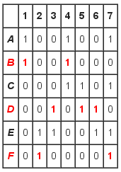

S* = {B, D, F} 便是一个精确覆盖。<br>
用图论表示的话：

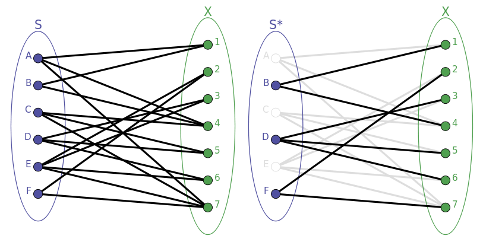

左侧每个节点表示S的每个集合，右侧每个节点表示X的每个元素，而精确覆盖便是一种匹配，满足右侧的每个点恰好有一条边。

### Algorithm X & Dancing Link
精确覆盖问题是NP完备。为了解决精确覆盖问题，X算法由大牛高德纳发明并实现。<br>
这里通过一个直观的例子来对X算法建立一个感性的认识：
```python
U=[1,2,3,4,5,6,7]
S={
    'A':[1,4,7],
    'B':[1,4],
    'C':[4,5,7],
    'D':[3,5,6],
    'E':[2,3,6,7],
    'F':[2,7]
}
```
我们用矩阵表示：

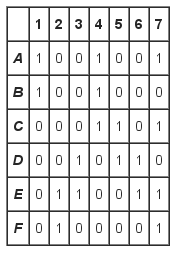

接下来按照以下步骤进行：<br>
**L1** 从第一列开始，选出包含第一列的所在的行：

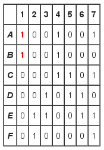

我们得到A，B。<br>
**L2** 从A，B中选出一个。<br>
**L2.1** 这里选择A，选出A包含的列：


我们得到1，4，7。<br>
**L3.1** 选出1，4，7包含的行：

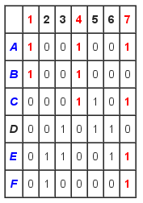

我们得到A，B，C，E，F。<br>
**L4.1** 去除A，B，C，E，F：

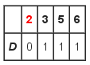

只剩下D，然而不满足条件，回到**L2**。<br>
**L2.2** 这次选择B：

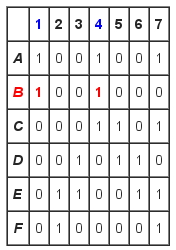

按照上述步骤进行依次得到：

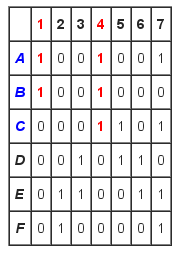<br>
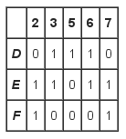<br>
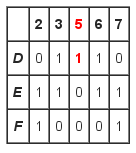<br>
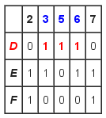<br>
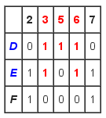<br>
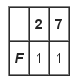

**L3** 成功找到，结束。<br>
以上就是X算法的基本步骤。在此基础上，Knuth提出了一种高效的实现技术叫舞蹈链，使用双向链表来表示该问题的矩阵。

**什么是舞蹈链？**<br>
舞蹈链, 也叫DLX, 是由Donald Knuth提出的技术，目的是快速实现他的Algorithm X。Algorithm X是一种递归算法，时间复杂度不确定, 深度优先, 通过回溯寻找完全覆盖问题所有可能的解。<br>
其名字来自于这个算法的工作方式，算法中的迭代让链接与同伴链接"跳舞"，很像“精心编排的舞蹈”。<br>
关于舞蹈链算法的详细工作方式可以看[这个](http://www.cnblogs.com/grenet/p/3145800.html)，这里就不详细的解释了。下面附上一张截图：

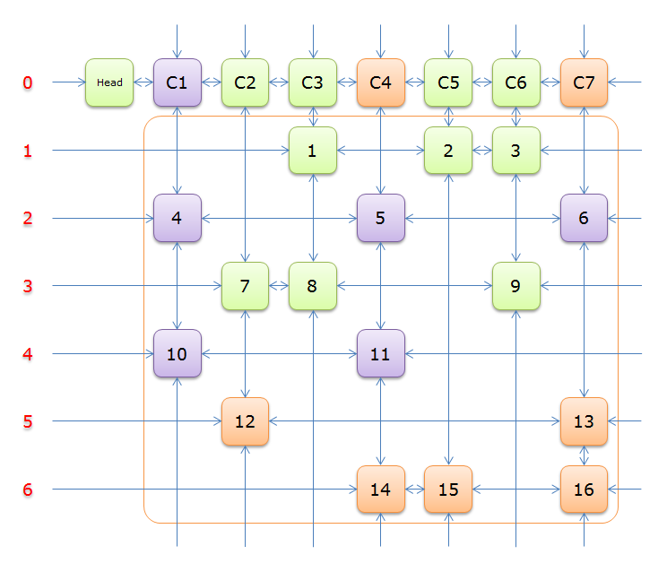

然而，舞蹈链实现起来可能相当繁琐，并且不易写地正确。所以下面是一个有趣的舞蹈链变种，用Python编写的X算法。<br>
在舞蹈链中，数据结构使用的是双向链表来表示矩阵，在python中我们用字典来代替：
```python
X={
    1:{'A','B'},
    2:{'E','F'},
    3:{'D','E'},
    4:{'A','B','C'},
    5:{'C','D'},
    6:{'D','E'},
    7:{'A','C','E','F'}
}
Y={
    'A':[1,4,7],
    'B':[1,4],
    'C':[4,5,7],
    'D':[3,5,6],
    'E':[2,3,6,7],
    'F':[2,7]
}
```
X算法：
```python
#! /usr/bin/env python

def solve(X,Y,solution=[]):
    if not X:
        yield list(solution)
    else:
        c=min(X,key=lambda c: len(X[c]))
        for r in list(X[c]):
            solution.append(r)
            cols=select(X,Y,r)
            for s in solve(X,Y,solution):
                yield s
            deselect(X,Y,r,cols)
            solution.pop()

def select(X,Y,r):
    cols=[]
    for j in Y[r]:
        for  i in X[j]:
            for k in Y[i]:
                if k!=j:
                    X[k].remove(i)
        cols.append(X.pop(j))
    return cols

def deselect(X,Y,r,cols):
    for j in reversed(Y[r]):
        X[j]=cols.pop()
        for i in X[j]:
            for k in Y[i]:
                if k!=j:
                    X[k].append(i)

def T(Y):
    X={}
    for i,j in Y.items():
        for k in j:
            if k in X:
                X[k].append(i)
            else:
                X[k]=[i]
    return X

if __name__=='__main__':
    Y={
        'A':[1,4,7],
        'B':[1,4],
        'C':[4,5,7],
        'D':[3,5,6],
        'E':[2,3,6,7],
        'F':[2,7]
    }
    X=T(Y)
    print list(solve(X,Y))
```

### Sudoku
现在我们知道了精确覆盖问题，X算法以及舞蹈链。那么，问题就来了，这些可以用来干啥呢。我只能说能干的挺多的，不过这里只谈谈如何利用它来解数独。

首先看数独规则：
- 每个格子只能填一个数字
- 每行每个数字只能填一遍
- 每列每个数字只能填一遍
- 每宫每个数字只能填一遍

如何求解：
- 把数独问题转换为精确覆盖问题
- 设计出数据矩阵
- 用舞蹈链算法求解该精确覆盖问题
- 把该精确覆盖问题的解转换为数独的解

我们用数组保存数独：
```python
sudoku=[
    [5, 3, 0, 0, 7, 0, 0, 0, 0],
    [6, 0, 0, 1, 9, 5, 0, 0, 0],
    [0, 9, 8, 0, 0, 0, 0, 6, 0],
    [8, 0, 0, 0, 6, 0, 0, 0, 3],
    [4, 0, 0, 8, 0, 3, 0, 0, 1],
    [7, 0, 0, 0, 2, 0, 0, 0, 6],
    [0, 6, 0, 0, 0, 0, 2, 8, 0],
    [0, 0, 0, 4, 1, 9, 0, 0, 5],
    [0, 0, 0, 0, 8, 0, 0, 7, 9]
]
```
问题的关键是如何把数独问题转换为精确覆盖问题。<br>
r，c，b，n分别代表行，列，第几个宫格，填入的数字，其中r，c，b的索引是从0开始。<br>
我们构造了这样的一个矩阵：

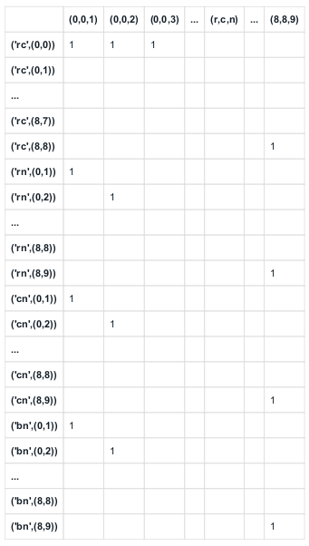

于是构造下列X，Y：
```python
R,C=3,3
N=R*C
X=([("rc", rc) for rc in product(range(N), range(N))] +
    [("rn", rn) for rn in product(range(N), range(1, N + 1))] +
    [("cn", cn) for cn in product(range(N), range(1, N + 1))] +
    [("bn", bn) for bn in product(range(N), range(1, N + 1))])
Y={}
for r, c, n in product(range(N), range(N), range(1, N + 1)):
    b=(r // R) * R + (c // C) # Box number
    Y[(r, c, n)] = [
        ("rc", (r, c)),
        ("rn", (r, n)),
        ("cn", (c, n)),
        ("bn", (b, n))]
X,Y=exact_cover(X,Y)

def exact_cover(X,Y):
    X = {j:set() for j in X}
    for i,row in Y.items():
        for j in row:
            X[j].add(i)
    return X,Y
```
通过已知的格子（相当于已经选择了），去除X中的部分子集：
```python
for i,row in enumerate(grid):
        for j,n in enumerate(row):
            if n:
                select(X, Y, (i, j, n))
```
通过求解精确覆盖问题，得到答案：
```python
for solution in solve(X, Y, []):
        for (r, c, n) in solution:
            grid[r][c] = n
        yield grid
```
完整代码：
```python
#! /usr/bin/env python
from itertools import product

def solve(X,Y,solution=[]):
    if not X:
        yield list(solution)
    else:
        c=min(X,key=lambda c: len(X[c]))
        for r in list(X[c]):
            solution.append(r)
            cols=select(X,Y,r)
            for s in solve(X,Y,solution):
                yield s
            deselect(X,Y,r,cols)
            solution.pop()

def select(X,Y,r):
    cols=[]
    for j in Y[r]:
        for  i in X[j]:
            for k in Y[i]:
                if k!=j:
                    X[k].remove(i)
        cols.append(X.pop(j))
    return cols

def deselect(X,Y,r,cols):
    for j in reversed(Y[r]):
        X[j]=cols.pop()
        for i in X[j]:
            for k in Y[i]:
                if k!=j:
                    X[k].add(i)

def T(Y):
    X={}
    for i,j in Y.items():
        for k in j:
            if k in X:
                X[k].append(i)
            else:
                X[k]=[i]
    return X

def exact_cover(X,Y):
    X = {j:set() for j in X}
    for i,row in Y.items():
        for j in row:
            X[j].add(i)
    return X,Y

def solve_sudoku(size,grid):
    R,C=size
    N=R*C
    X=([("rc", rc) for rc in product(range(N), range(N))] +
         [("rn", rn) for rn in product(range(N), range(1, N + 1))] +
         [("cn", cn) for cn in product(range(N), range(1, N + 1))] +
         [("bn", bn) for bn in product(range(N), range(1, N + 1))])
    Y={}
    for r, c, n in product(range(N), range(N), range(1, N + 1)):
        b=(r // R) * R + (c // C) # Box number
        Y[(r, c, n)] = [
            ("rc", (r, c)),
            ("rn", (r, n)),
            ("cn", (c, n)),
            ("bn", (b, n))]
    X,Y=exact_cover(X,Y)
    for i,row in enumerate(grid):
        for j,n in enumerate(row):
            if n:
                select(X, Y, (i, j, n))
    for solution in solve(X, Y, []):
        for (r, c, n) in solution:
            grid[r][c] = n
        yield grid

if __name__=='__main__':
    sudoku=[
        [5, 3, 0, 0, 7, 0, 0, 0, 0],
        [6, 0, 0, 1, 9, 5, 0, 0, 0],
        [0, 9, 8, 0, 0, 0, 0, 6, 0],
        [8, 0, 0, 0, 6, 0, 0, 0, 3],
        [4, 0, 0, 8, 0, 3, 0, 0, 1],
        [7, 0, 0, 0, 2, 0, 0, 0, 6],
        [0, 6, 0, 0, 0, 0, 2, 8, 0],
        [0, 0, 0, 4, 1, 9, 0, 0, 5],
        [0, 0, 0, 0, 8, 0, 0, 7, 9]
    ]
    for s in solve_sudoku((3,3),sudoku):
        for i in s: print i
```

### Reference
[0]. [30 行 Python 代码搞定 X 算法](http://blog.jobbole.com/74000/)<br>
[1]. [精确覆盖问题](http://zh.wikipedia.org/wiki/%E7%B2%BE%E7%A1%AE%E8%A6%86%E7%9B%96%E9%97%AE%E9%A2%98)<br>
[2]. [跳跃的舞者，舞蹈链（Dancing Links）算法——求解精确覆盖问题](http://www.cnblogs.com/grenet/p/3145800.html)<br>
[3]. [舞蹈链 - 维基百科，自由的百科全书](http://zh.wikipedia.org/wiki/%E8%88%9E%E8%B9%88%E9%93%BE)<br>
[4]. [算法实践——舞蹈链（Dancing Links）算法求解数独](http://www.cnblogs.com/grenet/p/3163550.html)