以专业的眼光看美剧《天蝎》
=========================

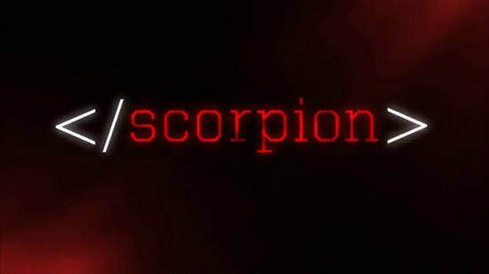

前言：每周二更新的《天蝎》，作为一部备受好评的秋季档神剧，第一集的横空出世确实表现不错，令人眼前亮，奈何后劲不足，第二集对抗生物黑客表现平平顶，其收集目标DNA定制病毒攻击的思想出于几年前的《想当厨子的生物学家是个好黑客》一书，最多当个科普看看。<br>
第三集则探讨了如何消除互联网上的信息问题。片中罪犯给出一种方法，为了阻止已发出的邮件，哪怕先后炸毁运营商的本地缓存还有主干网，主角光环照样能在万千路由器中找到一份备份。。


### Preface
今天我们看看其中一个寻找嫌疑人的片段。

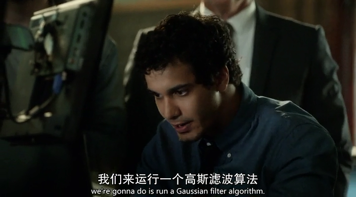
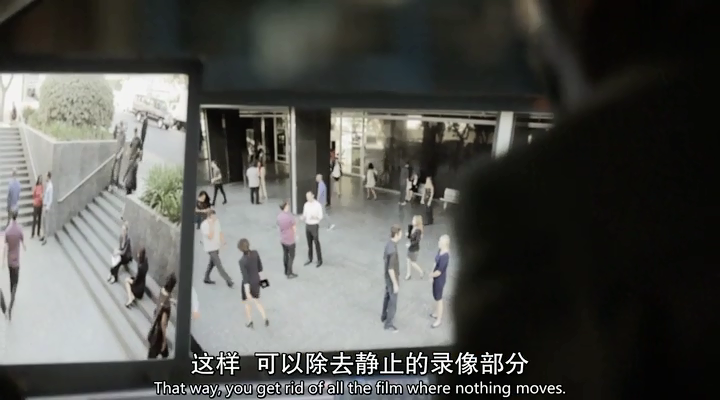
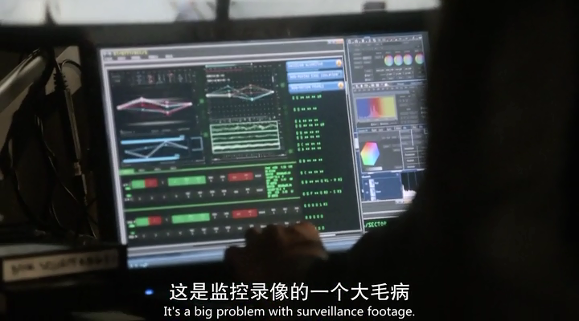
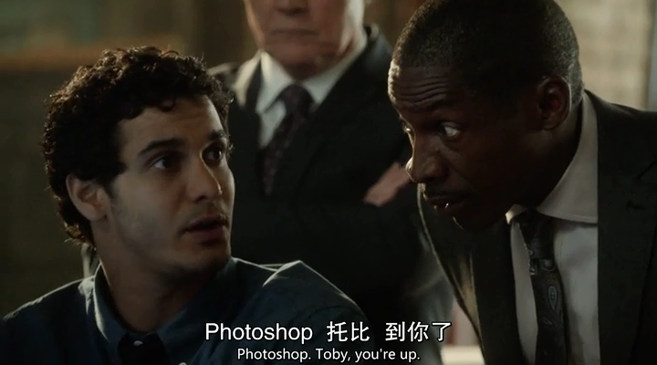

来，我们来运行一个高斯滤波算法。。先不管是否能够去除静止的录像画面，你能把Photoshop玩成这样神通广大不明觉厉。

### 图像滤波
在三维计算机视觉领域，通常对于二维图像的特征抽取是很关键的第一步，这主要包括抽取二维图像上的边缘、角点、纹理等。通常从这些被称为基元图的组成部分中，我们可以提取图像的以下特征：
- 不同物体边缘成像所带来的灰度跃变
- 物体不同材料或者不同颜色组成部分之间的分界线会产生灰度跃变
- 物体轮廓线与背景具有不同的反射特性，也会形成灰度值不连续
- 物体受到光照会形成阴影，这也会形成层灰度的跃变

从上面分析可以看出，如果能够较好的从二维图像中提取出这些信息，那么对于三维重建，物体定位，空间监控等后期目标能够有很好的支撑作用。而这些含有图像轮廓以及空间位置信息的点、线、面等特征，在图像上都体现为灰度值的不连续或者剧烈变化。也就是说，如果我们能够根据图像灰度矩阵找到灰度不连续的点位置，那么也就是实现了特征抽取。

不失一般性，从最简单的一维信号回忆，如果我们想从一维信号中找到其不连续的点，那么根据高等数学内容，可以对信号求导，其一阶导数局部最大值即为信号剧烈变化的点。

在二维函数中，梯度向量代表着函数的最大变化率方向，因此对于二维信号，可以采用其梯度向量的模来选取灰度值不连续点。这样在理想情况下，我们就可以用离散化的梯度逼近函数来检测图像灰度矩阵的灰度跃变位置，从而实现特征抽取。

现实中，有摄像机获取的图像，往往都存在噪声，而且信号并不存在理想的阶跃畸变，这样如果依然直接采用拉普拉斯算子进行灰度跃变检测，那样会产生很多的虚假特征点。因此，往往在图像处理之前，需要对灰度图进行滤波处理。

### 滤波原理
通常信息处理系统的目标是从测量到的带有噪声的信号中提取出真实的有用的信息，而往往真实有用信息是不可知的，因此只能通过滤波的方法进行信息估计。

在我们进行数学仿真或者误差评估是，往往认为传感器所引入的噪声服从正态分布（高斯白噪声），这样我们在进行滤波的时候就可以有针对性的来进行滤波器设计。

滤波就是根据观测某一随机过程的结果，对另一与之有关的随机过程进行估计的概率理论与方法。更通俗点讲，滤波就是建立的一个数学模型，通过这个模型来将图像数据进行能量转化，而能量低的就排除掉，噪声就是属于低能量部分。

通常从传感器所获得的数据都是离散的，常用的图像滤波方法都是根据像素点附近邻域像素的灰度值进行相应的加权平均所得（经过实际检验，通过这样，可以有效的消除近似白噪声的噪声信号，对于图像滤波来说，这会使得图像边缘相比滤波前模糊一点），不同的滤波方法这个权值大小以及所加权的数据范围不同。

### Gaussisn Filter
高斯滤波是最常用的一种图像滤波方法。

先看看均值滤波器，就是说某像素的颜色，由以其为中心的九宫格的像素平均值来决定。在这个基础上又发展成了带权的平均滤波器, 所谓的高斯平滑或者说滤波器就是这样一种带权的平均滤波器，除此之外还有中值滤波，简单滤波以及双边滤波等。

说白了就是一个函数来对输入的信号（其实这里的信号就是图像的像素值）进行计算然后得出结果作为该信号的值，只不过函数是高斯函数而已，就是这么简单。

高斯函数，也可以叫做高斯分布，这个比较熟悉。<br>
一维高斯分布：

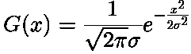
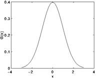

二维高斯分布：


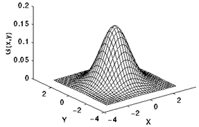

### Gaussian Kernel
理论上，高斯分布在所有定义域上都有非负值，这就需要一个无限大的卷积核。实际上，仅需要取均值周围3倍标准差内的值，以外部份直接去掉即可。如下图为标准差为1.0的整数值高斯核。<br>
3x3的高斯核

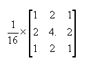

5x5的高斯核

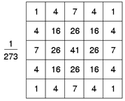

完成了高斯核的构造后，高斯滤波就是用此核来执行标准的卷积。

下面给出效果预览（代码在后面）<br>
原图和3x3高斯核的对比：

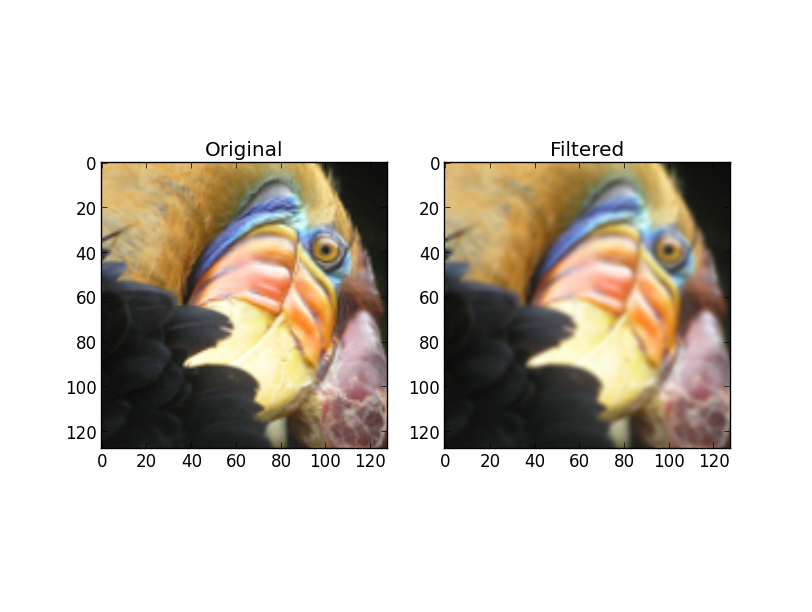

原图和5x5高斯核的对比：

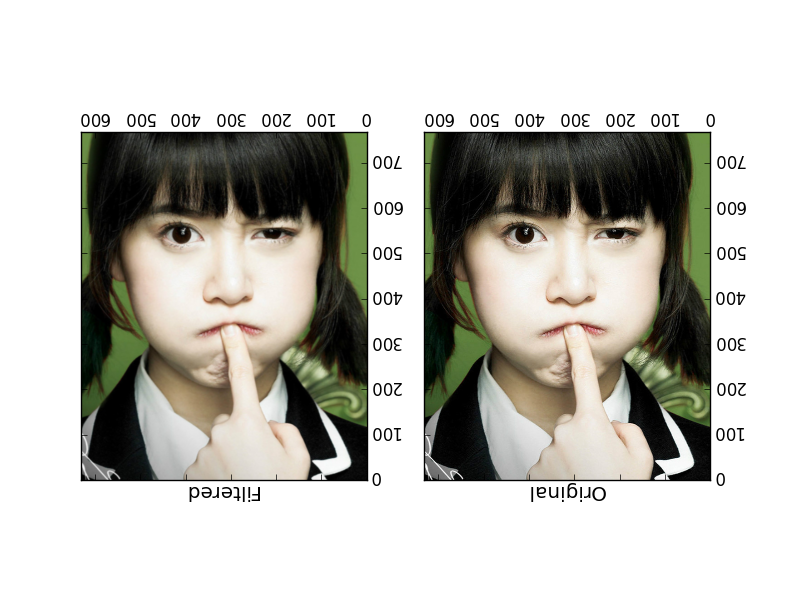

高斯滤波后图像被平滑的程度取决于标准差。它的输出是领域像素的加权平均，同时离中心越近的像素权重越高。因此，相对于均值滤波（mean filter）它的平滑效果更柔和，而且边缘保留的也更好。

高斯滤波被用作为平滑滤波器的本质原因是它是一个低通滤波器。而且，大部份基于卷积平滑滤波器都是低通滤波器。

### 代码实现
在matlab中你可以用fspecial函数来构造一个高斯核，然而在Octave3中没有fspecial函数，因为已经被移出核心包了，放到额外的`octave-image`包中。<br>
你也可以`apt-get install octave-image`（Debian）。<br>
当然你也可以下载[fspecial源码](http://www.csse.uwa.edu.au/~pk/research/matlabfns/OctaveCode/fspecial.m)直接使用。

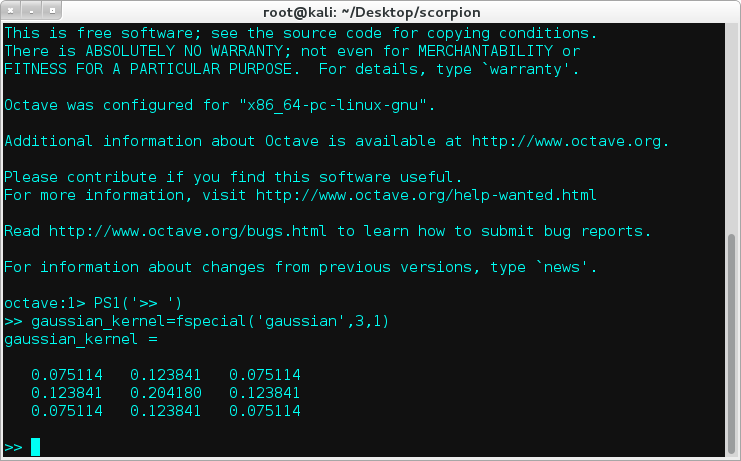

生成一个3x3高斯核。<br>
下面是自己用Octave写的脚本：
```octave
#! /usr/bin/octave

function Usage()
    prog_name=program_name();
    printf('====================================================\n');
    printf('Usage: ./%s [photo_file] [kernel_size]\n',prog_name);
    printf('Eg: ./%s myphoto.png 3\n',prog_name);
    printf('====================================================\n');
    exit;
end

function v=foo(matrix_r,filter)
    v=0;
    tmp=sum(sum(matrix_r.*filter));
    if tmp>255
        tmp=255;
    end
    v=tmp;
end

function [r g b]=RGB(matrix_rgb,filter)
    r=foo(matrix_rgb(:,:,1),filter);
    g=foo(matrix_rgb(:,:,2),filter);
    b=foo(matrix_rgb(:,:,3),filter);
end

argc=nargin;
argv_list=argv();
if argc<2
    Usage();
else
    image_file=argv_list{1};
    % Kernel size
    k=argv_list{2};
end

% Read image data
im=imread(image_file);
[m,n,a]=size(im);
g_im=double(im);

% Show the original image
printf('=============================================\n');
printf('Your original photo:\n');
printf('\nPress any key to continue...\n\n');
imagesc(im);
pause;

% Gaussian Filter
printf('The Gaussian Filter is processing...\n\n');
sigma=1;
w=floor(k/2);
filter=fspecial('gaussian',k,sigma);
for i= w+1:m-w
    for j= w+1:n-w
        [r g b]=RGB( im(i-w:i+w,j-w:j+w,:) , filter );
        g_im(i,j,1)=r;
        g_im(i,j,2)=g;
        g_im(i,j,3)=b;
    end
end

% Show the processed image
printf('The photo after processed:\n');
imagesc(g_im);

% Exit
printf('\nPress any key to quit...\n');
pause;

```

另外这是我用Python写的：
```python
#! /usr/bin/env python
import sys
from matplotlib.pyplot import *
from numpy import *

def Usage():
	print '='*80
	print 'Usage: ./%s [photo_file] [kernel_size]' % sys.argv[0]
	print 'Eg: ./%s myphoto.png 3' % sys.argv[0]
	print '='*80

def fspecial(func_name,kernel_size=3,sigma=1):
	if func_name=='gaussian':
		m=n=(kernel_size-1.)/2.
		y,x=ogrid[-m:m+1,-n:n+1]
		h=exp( -(x*x + y*y) / (2.*sigma*sigma) )
		h[ h < finfo(h.dtype).eps*h.max() ] = 0
		sumh=h.sum()
		if sumh!=0:
			h/=sumh
		return h

def RGB(rgb_mat,g_filter,flag=255):

	def foo(A,B):
		t=sum(A*B)
		if t>flag: return flag
		return t

	return [foo(rgb_mat[:,:,i],g_filter) for i in range(3)]

# Return a Nx3 matrix of pixels
def loadImageData(self,imagefile):
	# If you don't have matplotlib but have PIL,
	# you can use this to load image data.
	from PIL import Image
	im=Image.open(imagefile)
	m,n=im.size
	data=im.getdata()
	imgMat=zeros((m*n,3))

	for i in xrange(m*n):
		imgMat[i]=data[i]

	return imgMat

def GaussianFilter(image_file,k=3):
	# Read image data
	im=imread(image_file)
	m,n,a=im.shape
	g_im=im.copy()
	print 'Load Image Data Successful!'
	
	# Initial
	if im.max()>1:
		flag=255
	else:
		flag=1
	sigma=1
	w=k/2
	g_filter=fspecial('gaussian',k,sigma)
	print 'Gaussian Kernel is setup.'

	print 'The Gaussian Filter is processing...'
	for i in xrange(w,m-w):
		for j in xrange(w,n-w):
			t=RGB(im[i-w:i+w+1,j-w:j+w+1],g_filter,flag)
			g_im[i,j]=t

	print 'Finished.'
	print 'Show the photo.'
	subplot(121)
	title('Original')
	imshow(im)
	subplot(122)
	title('Filtered')
	imshow(g_im)
	show()

if __name__=='__main__':
	argc=len(sys.argv)
	if argc<3:
		Usage()
	else:
		image_file=sys.argv[1]
		# Kernel size
		k=int(sys.argv[2])

		GaussianFilter(image_file,k)
```

最后附上C++代码：
```c++
/** 
** method to remove noise from the corrupted image by gaussian filter value 
* @param corrupted input grayscale binary array with corrupted info 
* @param smooth output data for smooth result, the memory need to be allocated outside of the function 
* @param width width of the input grayscale image 
* @param height height of the input grayscale image 
*/  
void gaussianFilter2 (unsigned char* corrupted, unsigned char* smooth, int width, int height)  
{
    int templates[25] = { 1, 4, 7, 4, 1,   
                          4, 16, 26, 16, 4,   
                          7, 26, 41, 26, 7,  
                          4, 16, 26, 16, 4,   
                          1, 4, 7, 4, 1 };        

    memcpy ( smooth, corrupted, width*height*sizeof(unsigned char) );  
    for (int j=2;j<height-2;j++)  
    {  
        for (int i=2;i<width-2;i++)
        {
            int sum = 0;
            int index = 0;
            for ( int m=j-2; m<j+3; m++)
            {  
                for (int n=i-2; n<i+3; n++)
                {  
                    sum += corrupted [ m*width + n] * templates[index++];
                }
            }
            sum /= 273;
            if (sum > 255)
                sum = 255;
            smooth [ j*width+i ] = sum;
        }
    }
}
```

### 为何选择高斯滤波
有以下几点原因：
- 高斯函数是单值函数。即高斯函数在各个方向的平滑程度是相同的。
- 高斯函数具有旋转不变的特性，主要是因为它在工作的时候是用像素邻域的加权均值来代替该点的像素值。
- 高斯函数的傅立叶变换频谱是单瓣的，它能够去除高频信号同时又保留有用的信号。
- 高斯函数的参数sigma决定了平滑程度。sigma越大，平滑的就越厉害。
- 二维高斯函数卷积可以分两步来进行，首先将图像与一维高斯函数进行卷积，然后将卷积结果与方向垂直的相同一维高斯函数卷积。因此，二维高斯滤波的计算量随滤波模板宽度成线性增长而不是成平方增长。

### 话在最后
说真的，想不明白，一个用来去噪的算法，究竟是如何被利用来去除录像中的静止画面。<br>
再说了，现在监控设备一般采用动态侦测录像，就是在画面面有变化时才会录像，没有变化时是不录像的。<br>
至于如何判断画面变化，且听下回道来。

### Reference
[0].[图像处理－线性滤波－3 高斯滤波器](http://www.cnblogs.com/pegasus/archive/2011/05/20/2052031.html)<br>
[1].[高斯图像滤波原理及其编程离散化实现方法](http://blog.csdn.net/likezhaobin/article/details/6835049)<br>
[2].[高斯平滑 高斯模糊 高斯滤波器 ( Gaussian Smoothing, Gaussian Blur, Gaussian Filter ) C++ 实现](http://blog.csdn.net/hhygcy/article/details/4329056)<br>
[3].[读OpenCV之小侃高斯滤波](http://blog.csdn.net/xizero00/article/details/6719915)<br>
[4].[影像卷积和滤波运算（高斯滤波模板）](http://www.360doc.com/content/12/0921/16/10724725_237423041.shtml)
