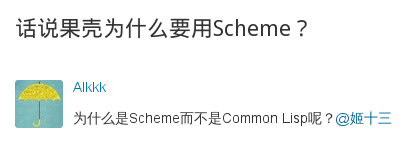
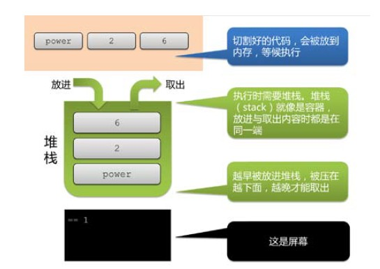
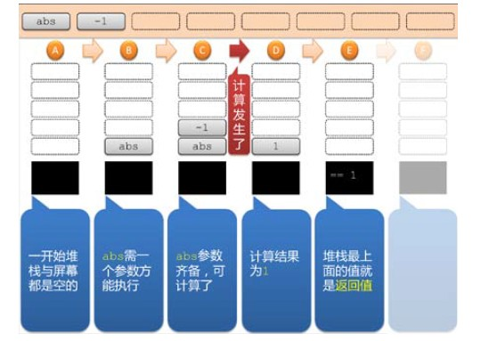
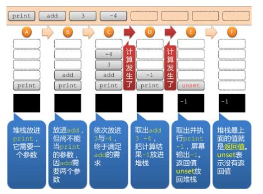
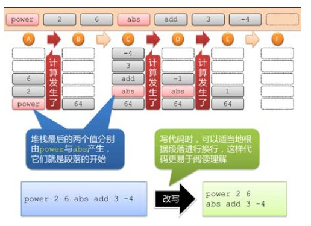
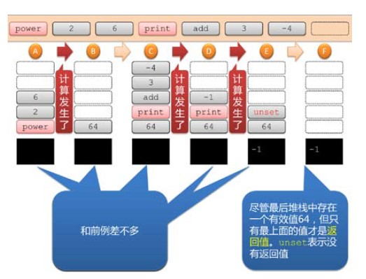
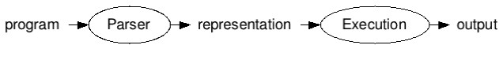
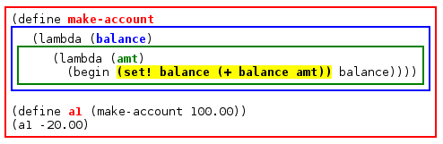
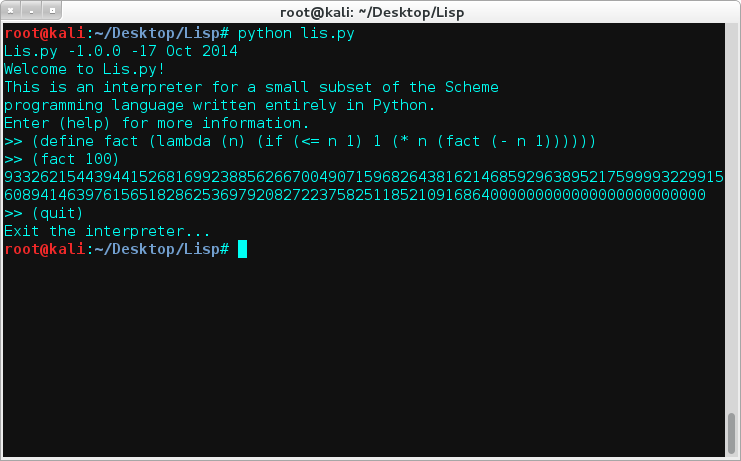

一个简易Lisp解释器
==================

### Lisp
Lisp，最初被拼为LISP(是"Lots of Irritating Silly Parentheses"——"大量恼人、愚蠢的括号"的缩写)，一个历史悠久的电脑编程语言家族，以波兰表示法编写。最早由约翰·麦卡锡在1958年基于λ演算创造，是历史第二悠久的高级语言，仅次于Fortran。也是第一个函数式编程语言。

其名称源自列表处理器（英语：List Processor）的缩写。LISP有很多种方言，各个实现中的语言不完全一样。LISP语言的主要现代版本包括Common Lisp, Scheme以及Clojure。1980年代盖伊·史提尔二世编写了Common Lisp试图进行标准化，这个标准被大多数解释器和编译器所接受。还有一种是编辑器Emacs所派生出来的Emacs Lisp（而Emacs正是用Lisp作为扩展语言进行功能扩展的）非常流行，并创建了自己的标准。

LISP是第一个函数型编程语言，区别于C/Java等命令型编程语言。<br>
由于历史的原因，Lisp长期以来被认为主要用于AI领域，但Lisp并不是为AI而设计，而是一种通用的编程语言。

Lisp的表达式是一个原子（atom）或表（list），原子（atom）又包含符号（symbol）与数值（number）；表是由零个或多个表达式组成的序列，表达式之间用空格分隔开，放入一对括号中，如：
```lisp
abc
()
(abc xyz)
(a b (c) d)
```
最后一个表是由四个元素构成的，其中第三个元素本身也是一个表，这种list又称为嵌套表（nested list）。

### Scheme
Scheme是Lisp的两种主要方言之一（另一种为Common Lisp）。不同于Common Lisp，Scheme遵循极简主义哲学，以一个小型语言核心作为标准，加上各种强力语言工具（语法糖）来扩展语言本身。

Scheme最早由麻省理工学院的盖伊·史提尔二世与杰拉德·杰伊·萨斯曼在1970年代发展出来，并由两人发表的"λ论文集"推广开来。<br> Scheme语言与λ演算关系十分密切。小写字母"λ"是Scheme语言的标志。

Scheme的哲学是：设计计算机语言不应该进行功能的堆砌，而应该尽可能减少弱点和限制，使剩下的功能显得必要。Scheme是第一个使用静态作用域的Lisp方言，也是第一个引入"干净宏"和第一类续延的编程语言。

尽管Java，C#，C++满天下，但是不要小瞧了Scheme，据说有一个Geek宅男聚集地使用Scheme写的：



### Interpreter
解释器是一种电脑程序，能够把高级编程语言一行一行直接转译运行。解释器不会一次把整个程序转译出来，只像一位"中间人"，每次运行程序时都要先转成另一种语言再作运行，因此解释器的程序运行速度比较缓慢。它每转译一行程序叙述就立刻运行，然后再转译下一行，再运行，如此不停地进行下去。

下面以详细的图示对解释器一个完整解释：









### Build a Scheme Interpreter
下面我们就来实现Lisp方言Scheme的一个子集的解释器。

大多数计算机语言都有许多语法规约 (例如关键字、中缀操作符、括号、操作符优先级、点标记、分号等等)，但是，作为Lisp语言家族中的一员，Scheme所有的语法都是基于包含在括号中的、采用前缀表示列表的。
```scheme
/* Scheme */
(if (> (val x) 0)
    (set! z (f (+ (* a (val x)) b))))
```
首先定义一下将要实现的Scheme子集的语法和语义。<br>
Scheme的优美之处就在于我们只需要六种特殊形式，以及另外的三种语法构造——变量、常量和过程调用。


一个语言解释器包括两部分：
- 解析(Parsing)：解析部分接受一个使用字符序列表示的输入程序，根据语言的语法规则对输入程序进行验证，然后将程序翻译成一种中间表示。在一个简单的解释器中，中间表示是一种树结构，紧密地反映了源程序中语句或表达式的嵌套结构。在一种称为编译器的语言翻译器中，内部表示是一系列可以直接由计算机执行的指令。正如Steve Yegge所说，"如果你不明白编译器的工作方式，那么你不会明白计算机的工作方式。"Yegge介绍了编译器可以解决的8种问题。这里我们的解析器由parse函数实现。
- 执行：程序的内部表示(由解释器)根据语言的语义规则进行进一步处理，进而执行源程序的实际运算。执行部分由eval函数实现。



下面则是一个运用的实例：
```
>> program = "(begin (define r 3) (* 3.141592653 (* r r)))"
 
>> parse(program)
['begin', ['define', 'r', 3], ['*', 3.141592653, ['*', 'r', 'r']]]
 
>> eval(parse(program))
28.274333877
```

### Parsing
我们先实现parse函数。

解析通常分成两个部分：词法分析和语法分析。前者将输入字符串分解成一系列的词法单元(token)；后者将词法单元组织成一种中间表示。工作形式如下：
```
>> program = "(set! x*2 (* x 2))"
 
>> tokenize(program)
['(', 'set!', 'x*2', '(', '*', 'x', '2', ')', ')']
 
>> parse(program)
['set!', 'x*2', ['*', 'x', 2]]
```
词法分析很简单就可以实现，唯一注意的就是在(源程序中)括号的两边添加空格：
```python
def tokenize(program):
	return [i for i in program.replace('(',' ( ').replace(')',' ) ').split(' ') if i]
```
接下来是语法分析。我们已经看到，Lisp的语法很简单。但是，一些Lisp解释器允许接受表示列表的任何字符串作为一个程序，从而使得语法分析的工作更加简单。换句话说，字符串(set! 1 2)可以被接受为是一个语法上有效的程序，只有当执行的时候解释器才会抱怨set!的第一个参数应该是一个符号，而不是数字。在Java或者Python中，与之等价的语句1 = 2将会在编译时被认定是错误。另一方面，Java和Python并不需要在编译时检测出表达式x/0是一个错误，因此，如你所见，一个错误应该何时被识别并没有严格的规定。使用read_tokens函数来实现parse函数，前者用以读取任何的表达式(数字、符号或者嵌套列表)。
```python
def parse(program):
	return read_tokens(tokenize(program))
```
tokenize函数获取一系列词法单元，parse通过在这些词法单元上调用read_tokens函数来进行工作。给定一个词法单元的列表，我们首先查看第一个词法单元；如果它是一个`)`，那么这是一个语法错误。如果它是一个`(`，那么我们开始构建一个表达式列表，直到我们读取一个匹配的`)`。所有其它的(词法单元)必须是符号或者数字，它们自身构成了一个完整的列表。
```python
def read_tokens(tokens):
	if len(tokens)==0:
		raise SyntaxError('unexpected EOF while reading')
	token=tokens.pop(0)
	if '('==token:
		L=[]
		while tokens[0]!=')':
			L.append(read_tokens(tokens))
		tokens.pop(0) # pop off ')'
		return L
	elif ')'==token:
		raise SyntaxError('unexpected )')
	else:
		return atom(token)
```
剩下的需要注意的就是要了解2代表一个整数，2.0代表一个浮点数，而x代表一个符号。我们将区分这些情况的工作去完成：对于每一个不是括号也不是引用(quote)的词法单元，我们首先尝试将它解释为一个int，然后尝试float，最后尝试将它解释为一个符号。
```python
def atom(token):
	try:
		return int(token)
	except Exception:
		try:
			return float(token)
		except Exception:
			return str(token)
```

### Eval
下面是eval函数的定义。对于我们定义的九种情况，每一种都有一至三行代码：
```python
def eval(x,env=global_env):
	isa=isinstance
	Symbol=str

	if isa(x,Symbol):			# variable reference
		return env.find(x)[x]
	elif not isa(x,list):		# constant literal
		return x
	elif x[0]=='quote':			# (quote exp)
		(_,exp)=x
		return exp
	elif x[0]=='if':			# (if test conseq alt)
		(_,test,conseq,alt)=x
		return eval((conseq if eval(test,env) else alt),env)
	elif x[0]=='set!':			# (set! var exp)
		(_,var,exp)=x
		env.find(var)[var]=eval(exp,env)
	elif x[0]=='define':		# (define var exp)
		(_,var,exp)=x
		env[var]=eval(exp,env)
	elif x[0]=='lambda':		# (lambda (var*) exp)
		(_,vars,exp)=x
		return lambda *args:eval(exp,Env(vars,args,env))
	elif x[0]=='begin':			# (begin exp*)
		for exp in x[1:]:
			val=eval(exp,env)
		return val
	else:						# (proc exp*)
		exps=[eval(exp,env) for exp in x]
		proc=exps.pop(0)
		return proc(*exps)
```
Environments只是从符号到符号所代表的值的映射而已。一个新的符号/值绑定由一个define语句或者一个过程定义(lambda表达式)添加。<br>
这里通过一个例子来观察定义然后调用一个Scheme过程的时候所发生的事情:
```
>> (define area (lambda (r) (* 3.141592653 (* r r))))
>> (area 3)
28.274333877
```
当我们对`(lambda (r) (* 3.141592653 (* r r)))`进行求值时，我们在eval函数中执行`elif x[0] == 'lambda'`分支，将`(_, vars, exp)`三个变量分别赋值为列表x的对应元素 (如果x的长度不是3，就抛出一个错误)。然后，我们创建一个新的过程，当该过程被调用的时候，将会对表达式`['*', 3.141592653 ['*', 'r', 'r']]`进行求值，该求值过程的环境 (environment) 是通过将过程的形式参数 (该例中只有一个参数，r) 绑定为过程调用时所提供的实际参数，外加当前环境中所有不在参数列表 (例如，变量*) 的变量组成的。新创建的过程被赋值给global_env中的area变量。

那么，当我们对`(area 3)`求值的时候发生了什么呢？因为area并不是任何表示特殊形式的符号之一，它必定是一个过程调用 (eval函数的最后一个else:分支)，因此整个表达式列表都将会被求值，每次求值其中的一个。对area进行求值将会获得我们刚刚创建的过程；对3进行求值所得的结果就是3。然后我们 (根据eval函数的最后一行) 使用参数列表[3]来调用这个新创建的过程。也就是说，对exp(也就是`['*', 3.141592653 ['*', 'r', 'r']]`)进行求值，并且求值所在的环境中r的值是3，并且外部环境是全局环境，因此*是乘法过程。

现在，解释一下Env类的细节：
```python
class Env(dict):

    def __init__(self, parms=(), args=(), outer=None):
        # Bind parm list to corresponding args, or single parm to list of args
        self.outer = outer
        if isa(parms, Symbol): 
            self.update({parms:list(args)})
        else: 
            if len(args) != len(parms):
                raise TypeError('expected %s, given %s, ' 
                                % (to_string(parms), to_string(args)))
            self.update(zip(parms,args))

    def find(self, var):
        "Find the innermost Env where var appears."
        if var in self: return self
        elif self.outer is None: raise LookupError(var)
        else: return self.outer.find(var)
```
注意Env是dict的一个子类，也就是说，通常的字典操作也适用于Env类。除此之外，该类还有两个方法，构造函数`__init__`和`find`函数，后者用来为一个变量查找正确的环境。理解这个类的关键(以及我们需要一个类，而不是仅仅使用dict的根本原因)在于外部环境(outer environment)这个概念。考虑下面这个程序：



每个矩形框都代表了一个环境，并且矩形框的颜色与环境中最新定义的变量的颜色相对应。在程序的最后两行我们定义了a1并且调用了(a1 -20.00)；这表示创建一个开户金额为100美元的银行账户，然后是取款20美元。在对(a1 -20.00)求值的过程中，我们将会对黄色高亮表达式进行求值，该表达式中具有三个变量。amt可以在最内层(绿色)环境中直接找到。但是balance在该环境中没有定义：我们需要查看绿色环境的外层环境，也就是蓝色环境。最后，+代表的变量在这两个环境中都没有定义；我们需要进一步查看外层环境，也就是全局(红色)环境。先查找内层环境，然后依次查找外部的环境，我们把这一过程称之为词法定界(lexical scoping)。

剩下的就是要定义全局环境。该环境需要包含+过程以及所有其它Scheme的内置过程。我们并不打算实现所有的内置过程，但是，通过导入Python的math模块，我们可以获得一部分这些过程，然后我们可以显式地添加20种常用的过程：
```python
def add_globals(env):
	import math, operator as op
	env.update(vars(math))
	env.update({
		'+':op.add, '-':op.sub, '*':op.mul, '/':op.div, 'not':op.not_,
    	'>':op.gt, '<':op.lt, '>=':op.ge, '<=':op.le, '=':op.eq, 
    	'equal?':op.eq, 'eq?':op.is_, 'length':len, 'cons':lambda x,y:[x]+y,
    	'car':lambda x:x[0],'cdr':lambda x:x[1:], 'append':op.add,  
    	'list':lambda *x:list(x), 'list?': lambda x:isa(x,list), 
    	'null?':lambda x:x==[], 'symbol?':lambda x: isa(x, Symbol)
		})
	return env

global_env=add_globals(Env())
```

### Add Interaction
最后，我们将要添加一个函数to_string，用来将一个表达式重新转换成Lisp可读的字符串；以及一个函数repl，该函数表示read-eval-print-loop (读取-求值-打印循环)，用以构成一个交互式的Lisp解释器：
```python
def repl(prompt='>> '):
	banner()
	while 1:
		program=raw_input(prompt)
		if program:
			if program=='(quit)' or program=='(exit)':
				quit()
				break
			elif program=='(help)':
				help()
				continue
			val=eval(parse(program))
			if val is not None: print to_string(val)

def to_string(exp):
	return '('+' '.join(map(to_string, exp))+')' if isa(exp, list) else str(exp)

def banner():
	print 'Lis.py -1.0.0 -17 Oct 2014'
	print 'Welcome to Lis.py!'
	print 'This is an interpreter for a small subset of the Scheme'
	print 'programming language written entirely in Python.'
	print 'Enter (help) for more information.'

def help():
	print 'Lip.py Help'
	print '==========='
	print 'Welcome to Lis.py!'
	print 'This is an interpreter for a small subset of the Scheme programming'
	print 'language written entirely in Python. Edited by Uri.'
	print 'Usage:'
	print '(help) :for help'
	print '(quit) or (exit) :to quit the lisp interpreter'

def quit():
	print 'Exit the interpreter...'
```
下面以一个阶乘例子演示：



### 最后的絮语
如果你想实现高端版的Scheme解释器，原文作者在此基础上更加完善了一些功能，新增了`string`,`boolean`,`complex`,`port`等类型，以及`strings`,`comments`,`quotes`,`# literals`,`call`等语法。详细请看第六条参考的文章。<br>
如果看了本文你想动手试一试，[这里](http://www.cs.virginia.edu/~evans/cs1120-f09/ps/ps7/)有一个virginia大学的作业，用Python完成Scheme解释器的实现，有详细的指导。<br>
如果想练习Lisp，可以看这里[bubble-dancer.jp](http://bubble-dancer.jp/)，这是一个在线的Scheme解释器，js实现。

### Reference
[0]. [LISP - 维基百科，自由的百科全书](http://zh.wikipedia.org/wiki/LISP)<br>
[1]. [Scheme - 维基百科，自由的百科全书](http://zh.wikipedia.org/wiki/Scheme)<br>
[2]. [解释器原理](http://blog.csdn.net/broadview2006/article/details/7827641)<br>
[4]. [如何使用Python编写一个Lisp解释器](http://blog.jobbole.com/47659/)<br>
[5]. [(How to Write a (Lisp) Interpreter (in Python))](http://norvig.com/lispy.html)<br>
[6]. [(An ((Even Better) Lisp) Interpreter (in Python))](http://norvig.com/lispy2.html)<br>
[7]. [cs1120 Problem Set 7:Charming Snakes with Mesmerizing Memoizers](http://www.cs.virginia.edu/~evans/cs1120-f09/ps/ps7/)