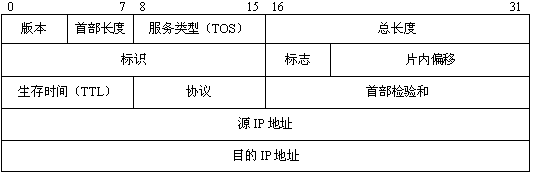
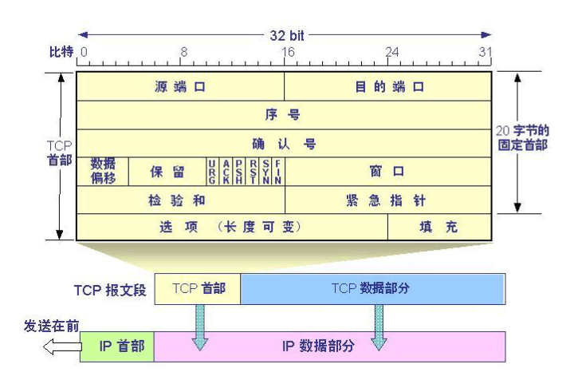
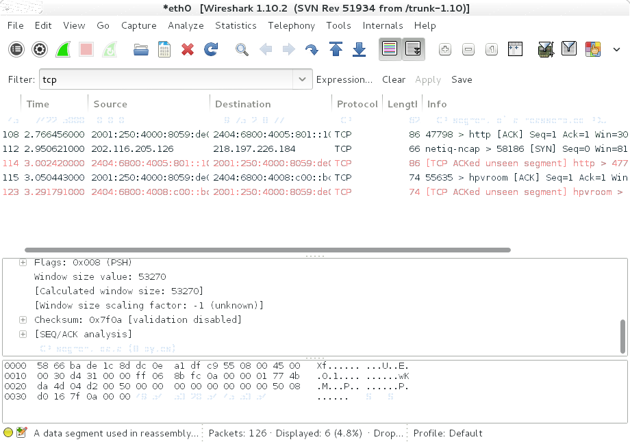

Python伪造TCP数据包
===================

### TCP/IP数据包
TCP协议被广泛运用于互联网上的数据传输，它是一种面向连接（连接导向）的、可靠的、基于IP的传输层协议。<br>
一个数据包由IP头部信息、TCP/UDP头部信息和数据构成：
```
Packet = IP Header + TCP/UDP Header + Data
```

大多数操作系统的socket API都支持包注入（尤其是基于Berkeley Sockets的），微软在windows xp之后为了避免包嗅探限制了原始套接字的能力。此文只适用于UNIX/类UNIX系统。

IP头部格式：
```
|  0 1 2 3 4 5 6 7 8               16              24              31 |
|  +-+-+-+-+-+-+-+-+-+-+-+-+-+-+-+-+-+-+-+-+-+-+-+-+-+-+-+-+-+-+-+-+  |
|  Version | IHL | Type of Service |           Total Length           |
|  +-+-+-+-+-+-+-+-+-+-+-+-+-+-+-+-+-+-+-+-+-+-+-+-+-+-+-+-+-+-+-+-+  |
|          Identification          | Flags |      Fragment Offset     |
|  +-+-+-+-+-+-+-+-+-+-+-+-+-+-+-+-+-+-+-+-+-+-+-+-+-+-+-+-+-+-+-+-+  |
|    Time to Live  |    Protocol   |           Header Checksum        |
|  +-+-+-+-+-+-+-+-+-+-+-+-+-+-+-+-+-+-+-+-+-+-+-+-+-+-+-+-+-+-+-+-+  |
|                               Source Address                        |
|  +-+-+-+-+-+-+-+-+-+-+-+-+-+-+-+-+-+-+-+-+-+-+-+-+-+-+-+-+-+-+-+-+  |
|                          Destination Address                        |
|  +-+-+-+-+-+-+-+-+-+-+-+-+-+-+-+-+-+-+-+-+-+-+-+-+-+-+-+-+-+-+-+-+  |
|                        Options                   |     Padding      |
|  +-+-+-+-+-+-+-+-+-+-+-+-+-+-+-+-+-+-+-+-+-+-+-+-+-+-+-+-+-+-+-+-+  |
```


TCP头部格式：
```
|  0 1 2 3 4 5 6 7 8               16              24              31 |
|  +-+-+-+-+-+-+-+-+-+-+-+-+-+-+-+-+-+-+-+-+-+-+-+-+-+-+-+-+-+-+-+-+  |
|           Source Port            |         Destination Port         |
|  +-+-+-+-+-+-+-+-+-+-+-+-+-+-+-+-+-+-+-+-+-+-+-+-+-+-+-+-+-+-+-+-+  |
|                           Sequence Number                           |
|  +-+-+-+-+-+-+-+-+-+-+-+-+-+-+-+-+-+-+-+-+-+-+-+-+-+-+-+-+-+-+-+-+  |
|                        Acknowledgment Number                        |
|  +-+-+-+-+-+-+-+-+-+-+-+-+-+-+-+-+-+-+-+-+-+-+-+-+-+-+-+-+-+-+-+-+  |
|    Data  |           |U|A|P|R|S|F|                                  |
|   Offset | Reserved  |R|C|S|S|Y|I|               Window             |
|          |           |G|K|H|T|N|N|                                  |
|  +-+-+-+-+-+-+-+-+-+-+-+-+-+-+-+-+-+-+-+-+-+-+-+-+-+-+-+-+-+-+-+-+  |
|             Checksum             |          Urgent Pointer          |
|  +-+-+-+-+-+-+-+-+-+-+-+-+-+-+-+-+-+-+-+-+-+-+-+-+-+-+-+-+-+-+-+-+  |
|                       Options                    |      Padding     | 
|  +-+-+-+-+-+-+-+-+-+-+-+-+-+-+-+-+-+-+-+-+-+-+-+-+-+-+-+-+-+-+-+-+  |
|                                 data                                |
|  +-+-+-+-+-+-+-+-+-+-+-+-+-+-+-+-+-+-+-+-+-+-+-+-+-+-+-+-+-+-+-+-+  |
```
- Source Port是源端口，16位。
- Destination Port是目的端口，16位。
- Sequence Number是发送数据包中的第一个字节的序列号，32位。
- Acknowledgment Number是确认序列号，32位。
- Data Offset是数据偏移，4位，该字段的值是TCP首部（包括选项）长度乘以4。
- 标志位： 6位，URG表示Urgent Pointer字段有意义：
    ACK表示Acknowledgment Number字段有意义
    PSH表示Push功能，RST表示复位TCP连接
    SYN表示SYN报文（在建立TCP连接的时候使用）
    FIN表示没有数据需要发送了（在关闭TCP连接的时候使用）
- Window表示接收缓冲区的空闲空间，16位，用来告诉TCP连接对端自己能够接收的最大数据长度。
- Checksum是校验和，16位。
- Urgent Pointers是紧急指针，16位，只有URG标志位被设置时该字段才有意义，表示紧急数据相对序列号（Sequence Number字段的值）的偏移。


### Socket
套接字是为特定网络协议（例如TCP/IP，ICMP/IP，UDP/IP等）套件对上的网络应用程序提供者提供当前可移植标准的对象。它们允许程序接受并进行连接，如发送和接受数据。为了建立通信通道，网络通信的每个端点拥有一个套接字对象极为重要。

套接字为BSD UNIX系统核心的一部分，而且他们也被许多其他类似UNIX的操作系统包括Linux所采纳。许多非BSD UNIX系统（如ms-dos，windows，os/2，mac os及大部分主机环境）都以库形式提供对套接字的支持。

三种最流行的套接字类型是:stream，datagram和raw。stream和datagram套接字可以直接与TCP协议进行接口，而raw套接字则接口到IP协议，但套接字并不限于TCP/IP。

在python中我们使用socket模块，为了建立一个可以自己构造数据的包，我们使用`SOCK_RAW`这种socket格式，使用`IPPROTO_RAW`协议，它会告诉系统我们将提供网络层和传输层。
```python
s = socket.socket(socket.AF_INET,socket.SOCK_RAW,)
```
IP头部信息构造类:
```python
class ip():

    def __init__(self, source, destination):
        self.version = 4
        self.ihl = 5 # Internet Header Length
        self.tos = 0 # Type of Service
        self.tl = 0 # total length will be filled by kernel
        self.id = 54321
        self.flags = 0 # More fragments
        self.offset = 0
        self.ttl = 255
        self.protocol = socket.IPPROTO_TCP
        self.checksum = 0 # will be filled by kernel
        self.source = socket.inet_aton(source)
        self.destination = socket.inet_aton(destination)

    def pack(self):
        ver_ihl = (self.version << 4) + self.ihl
        flags_offset = (self.flags << 13) + self.offset
        ip_header = struct.pack("!BBHHHBBH4s4s",
                    ver_ihl,
                    self.tos,
                    self.tl,
                    self.id,
                    flags_offset,
                    self.ttl,
                    self.protocol,
                    self.checksum,
                    self.source,
                    self.destination)
```
TCP头部信息构造类:
```python
class tcp():

    def __init__(self, srcp, dstp):
        self.srcp = srcp
        self.dstp = dstp
        self.seqn = 0
        self.ackn = 0
        self.offset = 5 # Data offset: 5x4 = 20 bytes
        self.reserved = 0
        self.urg = 0
        self.ack = 0
        self.psh = 1
        self.rst = 0
        self.syn = 0
        self.fin = 0
        self.window = socket.htons(5840)
        self.checksum = 0
        self.urgp = 0
        self.payload = ""

    def pack(self, source, destination):
        data_offset = (self.offset << 4) + 0
        flags = self.fin + (self.syn << 1) + (self.rst << 2) + (self.psh << 3) + (self.ack << 4) + (self.urg << 5)
        tcp_header = struct.pack("!HHLLBBHHH",
                     self.srcp,
                     self.dstp,
                     self.seqn,
                     self.ackn,
                     data_offset,
                     flags, 
                     self.window,
                     self.checksum,
                     self.urgp)
        #pseudo header fields
        source_ip = source
        destination_ip = destination
        reserved = 0
        protocol = socket.IPPROTO_TCP
        total_length = len(tcp_header) + len(self.payload)
        # Pseudo header
        psh = struct.pack("!4s4sBBH",
              source_ip,
              destination_ip,
              reserved,
              protocol,
              total_length)
        psh = psh + tcp_header + self.payload
        tcp_checksum = checksum(psh)
        tcp_header = struct.pack("!HHLLBBH",
                  self.srcp,
                  self.dstp,
                  self.seqn,
                  self.ackn,
                  data_offset,
                  flags,
                  self.window)
        tcp_header+= struct.pack("H", tcp_checksum) + struct.pack("!H", self.urgp)
```
校验函数：
```python
def checksum(data):
    s = 0
    n = len(data) % 2
    for i in range(0, len(data)-n, 2):
        s+= ord(data[i]) + (ord(data[i+1]) << 8)
    if n:
        s+= ord(data[i+1])
    while (s >> 16):
        print("s >> 16: ", s >> 16)
        s = (s & 0xFFFF) + (s >> 16)
    print("sum:", s)
    s = ~s & 0xffff
```
下面发送一个，然后用wireshark抓一下包：



能看到成功发出。<br>
完整例子：
```
#! /usr/bin/env python
import socket
import struct

def checksum(data):
    s = 0
    n = len(data) % 2
    for i in range(0, len(data)-n, 2):
        s+= ord(data[i]) + (ord(data[i+1]) << 8)
    if n:
        s+= ord(data[i+1])
    while (s >> 16):
        s = (s & 0xFFFF) + (s >> 16)
    s = ~s & 0xffff
    return s

class ip():

    def __init__(self, source, destination):
        self.version = 4
        self.ihl = 5 # Internet Header Length
        self.tos = 0 # Type of Service
        self.tl = 0 # total length will be filled by kernel
        self.id = 54321
        self.flags = 0 # More fragments
        self.offset = 0
        self.ttl = 255
        self.protocol = socket.IPPROTO_TCP
        self.checksum = 0 # will be filled by kernel
        self.source = socket.inet_aton(source)
        self.destination = socket.inet_aton(destination)

    def pack(self):
        ver_ihl = (self.version << 4) + self.ihl
        flags_offset = (self.flags << 13) + self.offset
        ip_header = struct.pack("!BBHHHBBH4s4s",
                    ver_ihl,
                    self.tos,
                    self.tl,
                    self.id,
                    flags_offset,
                    self.ttl,
                    self.protocol,
                    self.checksum,
                    self.source,
                    self.destination)
        return ip_header

class tcp():

    def __init__(self, srcp, dstp):
        self.srcp = srcp
        self.dstp = dstp
        self.seqn = 0
        self.ackn = 0
        self.offset = 5 # Data offset: 5x4 = 20 bytes
        self.reserved = 0
        self.urg = 0
        self.ack = 0
        self.psh = 1
        self.rst = 0
        self.syn = 0
        self.fin = 0
        self.window = socket.htons(5840)
        self.checksum = 0
        self.urgp = 0
        self.payload = ""

    def pack(self, source, destination):
        data_offset = (self.offset << 4) + 0
        flags = self.fin + (self.syn << 1) + (self.rst << 2) + (self.psh << 3) + (self.ack << 4) + (self.urg << 5)
        tcp_header = struct.pack("!HHLLBBHHH",
                     self.srcp,
                     self.dstp,
                     self.seqn,
                     self.ackn,
                     data_offset,
                     flags, 
                     self.window,
                     self.checksum,
                     self.urgp)
        #pseudo header fields
        source_ip = source
        destination_ip = destination
        reserved = 0
        protocol = socket.IPPROTO_TCP
        total_length = len(tcp_header) + len(self.payload)
        # Pseudo header
        psh = struct.pack("!4s4sBBH",
              source_ip,
              destination_ip,
              reserved,
              protocol,
              total_length)
        psh = psh + tcp_header + self.payload
        tcp_checksum = checksum(psh)
        tcp_header = struct.pack("!HHLLBBH",
                  self.srcp,
                  self.dstp,
                  self.seqn,
                  self.ackn,
                  data_offset,
                  flags,
                  self.window)
        tcp_header+= struct.pack("H", tcp_checksum) + struct.pack("!H", self.urgp)
        return tcp_header

def test(source,site,data):
	s = socket.socket(socket.AF_INET,
                  socket.SOCK_RAW,
                  socket.IPPROTO_RAW)
	src_host=source
	dest_host=socket.gethostbyname(site)
	# IP Header
	ipobj=ip(src_host,dest_host)
	iph=ipobj.pack()
	# TCP Header
	tcpobj=tcp(1234,80)
	tcpobj.data_length=len(data)
	tcph=tcpobj.pack(ipobj.source,ipobj.destination)
	# Injection
	packet=iph+tcph+data
	s.sendto(packet,(dest_host,80))
	s.close()

if __name__ == '__main__':
	test("10.0.0.1","www.baidu.com","ITS TEST")
```

### Reference
[0]. [使用Python进行TCP数据包注入（伪造）](http://www.freebuf.com/articles/network/41127.html)<br>
[1]. [TCP/IP协议头部结构体（网摘小结）](http://blog.csdn.net/ithomer/article/details/5662383)<br>
[2]. [TCP数据包格式](http://wenku.baidu.com/link?url=XLSOWOC-0txZDBze4KR7EP6DOGjJFP_-n2WC3g5DwK618pyMukjY6wAVUSBwDuGV5vJiuAAFC0wMkwQzh-CpmRwQ1oRVKHQHdCBXwBUJhj3)<br>
[3]. [Python socket编程](http://blog.sina.com.cn/s/blog_523491650100hikg.html)<br>
[4]. [Python使用struct处理二进制](http://www.cnblogs.com/gala/archive/2011/09/22/2184801.html)