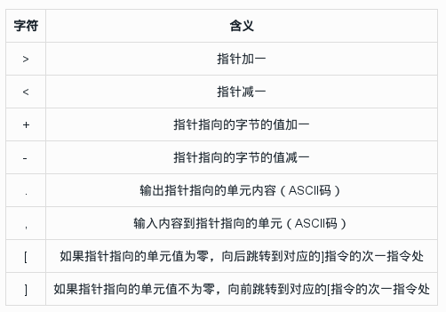
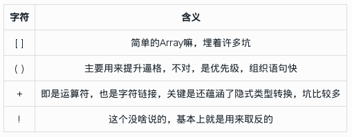
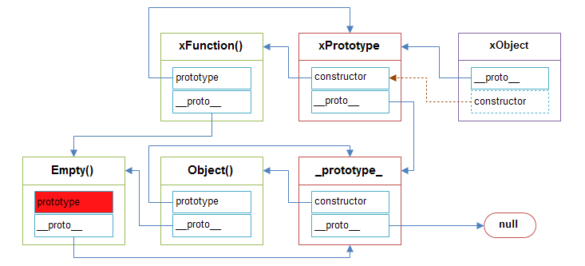

# JS Brainfuck

### Preface
今天无意中在Alloyteam上看到一篇文章，大感兴趣，请原谅我的愚昧无知，到现在才知道js还可以这样玩。<br>
原文是对一道XSS题的解析过程，本文则来谈谈js的brainfuck化之路。
先看看那道题目：
```js
(function escape(input) {
    input = input.replace(/[;\\\/<>a-zA-Z]/g, "_").slice(0,1500);
    return "<script>[][([![]]+[])[++[++[++[[]][+[]]][+[]]][+[]]]+([]+{})[++[[]][+[]]]+([!![]]+[])[++[[]][+[]]]+([!![]]+[])[+[]]]"+input+"</script> ";
})('?')
```
是不是被这一长串字符给看晕了，好吧，这简直就不是人看的！
```js
[][([![]]+[])[++[++[++[[]][+[]]][+[]]][+[]]]+([]+{})[++[[]][+[]]]+([!![]]+[])[++[[]][+[]]]+([!![]]+[])[+[]]]
```
放心，看完本文，保证你也会流利的手写一个这个。

### Brainfuck
好吧，先介绍brainfuck语言。Brainfuck，是一种极小化的计算机语言，它是由Urban Müller在1993年创建的。

Müller的目标是创建一种简单的、可以用最小的编译器来实现的、符合图灵完全思想的编程语言。这种语言由八种运算符构成，为Amiga机器编写的编译器只有240个字节大小。

就象它的名字所暗示的，brainfuck程序很难读懂。尽管如此，brainfuck图灵机一样可以完成任何计算任务。虽然brainfuck的计算方式如此与众不同，但它确实能够正确运行。

这种语言基于一个简单的机器模型，除了指令，这个机器还包括：一个以字节为单位、被初始化为零的数组、一个指向该数组的指针（初始时指向数组的第一个字节）、以及用于输入输出的两个字节流。

下面是这八种状态的描述，其中每个状态由一个字符标识：



Helloworld:
```brainfuck
++++++++++[>+++++++>++++++++++>+++>+<<<<-]>++.>+.+++++++..+++.>++.<<+++++++++++++++.>.+++.------.--------.>+.>.
```

### 第 0 条军规
首先请看好本文的游戏设定：
1.不能使用任何英文字母
2.不能使用任何数字
3.不能使用` ? , : , @ , # , % , & , ^ , * , - , = `等符号
好吧，那我们能使用什么呢？

在BF语言中，用到了八种状态描述符。而在Javascript里，我们也可以用到下列八种字符：
```js
[ ] ( ) { } + !
```
可是不能降低自身的逼格啊，所以本文以下将只使用到下列六种符号：
```js
[ ] ( ) + !
```
友情提示：八种字符可以实现同样的功能，并且长度至少减少一半。

### Ramp Up
热个身先，熟悉一下上述六种符号在Javascript中常见的用法：



看了上面这些你会感到困惑，尼玛用这几个也能写个hello world? 可是万万没想到啊，居然真的能，更能写出猥琐的弹窗流。

以下给出Javascript的第一公设，并在此基础上推导出两个定理来构建整个大厦。<br>
第一公设：
```
Array   =>  []
Number  =>  +[]
String  =>  []+[]
Boolean =>  ![]
```
公理1：
```
false: ![]
true: !![]
undefined: [][[]]
NaN: +[![]]
```
公理2：
```
0: +[]
1: +!+[] or +!![]
2: !+[]+!+[] or !![]+!![]
'0': +[]+[]
'10': [+!+[]]+[+[]]
```
不要问我为什么，说了我也不会告诉你，哼！

### 大道至简的数字
根据公理2，我们可以简单的表达任意正整数：
```
0: +[]
1: +!+[]
n: ∑(!+[]),i=1,2,..,n
```
如果想要表达负数，只需要添加`-`符号啦。不过目前我们不需要引入减号来扩充字符集。

如果想把数字转成字符串，即String()，在js中，一般为了偷懒，习惯于`+''`，也就是`+`的隐式类型转换，所以在最后加上一个方括号，如下：
```
'n': ( ∑(!+[]) )+[],i=1,2,..,n
```
现在我们拥有了数字了，可是据我所知，目前仅靠数字能运行的程序貌似只有二进制文件了，可是我连汇编都不知道，intel cpu上的x86指令集也不了解，所以，还是乖乖用字母手写code吧。

### 26个字母的艰难之旅
这段是本篇文章最艰难的部分，为啥这样说呢，因为为了凑齐26颗字母可谓是绞尽脑汁绕来绕去。

首先来看第一个问题：用一堆方括号加号感叹号可以凑出字母？<br>
答案是：Yes!<br>
How to? 思路才是王道。

我们知道，Javascript中主要的数据类型有5种，`Undefined, Null ,Boolean, Number, String, Object`。
我们从布尔值入手，`1`是数字，取反后则变成布尔类型的`false`，同理`!0`则是`true`，注意，这里返回的是类型，但我们同样可以通过`+[]`将其转换为字符串。<br>
可以看到公理1告诉了我们如何返回这几种类型：
```
false: ![]
true: !![]
undefined: [][[]]
NaN: +[![]]
```
在js中，字符串是可以索引的，也就是说，我们可以从上面得到的字符串中提取想要的字母咯，看到这里是不是有点柳暗花明了，没错，这之后所有的字母我们都是从js内置的类型字符串中提取。

比如说字母`f`:
```
false => 'false' => 'false'[0] => 'f'
![] => ![]+[] => (![]+[])[+[]] => 'f'
```
现在我们将公理1中的字母列出如下：
```
'a': (![]+[])[+!+[]]
'd': ([][[]]+[])[+!+[]+!+[]]
'e': (!![]+[])[!+[]+!+[]+!+[]]
'f': (![]+[])[+[]]
'i': ([][[]]+[])[+!+[]+!+[]+!+[]+!+[]+!+[]]
'l': (![]+[])[!+[]+!+[]]
'n': ([][[]]+[])[+!+[]]
'r': (!![]+[])[+!+[]]
's': (![]+[])[!+[]+!+[]+!+[]]
't': (!![]+[])[+[]]
'u': ([][[]]+[])[+[]]
'N': (+[![]]+[])[+[]]
```
呃，只有12个，总感觉字母不够用啊。。<br>
接下来就是使用各种小技巧来扩展我们的字母库了，前提是基于现有的字母。

**技能W：filter**<br>
filter()是Array对象的一个方法，其实跟map()差不多，就是多了一个条件判断。为啥这里要提到filter呢，你没发现吗，'filter'里面的所有字母我们现在都get了，而Array不就是[]吗，嗦嘎。
```
console:
> [].filter // 对象的方法可以这样引用： []['filter']
< function filter() { [native code] }
```
即：
```
[]['filter']+[] => "function filter() { [native code] }"
'filter' === (![]+[])[+[]]+([][[]]+[])[+!+[]+!+[]+!+[]+!+[]+!+[]]+(![]+[])[!+[]+!+[]]+(!![]+[])[+[]]+(!![]+[])[!+[]+!+[]+!+[]]+(!![]+[])[+!+[]]
```
于是乎，我们get新技能`c, o, v, (, ), {, }, [, ], 空格`。
```
// 太长了，这里只示例字母c
'c': ([][(![]+[])[+[]]+([][[]]+[])[+!+[]+!+[]+!+[]+!+[]+!+[]]+(![]+[])[!+[]+!+[]]+(!![]+[])[+[]]+(!![]+[])[!+[]+!+[]+!+[]]+(!![]+[])[+!+[]]]+[])[!![]+!![]+!![]]
```

** 技能Q：constructor **<br>
相比于上个被动技能，这个constructor的确伤害不一般。只有了解了constructor，才能更深入的理解javascript。<br>
谈到constructor就不得不提到prototype和所谓的原型链。这里不细说，下图解释的很清楚：



不理解也没关系，跟本文关系不大。
```
[]['constructor'] => function Array() { [native code] }
''['constructor'] => function String() { [native code] }

[]['constructor']+[] => "function Array() { [native code] }"
([]+[])['constructor']+[] => "function String() { [native code] }"
```
同样的，我们又增加了新的元素`g, y, A, S`。<br>
例如：
```
'S': (([]+[])[([][(![]+[])[+[]]+([![]]+[][[]])[+!+[]+[+[]]]+(![]+[])[!+[]+!+[]]+(!![]+[])[+[]]+(!![]+[])[!+[]+!+[]+!+[]]+(!![]+[])[+!+[]]]+[])[!+[]+!+[]+!+[]]+([][(![]+[])[+[]]+([][[]]+[])[+!+[]+!+[]+!+[]+!+[]+!+[]]+(![]+[])[!+[]+!+[]]+(!![]+[])[+[]]+(!![]+[])[!+[]+!+[]+!+[]]+(!![]+[])[+!+[]]]+[])[!![]+!![]+!![]+!![]+!![]+!![]]+([][[]]+[])[+!+[]]+(![]+[])[!+[]+!+[]+!+[]]+(!![]+[])[+[]]+(!![]+[])[+!+[]]+([][[]]+[])[+[]]+([][(![]+[])[+[]]+([![]]+[][[]])[+!+[]+[+[]]]+(![]+[])[!+[]+!+[]]+(!![]+[])[+[]]+(!![]+[])[!+[]+!+[]+!+[]]+(!![]+[])[+!+[]]]+[])[!+[]+!+[]+!+[]]+(!![]+[])[+[]]+([][(![]+[])[+[]]+([][[]]+[])[+!+[]+!+[]+!+[]+!+[]+!+[]]+(![]+[])[!+[]+!+[]]+(!![]+[])[+[]]+(!![]+[])[!+[]+!+[]+!+[]]+(!![]+[])[+!+[]]]+[])[!![]+!![]+!![]+!![]+!![]+!![]]+(!![]+[])[+!+[]]]+[])[!![]+!![]+!![]+!![]+!![]+!![]+!![]+!![]+!![]]
```

**大招R：toString**<br>
终于出大招了。toString()<br>可不是将其他类型的数据转成字符串，而是相当于进制转换。看下例：
```
console:
> (3).toString(2)
< '11'
> (15).toString(16)
< 'f'
```
看到那个`f`后有没有点小激动呢，虽然是16进制的数值15，可是也是字母啊。我们知道，在十进制以上的进制中，数字9后的数字是用字母代表的，并且依次按照字母表的顺寻排列，比如说，在18进制中，第17个是h，即
```
> 17['toString'](18)
< 'h'
> 35['toString'](36)
< 'z'
```
通过这种方法，我们可以得到任意字母，好强大。（注：最大只能36进制，否则会报错，原因是字母不够用）

**总结一下**<br>
回顾一下之前所做的，整个流程很明白。
```
四个关键字：'false','true','undefined','NaN' =>
凑出一个数组的方法名：'filter' =>
'filter'返回的字符串中提供了字母'c'和'o'，拼凑出：'constructor' =>
利用'constructor'得到关键字母'S'，得到可实现任意字母的方法：'toString'
```
也就是说，现在我们可以拼出任意字母及符号，并能写出程序语句了。

### Javascript 的 BF 化之路
既然现在我们可以书写code了，可是如何让代码字符串执行呢？
```js
foo(); // 执行函数
(function (){ code })(); // 执行匿名函数
~function (){ code }();
```
其实，function也是一个对象，即Function对象。比如说下面就是建立一个匿名函数：
```
> Function('alert(1)')
< function anonymous() {
    alert(1)
  }
  // 可以看到，返回的是一个匿名函数
> Function('alert(1)')() // 立即执行
```
也就是说，现在的路思路是我们只要找到一个Function对象，将代码放在里面让其执行。<br>
还记得之前用到的`filter`吗，它是一个函数，其constructor就是一个Function！
```
[]['filter']['constructor']( CODE )()
```
这样里面的code就可以被执行啦！<br>
下面就放送完整版的弹窗代码，在console里试试吧：
```
// alert(1)
[][(![]+[])[+[]]+([][[]]+[])[+!+[]+!+[]+!+[]+!+[]+!+[]]+(![]+[])[!+[]+!+[]]+(!![]+[])[+[]]+(!![]+[])[!+[]+!+[]+!+[]]+(!![]+[])[+!+[]]][([][(![]+[])[+[]]+([![]]+[][[]])[+!+[]+[+[]]]+(![]+[])[!+[]+!+[]]+(!![]+[])[+[]]+(!![]+[])[!+[]+!+[]+!+[]]+(!![]+[])[+!+[]]]+[])[!+[]+!+[]+!+[]]+([][(![]+[])[+[]]+([][[]]+[])[+!+[]+!+[]+!+[]+!+[]+!+[]]+(![]+[])[!+[]+!+[]]+(!![]+[])[+[]]+(!![]+[])[!+[]+!+[]+!+[]]+(!![]+[])[+!+[]]]+[])[!![]+!![]+!![]+!![]+!![]+!![]]+([][[]]+[])[+!+[]]+(![]+[])[!+[]+!+[]+!+[]]+(!![]+[])[+[]]+(!![]+[])[+!+[]]+([][[]]+[])[+[]]+([][(![]+[])[+[]]+([![]]+[][[]])[+!+[]+[+[]]]+(![]+[])[!+[]+!+[]]+(!![]+[])[+[]]+(!![]+[])[!+[]+!+[]+!+[]]+(!![]+[])[+!+[]]]+[])[!+[]+!+[]+!+[]]+(!![]+[])[+[]]+([][(![]+[])[+[]]+([][[]]+[])[+!+[]+!+[]+!+[]+!+[]+!+[]]+(![]+[])[!+[]+!+[]]+(!![]+[])[+[]]+(!![]+[])[!+[]+!+[]+!+[]]+(!![]+[])[+!+[]]]+[])[!![]+!![]+!![]+!![]+!![]+!![]]+(!![]+[])[+!+[]]]((![]+[])[+!+[]]+(![]+[])[!+[]+!+[]]+(!![]+[])[!+[]+!+[]+!+[]]+(!![]+[])[+!+[]]+(!![]+[])[+[]]+([][(![]+[])[+[]]+([][[]]+[])[+!+[]+!+[]+!+[]+!+[]+!+[]]+(![]+[])[!+[]+!+[]]+(!![]+[])[+[]]+(!![]+[])[!+[]+!+[]+!+[]]+(!![]+[])[+!+[]]]+[])[!![]+!![]+!![]+!![]+!![]+!![]+!![]+!![]+!![]+!![]+!![]+!![]+!![]+!![]+!![]]+(+!![])+([][(![]+[])[+[]]+([][[]]+[])[+!+[]+!+[]+!+[]+!+[]+!+[]]+(![]+[])[!+[]+!+[]]+(!![]+[])[+[]]+(!![]+[])[!+[]+!+[]+!+[]]+(!![]+[])[+!+[]]]+[])[!![]+!![]+!![]+!![]+!![]+!![]+!![]+!![]+!![]+!![]+!![]+!![]+!![]+!![]+!![]+!![]])()
```
随手写的烂代码，不解释，就是任性！
```python
#! /usr/bin/env python
trans_dict={
	# Chars
	'a': '(![]+[])[+!+[]]',
	'c': '([][(![]+[])[+[]]+([![]]+[][[]])[+!+[]+[+[]]]+(![]+[])[!+[]+!+[]]+(!![]+[])[+[]]+(!![]+[])[!+[]+!+[]+!+[]]+(!![]+[])[+!+[]]]+[])[!+[]+!+[]+!+[]]',
	'd': '([][[]]+[])[+!+[]+!+[]]',
	'e': '(!![]+[])[!+[]+!+[]+!+[]]',
	'f': '(![]+[])[+[]]',
	'i': '([][[]]+[])[+!+[]+!+[]+!+[]+!+[]+!+[]]',
	'l': '(![]+[])[!+[]+!+[]]',
	'n': '([][[]]+[])[+!+[]]',
	'r': '(!![]+[])[+!+[]]',
	's': '(![]+[])[!+[]+!+[]+!+[]]',
	't': '(!![]+[])[+[]]',
	'u': '([][[]]+[])[+[]]',
	# Number
	0: '+[]',
	1: '+!![]',
	# Symbol
	# 此处省略一万字。。
	# Placeholder
	'#':'#'
}

def JF(string):
	return '+'.join([JF_char(c) for c in string])

def JF_char(c):
	if c in trans_dict:
		return trans_dict[c]
	try:
		i=int(c)
		return '('+JF_n(i)+')'
	except Exception, e:
		return '# Unexcept Char #'

def JF_n(n):
	if n<=1: return trans_dict[n]
	else:
		return '+'.join(['!![]']*n)

def JF_eval(code):
	template='[][filter][constructor]('+code+')()'
	return reduce(lambda t,s: t.replace(s,JF(s)),[template,'filter','constructor',code])

if __name__ == '__main__':
	code='alert(1)'
	print code
	print JF_eval(code)
```

### Reference
[0]. [Brainfuck - 维基百科](http://zh.wikipedia.org/wiki/Brainfuck)<br>
[1]. [前端XSS高阶玩法](http://www.alloyteam.com/2014/11/qian-duan-xss-gao-jie-wan-fa/)<br>
[2]. [JSFuck - Write any JavaScript with 6 Characters: \[\]()!+](http://www.jsfuck.com/)<br>
[3]. [JS数据类型](http://new-fighter.iteye.com/blog/1758707)<br>
[4]. [js中的this,constructor,prototype详解](http://blog.sae.sina.com.cn/archives/1206)<br>
[5]. [深入分析js中的constructor和prototype](http://www.cnblogs.com/yupeng/archive/2012/04/06/2435386.html)
