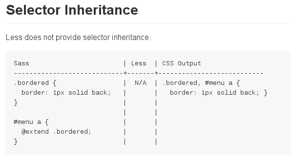
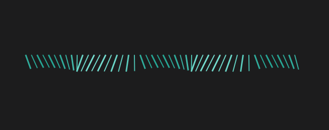

# LESS is More

@(随笔)[LESS|CSS|Markdown]

### Preface
一个小静简的项目的代码可以很松散随意，可是如果上升到工程化的角度，就需要框架和规范了。就连CSS这种称不上语言的语言，写法随意结构混乱，在大型工程中维护成本很大。对于解决以上部分问题，LESS于是就应运而生了，没错，CSS代码也可以预编译，也支持变量函数递归导入库。以下将对此进行探讨。

### 简介
作为一门标记性语言，CSS 的语法相对简单，对使用者的要求较低，但同时也带来一些问题：CSS 需要书写大量看似没有逻辑的代码，不方便维护及扩展，不利于复用，尤其对于非前端开发工程师来讲，往往会因为缺少 CSS 编写经验而很难写出组织良好且易于维护的 CSS 代码，造成这些困难的很大原因源于 CSS 是一门非程序式语言，没有变量、函数、SCOPE（作用域）等概念。LESS 为 Web 开发者带来了福音，它在 CSS 的语法基础之上，引入了变量，Mixin（混入），运算以及函数等功能，大大简化了 CSS 的编写，并且降低了 CSS 的维护成本，就像它的名称所说的那样，LESS 可以让我们用更少的代码做更多的事情。

### How to use LESS
本质上，LESS 包含一套自定义的语法及一个解析器，用户根据这些语法定义自己的样式规则，这些规则最终会通过解析器，编译生成对应的 CSS 文件。LESS 并没有裁剪 CSS 原有的特性，更不是用来取代 CSS 的，而是在现有 CSS 语法的基础上，为 CSS 加入程序式语言的特性。下面是一个简单的例子：<br>
LESS文件：
```less
@color: #4D926F; 

#header { 
    color: @color; 
}
h2 {
    color: @color; 
}
```
经过编译生成的 CSS 文件如下：
```css
#header { 
    color: #4D926F; 
} 
h2 { 
    color: #4D926F; 
}
```
可以看到学习 LESS 非常容易，只要你了解 CSS 基础就可以很容易上手。

LESS 可以直接在客户端使用，也可以在服务器端使用。在实际项目开发中，更推荐使用第三种方式，将 LESS 文件编译生成静态 CSS 文件，并在 HTML 文档中应用。

**客户端**
我们可以直接在客户端使用 .less（LESS 源文件），只需要从[官网](http://lesscss.org)上下载 less.js 文件，然后在我们需要引入 LESS 源文件的 HTML 中加入如下代码：
```html
<script src="less.js">
```
LESS 源文件的引入方式与标准 CSS 文件引入方式一样：
```html
<link rel="stylesheet/less" type="text/css" href="styles.less">
```
需要注意的是：在引入 .less 文件时，rel 属性要设置为`stylesheet/less`。还有更重要的一点需要注意的是：**LESS 源文件一定要在 less.js 引入之前引入，这样才能保证 LESS 源文件正确编译解析**。

**服务器端**
LESS 在服务器端的使用主要是借助于 LESS 的编译器，将 LESS 源文件编译生成最终的 CSS 文件，目前常用的方式是利用 node 的包管理器 (npm) 安装 LESS，安装成功后就可以在 node 环境中对 LESS 源文件进行编译。
```
npm install -g less
```
然后编译 .less 文件生成 .css 文件：
```
lessc style.less >style.css
```
在项目开发初期，我们无论采用客户端还是服务器端的用法，我们都需要想办法将我们要用到的 CSS 或 LESS 文件引入到我们的 HTML 页面或是桥接文件中，LESS 提供了一个我们很熟悉的功能— Importing。我们可以通过这个关键字引入我们需要的 .less 或 .css 文件。 如：
```
@import “variables.less”;
```
.less 文件也可以省略后缀名，像这样：
```
@import “variables”;
```
引入 CSS 同 LESS 文件一样，只是 .css 后缀名不能省略。

所以，一般通过 LESS 的编译器，将 LESS 文件编译成为 CSS 文件，在 HTML 文章中引入使用。这里要强调的一点，LESS 是完全兼容 CSS 语法的，也就是说，我们可以将标准的 CSS 文件直接改成 .less 格式，LESS 编译器可以完全识别。

### 语法
接下来将介绍以下特性：
- Variables
- Mixins
- Nested rules
- Media query bubbling and nested media queries
- Operations
- Functions
- Namespaces and Accessors
- Scope
- Comments
- Importing

**Variables**<br>
示例：
```less
@nice-blue: #5B83AD;
@light-blue: @nice-blue + #111;

#header {
  color: @light-blue;
}
```
编译后的CSS：
```css
#header {
  color: #6c94be;
}
```
该特性适用于定义主题，我们可以将背景颜色、字体颜色、边框属性等常规样式进行统一定义，这样不同的主题只需要定义不同的变量文件就可以了。当然该特性也同样适用于 CSS RESET（重置样式表），在 Web 开发中，我们往往需要屏蔽浏览器默认的样式行为而需要重新定义样式表来覆盖浏览器的默认行为，这里可以使用 LESS 的变量特性，这样就可以在不同的项目间重用样式表，我们仅需要在不同的项目样式表中，根据需求重新给变量赋值即可。

**Scope**<br>
LESS 中的变量和其他编程语言一样，可以实现值的复用，同样它也有生命周期，也就是 Scope（变量范围，开发人员惯称为作用域），简单的讲就是局部变量还是全局变量的概念，查找变量的顺序是先在局部定义中找，如果找不到，则查找上级定义，直至全局。
示例：
```less
@width : 20px; 
#homeDiv {
    @width : 30px; 
    #centerDiv{
        width : @width;// 此处应该取最近定义的变量 width 的值 30px
    }
}
#leftDiv { 
    width : @width; // 此处应该取最上面定义的变量 width 的值 20px 
}
```
编译后的CSS：
```css
#homeDiv #centerDiv { 
    width: 30px; 
} 
#leftDiv { 
    width: 20px; 
}
```

**Mixins**<br>
示例：
```less
.bordered {
  border-top: dotted 1px black;
  border-bottom: solid 2px black;
}

#menu a {
  color: #111;
  .bordered;
}

.post a {
  color: red;
  .bordered;
}
```
好吧，我们也可以把这叫做嵌套（多好复用啊）。

**Nested rules**<br>
先看如果要写以下css：
```css
#header {
  color: black;
}
#header .navigation {
  font-size: 12px;
}
#header .logo {
  width: 300px;
}
```
如果用less则相当简洁整齐了：
```less
#header {
  color: black;
  .navigation {
    font-size: 12px;
  }
  .logo {
    width: 300px;
  }
}
```
这里不得不说一下`&`，代表的是当前选择符的夫选择符：
```less
.clearfix {
  display: block;
  zoom: 1;

  &:after {
    content: " ";
    display: block;
    font-size: 0;
    height: 0;
    clear: both;
    visibility: hidden;
  }
}
```

**Media query bubbling and nested media queries**<br>
媒体查询也能如此漂亮不是吗：
```less
.screencolor{
  @media screen {
    color: green;
    @media (min-width:768px) {
    color: red;
    }
    }
  @media tv {
    color: black;
  }
}
```
编译后的CSS：
```css
@media screen {
  .screencolor {
    color: green;
  }
}
@media screen and (min-width: 768px) {
  .screencolor {
    color: red;
  }
}
@media tv {
  .screencolor {
    color: black;
  }
}
```

**Operations**<br>
```less
@base: 5%;
@filler: @base * 2;
@other: @base + @filler;

color: #888 / 4;
background-color: @base-color + #111;
height: 100% / 2 + @filler;
```
这个必须有啊。

**Functions**<br>
现在可以在css中写函数了：
```less
// 定义一个样式选择器
.borderRadius(@radius:5px){
    -moz-border-radius: @radius;
    -webkit-border-radius: @radius;
    border-radius: @radius;
} 
// 使用已定义的样式选择器
#header {
    .borderRadius(10px); // 把 10px 作为参数传递给样式选择器
} 
.btn {
    .borderRadius();// // 使用默认值
}
```
输出：
```css
#header {
    -moz-border-radius: 10px;
    -webkit-border-radius: 10px;
    border-radius: 10px; 
}
.btn {
    -moz-border-radius: 5px;
    -webkit-border-radius: 5px;
    border-radius: 5px;
}
```
就连 JavaScript 中 arguments 在 LESS 中都有了：`@arguments`。当引用这个参数时，该参数表示所有的变量，很多情况下，这个参数可以省去你很多代码。
```less
.boxShadow(@x:0,@y:0,@blur:1px,@color:#000){
    -moz-box-shadow: @arguments;
    -webkit-box-shadow: @arguments;
    box-shadow: @arguments; 
}
#header {
    .boxShadow(2px,2px,3px,#f36);
}
```

**amespaces and Accessors**<br>
在 Javascript 中遇到的命名空间污染问题继续祸害着 CSS，当我们拥有了大量选择器的时候，特别是团队协同开发时，如何保证选择器之间重名问题？如果是 java 程序员或 C++ 程序员，肯定会想到命名空间 Namespaces，LESS 也采用了命名空间的方法来避免重名问题。看下面这样一段代码：
```less
#bundle {
  .button {
    display: block;
    border: 1px solid black;
    background-color: grey;
    &:hover {
      background-color: white
    }
  }
  .tab { ... }
  .citation { ... }
}

#header a {
  color: orange;
  #bundle > .button;
}
```
简单来说，我们定义了一个名为 bundle 的命名空间，如果我们要复用 button 这个选择器的时候，我们只需要在需要混入这个选择器的地方这样使用就可以了。#bundle > .button。

**Comments**<br>
```less
/* One hell of a block
style comment! */
@var: red;

// Get in line!
@var: white;
```

**Importing**<br>
```less
@import "library"; // library.less
@import "typo.css";
```
这里只是简单介绍，详细请看官方文档。

### LESS & SASS
说到LESS，不得不提到另外一种神级动态样式语言SASS（Syntactically Awesome Stylesheets）。

Sass语法类似与Haml，属于缩排语法（makeup），对于写惯Css的前端来说是很不直观的（Python党表示无异议），也不能将原来的Css加到Sass里面，因此Sass改良了语法，Sass 3就变成了Scss(Sassy CSS)。与原来的语法兼容，只是用{}取代了原来的缩进。

Sass:
```sass
.content
  margin:10px auto
  h1
    font-size:24px;
```
Scss:
```scss
.content{
  margin:10px auto
  h1{
    font-size:24px;
  }
}
```

那么Sass/Scss与Less有哪些区别呢？
1. Sass是基于Ruby的，是在服务端处理的，而Less是需要引入less.js来处理Less代码输出Css到浏览器，也可以在开发环节使用Less，然后编译成Css文件，直接放到项目中，也有 Less.app、SimpleLess、CodeKit.app这样的工具，也有在线编译地址。
2. 变量符不一样，less是@，而Scss是$，而且变量的作用域也不一样。
3. 输出设置，Less没有输出设置，Sass提供4中输出选项：nested, compact, compressed 和 expanded。
4. Sass支持条件语句，可以使用if{}else{},for{}循环等等。而Less不支持。

至于共同点：
1. 变量允许我们单独定义通用的样式，在css中调用。
2. 混合可以将一个定义好的class A轻松的引入到另一个class B中，从而简单实现class B继承class A中的所有属性。我们还可以带参数地调用，就像使用函数一样。
3. 我们可以在一个选择器中嵌套另一个选择器来实现继承，这样很大程度减少了代码量，并且代码看起来更加的清晰。
4. 运算提供了加，减，乘，除操作，可以做属性值和颜色的运算，这样就可以实现属性值之间的复杂关系。
5. 提供了一系列的颜色运算函数. 颜色会先被转化成 HSL 色彩空间, 然后在通道级别操作。
6. 文件引入

在github上有一篇各个方面详细的对比，通过两种不同的书写方式放在一起看会更加直接明了，这里是[传送门](https://gist.github.com/chriseppstein/674726)。



可以看到LESS不支持继承。

### Demo
看了这么多，是不是手痒了，下面我们来写一个demo来练练手。（请允许我放张静态图）



在codepen上看到一个狂拽酷炫吊炸天的CSS3动画效果，并且也是用LESS写的。现在我们自己动手写一个。
```html
<link rel="stylesheet" type="text/css" href="css/normalize.css">
<link rel="stylesheet" type="text/css" href="css/swing.css">

<div>
	<span></span>
	<span></span>
	<span></span>
	<span></span>
	<span></span>
	<span></span>
	<span></span>
	<span></span>
</div>
```
下面我们分部来写swing.less：
```less
@bgcolor: #1c1c1d;
@span_w_h: 15px;
@span_color: #2FAC9B;

.center{
	text-align: center;
	margin: 0 auto;
}
body{
	background: @bgcolor;
	.center;
}
div{
	position: relative;
	top: 50%;
	.center;

	span{
		display: inline-block;
		width: @span_w_h;
		height: @span_w_h;
		background: @span_color;
	}
}
.border-radius{border-radius: 500px;}
```
一开始简单设置一下基本的元素样式。然后为了考虑CSS3动画特效浏览器兼容问题，个人觉得这是LESS该做的事情，它应该优化好这些。
```less
.keyframes(rotateZ);
.keyframes(@name){
	@keyframes @name { .foo; };
	@-webkit-keyframes @name { .foo; };
	@-moz-keyframes @name { .foo; };
	@-ms-keyframes @name { .foo; };
	@-o-keyframes @name { .foo; };
}

.transform(@foo){
	transform: @arguments;
	-webkit-transform: @arguments;
	-moz-transform: @arguments;
	-o-transform: @arguments;
	-ms-transform: @arguments;
}

.animation(@name,@duration:1s,@timing:0.05s,@count:infinite,@other){
	animation: @arguments;
	-moz-animation: @arguments;
	-webkit-animation: @arguments;
	-o-animation: @arguments;
	-ms-animation: @arguments;
}
```
其中.keyframes中的.foo就是我们具体要写的动画效果。
```less
.foo{
	0% { .transform( rotateZ(-20deg) );}
	50% {
		.transform( rotateZ(20deg) scaleY(1.2) );
		background: lighten(@span_color, 20%);
	}
	100%{ .transform( rotateZ(-20deg) );}
}
```
接下来就是如何将这些样式应用到span元素上去了，不可能一个一个写，所以这里就要用到递归了：
```less
.generate-span(8);
.generate-span(@n, @i: 1) when (@i =< @n) {
	div span:nth-child(@{i}){
		.border-radius;
		transform-origin:50% 0%;
		.animation( rotateZ, 1s, (@i * 0.05s), infinite, cubic-bezier(0.005, 0.560, 0.580, 1.590) );
		width: (@span_w_h/6);
		height: (@span_w_h*2);
		margin:0 (@span_w_h/6);
	}
	.generate-span(@n, (@i + 1));
}
```
最后就是生成swing.css了，这里可以对比一下，swing.less文件大小为1.5kb，而swing.css则达到30.2kb，是不是很吓人。

### Reference
[0]. [Features of the Less language](http://lesscss.org/features/)<br>
[1]. [LESS CSS 框架简介](http://www.ibm.com/developerworks/cn/web/1207_zhaoch_lesscss/)<br>
[2]. [动态样式语言Sass&Less介绍与区别](http://www.kekaku.com/webdevelop/1052)<br>
[3]. [Sass/Less Comparison](https://gist.github.com/chriseppstein/674726)<br>
[4]. [codepen上的demo1](http://codepen.io/JesGraPa/pen/Hyaiw)<br>
[5]. [codepen上的demo2](http://codepen.io/juanbrujo/pen/sozLK)