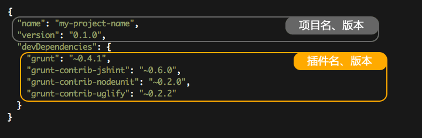
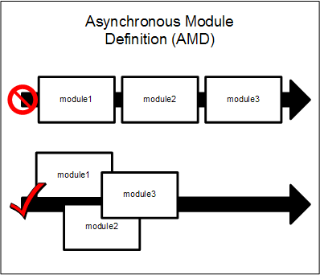
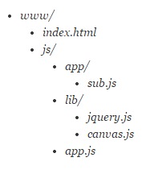
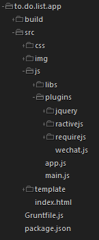
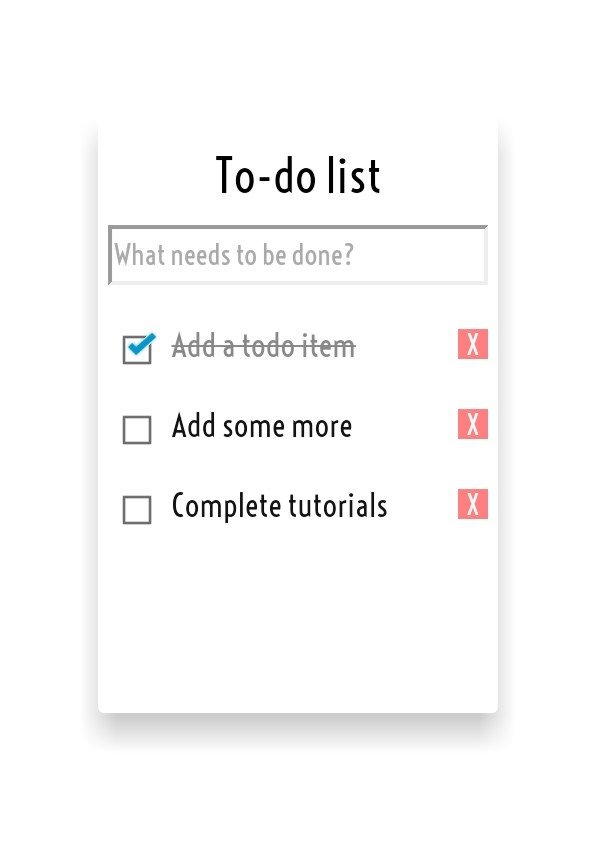

# Build a To-do List App
@(随笔)[ractivejs|requierjs|grunt]

### Preface
Being A Frontend Developer For A WeekEnd? WTF, are you killing me? 好吧，那篇文章的作者是一名后台开发者，通过一个周末的时间学习前端开发，其中用到了Grunt，Backbone.js，Underscore.js，RequireJS以及自己开源的TravisLight工具。这里不讨论作者最后到底到达了什么程度，只是想吐槽一句文章写的太乱了，传说中的意识流开发。顺带一句，本文将手把手教你如何写一个简单的To-do List，仅仅用到grunt，requirejs，ractivejs，写完后你会有一种站在前端开发大门前的感觉，至于后面的内功就靠自己修炼了。

### Grunt
首先来看第一个要了解的工具，Grunt。
```
Q: 这货是啥啊？
A: 一个很火的前端自动化小工具，基于任务的命令行构建工具。
Q: 为何要用构建工具？
A: 一句话：自动化。对于需要反复重复的任务，例如压缩（minification）、编译、单元测试、linting等，自动化工具可以减轻你的劳动，简化你的工作。当你正确配置好了任务，任务运行器就会自动帮你或你的小组完成大部分无聊的工作。
Q: 为什么要使用Grunt？
A: Grunt生态系统非常庞大，并且一直在增长。由于拥有数量庞大的插件可供选择，因此，你可以利用Grunt自动完成任何事，并且花费最少的代价。如果找不到你所需要的插件，那就自己动手创造一个Grunt插件，然后将其发布到npm上吧。
```

看到上面的对话表示还是无关痛痒，那么看下面一个基于现实的场景：
> 
[场景1：项目开始前]
先建立一个 projA 的文件夹，再建 html，css，js，images（建5个或以上文件夹，花费1分钟），拷贝 CSS库（Yui Reset | bootstrap），JS库（Requiet.js | Seajs | jQuery | jQuery插件 ）进相应目录（拷贝 N个文件，花费N分钟），再新建 html/index.html，js/comm.js，css/base.css，css/comm.css，css/module-A.css ...（建N个文件，花费N分钟）。

> 
[场景2：编码中]
编辑器编码 => 切换到浏览器F5 => 编辑器编码 => 切换到浏览器F5 => 编辑器编码 => 切换到浏览器F5 ...（此处陷入死循环）


键盘就这样杯具了。。

> 
[场景3：编码完成]
HTML去掉注析、换行符 - HtmlMin
CSS文件压缩合并 – CssMinify
JS代码风格检查 – JsHint
JS代码压缩 – Uglyfy
image压缩 - imagemin

在一个项目过程中，键盘就是这样被玩坏的，我只能说人生苦短。。<br>
我们需要一个自动化的工作流程，让我们更专注于coding，而不是coding外的繁琐工作。于是Grunt应运而生。可以想像，如果在node环境下，一行命令搞定一个场景，So Cool！

**安装**
Grunt基于Node.js，安装之前要先安装Node.js(>0.8.0)，然后运行下面的命令：
```
sudo npm install grunt-cli -g
```
grunt-cli表示安装的是grunt的命令行界面，参数g表示全局安装。
```
sudo npm install grunt-init -g
```
当然你还可以安装grunt-init，grunt-init是个脚手架工具，它可以帮你完成项目的自动化创建，包括项目的目录结构，每个目录里的文件等，具体情况要看你运行grunt-init指定的模板。

**配置Grunt**
Grunt使用模块结构，除了安装命令行界面以外，还要根据需要安装相应的模块。这些模块应该采用局部安装，因为不同项目可能需要同一个模块的不同版本。

首先，在项目的根目录下，创建一个文本文件package.json，指定当前项目所需的模块。下面就是一个例子：



注：`~`表示不低于。<br>
然后，在项目的根目录下运行下面的命令，这些插件就会被自动安装在node_modules子目录。
```
npm install
```
上面这种方法是针对已有package.json的情况。如果想要自动生成package.json文件，可以使用npm init命令，按照屏幕提示回答所需模块的名称和版本即可。
```
npm init
```

第二个就是命令脚本文件Gruntfile.js。<br>
模块安装完以后，下一步在项目的根目录下，新建脚本文件Gruntfile.js。它是grunt的配置文件，就好像package.json是npm的配置文件一样。Gruntfile.js就是一般的Node.js模块的写法。


最后键入grunt，就表示执行默认的default任务。


Grunt的模块已经超过了2000个，最后再介绍几个常用的模块：
> 
grunt-contrib-clean：删除文件。
grunt-contrib-compass：使用compass编译sass文件。
grunt-contrib-concat：合并文件。
grunt-contrib-copy：复制文件。
grunt-contrib-cssmin：压缩以及合并CSS文件。
grunt-contrib-imagemin：图像压缩模块。
grunt-contrib-jshint：检查JavaScript语法。
grunt-contrib-uglify：压缩以及合并JavaScript文件。
grunt-contrib-watch：监视文件变动，做出相应动作。

模块的前缀如果是grunt-contrib，就表示该模块由grunt开发团队维护；如果前缀是grunt（比如grunt-pakmanager），就表示由第三方开发者维护。至于这些模块的配置写法，这里就不再细讲，具体看官方文档。

### RequireJs
RequireJS 是一个JavaScript模块加载器。它非常适合在浏览器中使用, 它非常适合在浏览器中使用，但它也可以用在其他脚本环境, 就像 Rhino and Node. 使用RequireJS加载模块化脚本将提高代码的加载速度和质量。

谈起RequireJS，你无法绕过提及JavaScript模块是什么，以及AMD是什么。

JavaScript模块只是遵循SRP(Single Responsibility Principle单一职责原则)的代码段，它暴露了一个公开的API。在现今JavaScript开发中，你可以在模块中封装许多功能，而且在大多数项目中，每个模块都有其自己的文件。这使得JavaScript开发者日子有点难过，因为它们需要持续不断的关注模块之间的依赖性，按照一个特定的顺序加载这些模块，否则运行时将会放生错误。

当你要加载JavaScript模块时，就会使用script标签。为了加载依赖的模块，你就要先加载被依赖的，之后再加载依赖的。使用script标签时，你需要按照此特定顺序安排它们的加载，而且脚本的加载是同步的。可以使用async和defer关键字使得加载异步，但可能因此在加载过程中丢失加载的顺序。另一个选择是将所有的脚本捆绑打包在一起，但在捆绑的时候你仍然需要把它们按照正确的顺序排序。

AMD就是这样一种对模块的定义，使模块和它的依赖可以被异步的加载，但又按照正确的顺序。



CommonJS, 是对通用的JavaScript模式的标准化尝试，它包含有 AMD 定义。在ECMAScript 6这个下一版本JavaScript 规范中，有关于输出，输入以及模块的规范定义，这些将成为JavaScript语言的一部分，而且这不会太久。

RequireJS所做的是，在你使用script标签加载你所定义的依赖时，将这些依赖通过head.appendChild()函数来加载他们。当依赖加载以后，RequireJS计算出模块定义的顺序，并按正确的顺序进行调用。这意味着你需要做的仅仅是使用一个“根”来读取你需要的所有功能，然后剩下的事情只需要交给RequireJS就行了。为了正确的使用这些功能，你定义的所有模块都需要使用RequireJS的API，否者它不会像期望的那样工作。

RequireJS API 存在于RequireJS载入时创建的命名空间requirejs下。其主要API主要是下面三个函数:
- define 该函数用户创建模块。每个模块拥有一个唯一的模块ID，它被用于RequireJS的运行时函数，define函数是一个全局函数，不需要使用requirejs命名空间.
- require 该函数用于读取依赖。同样它是一个全局函数，不需要使用requirejs命名空间.
- config 该函数用于配置RequireJS.

在后面，我们将教你如果使用这些函数，但首先让我们先了解下RequireJS的加载流程。

假设我们有一个目录如下：



RequireJS以一个相对于baseUrl的地址来加载所有的代码。 页面顶层<script>标签含有一个特殊的属性data-main，require.js使用它来启动脚本加载过程，而baseUrl一般设置到与该属性相一致的目录。
index.html：

```
<!--This sets the baseUrl to the "scripts" directory, and
    loads a script that will have a module ID of 'main'-->
<script data-main="js/app" src="require.js"></script>
```

baseUrl亦可通过RequireJS config手动设置。如果没有显式指定config及data-main，则默认的baseUrl为包含RequireJS的那个HTML页面的所属目录。

RequireJS默认假定所有的依赖资源都是js脚本，因此无需在module ID上再加".js"后缀，RequireJS在进行module ID到path的解析时会自动补上后缀。你可以通过paths config设置一组脚本，这些有助于我们在使用脚本时码更少的字。

下面再看主模块（或入口模块）app.js。如果你想改变RequireJS的默认配置来使用自己的配置，require.configh函数。config函数需要传入一个可选参数对象，这个可选参数对象包括了许多的配置参数选项。
app.js
```js
requirejs.config({
    //By default load any module IDs from js/lib
    baseUrl: 'js/lib',
    //except, if the module ID starts with "app",
    //load it from the js/app directory. paths
    //config is relative to the baseUrl, and
    //never includes a ".js" extension since
    //the paths config could be for a directory.
    paths: {
        app: 'js/app'
    }
});

// Start the main app logic.
requirejs(['jquery', 'canvas', 'app/sub'],
function   ($,        canvas,   sub) {
    //jQuery, canvas and the app/sub module are all
    //loaded and can be used here now.
});
```
以下是可以使用的配置：
- baseUrl  用于加载模块的根路径。
- paths  用于映射不存在根路径下面的模块路径。
- shims  配置在脚本/模块外面并没有使用RequireJS的函数依赖并且初始化函数。假设underscore并没有使用RequireJS定义，但是你还是想通过RequireJS来使用它，那么你就需要在配置中把它定义为一个shim。
- deps  加载依赖关系数组

**定义模块**<br>
模块是进行了内部实现封装、暴露接口和合理限制范围的对象。ReuqireJS提供了define函数用于定义模块。按章惯例每个Javascript文件只应该定义一个模块。define函数接受一个依赖数组和一个包含模块定义的函数。通常模块定义函数会把前面的数组中的依赖模块按顺序做为参数接收。例如，下面是一个简单的模块定义:
```js
define(["logger"], function(logger) {       
    return {
        firstName: "John",
        lastName: "Black",
        sayHello: function () {
            logger.log("hello");
        }
    }
});
```
我们看，一个包含了logger的模块依赖数组被传给了define函数,该模块后面会被调用。同样我们看所定义的模块中有一个名为logger的参数，它会被设置为logger模块。每一个模块都应该返回它的API。这个示例中我们有两个属性(firstName和lastName)和一个函数(sayHello)。然后，只要你后面定义的模块通过ID来引用这个模块，你就可以使用其暴露的API。

**require函数**<br>
在RequireJS中另外一个非常有用的函数是require函数。require函数用于加载模块依赖但并不会创建一个模块。例如：下面就是使用require定义了能够使用jQuery的一个函数。
```js
require(['jquery'], function ($) {
    //jQuery was loaded and can be used now
});
```

### RactiveJs
在前端MVC框架越来越火热的今天，从之前的Backbone.js到现在的AngularJS、Ember.js，大家都渐渐意识到了前端框架带给开发人员的好处。但是，无法回避的一点是这些框架的学习曲线都很陡峭，从入门到熟练使用可能得花上相当长的一段时间。对于新手而言，这不仅是时间上的消耗问题，更是心理上的打击和摧残。因此，我们需要一款简单明了的库或框架，让我们不仅能快速学习理解并使用到项目中，也能在这个过程中慢慢的学习了解前端框架的思想，以便为将来学习那些能够创建企业级别应用的前端框架的学习打下基础。

所以，今天我们就来讲一讲Ractive.js。Ractive.js是一款简单却功能强大的JS库，它实现了模板，数据绑定，DOM实时更新，事件处理等多个有用的功能。它的灵感来源于AngularJS，因此和AngularJS长得很像；同时，它也从Backbone.js中学到了一些有趣的想法，因此和Backbone.js也有点像。然而，上面提到的这些都不是我们选择使用它的主要原因，而是因为它足够简单。你完全可以在一两个小时之内学会使用Ractive.js，而不需要花很长事件去纠结AngularJS中`$scope().$apply()`之类令人头疼的问题。

官网首页上有个60秒入门例子，可是我觉得吧，看了跟没看一样。不过值得一提的是，它的[Tutorials](http://learn.ractivejs.org/hello-world/1/)做的不错，如果能全部做完，相信你对ractivejs了解会更加深刻。本文要做的To-do list就是来自第十个例子。

为了下面能够继续进行，这里必须写个Hello world来啰嗦一下。<br>
1.在index.html添加一个容器元素来渲染模板：
```html
<body>
    <div id='container'></div>
    <script src='Ractive.js'></script>
</body>
```
2.编写一个模板(Ractive.js使用的模版遵循mustache语法)：
```html
<script id='myTemplate' type='text/ractive'>
    <p>{{greeting}}, {{recipient}}!</p>
</script>
```
3.再来一段简单的JS代码：
```html
<script>
var ractive = new Ractive({
    el: 'container',
    template: '#myTemplate',
    data: { greeting: 'Hello', recipient: 'world' }
});
</script>
```
其实，最关键就是模板+Ractive对象。而至于Ractive对象的属性和方法，如何更新数据，DOM事件处理，数据双向绑定，局部模板等特性请见官方文档和教程，这里写不下了。

### To-do List App
好吧，看了这么多，现在终于开始动手做我们自己的To-do List了，马上就用到之前学到的东西。
在开始coding之前，我们还是组织一下整个项目的目录结构，避免太混乱。如下图：



源码放在src目录下，src目录和Gruntfile.js以及package.json都放在根目录下，而build目录是grunt生成的（还有个npm下载插件的modules目录，这里删掉了）。

首先来写index.html：
```html
<head>
    <title>To-do list</title>
    <meta http-equiv='content-type' content='text/html;charset=UTF-8'>
    <meta http-equiv="X-UA-Compatible" content="IE=edge,chrome=1" />
    <meta name="viewport" content="width=device-width, initial-scale=1.0, user-scalable=0, minimum-scale=1.0, maximum-scale=1.0">
    <meta name="apple-mobile-web-app-capable" content="yes">
    <meta name="apple-mobile-web-app-status-bar-style" content="black">
    <meta name="format-detection" content="telephone=no">
    <link rel="stylesheet" type="text/css" href="css/main.css">
    <link rel="stylesheet" type="text/css" href="css/card_3d.css">
    
    <script data-main="js/main" src="js/libs/require.min.js"></script>
</head>

<div id='todolist' class='card_3d todolist'></div>
```
首页很简单，其中div#todolist就是模板渲染后输出的容器，看到这里是不是觉得使用模板特别简洁呢。而模板，我们用到了两个，放在template目录下：<br>
ul.template:
```html
<h2>To-do list</h2>
<!-- Fixme: on-change bug -->
<input on-change='newTodo' class='newTodo' placeholder={{placeholder}}>

<ul class='todos center'>
    {{#items:i}}
        {{>item}}
    {{/items}}
</ul>
```
li.template:
```html
<li class='{{ done? "done" : "pending" }}'>
    <input type='checkbox' checked='{{done}}'>
    <span on-tap='edit'>{{description}}
        {{#if editing}}
            <input class='edit' value='{{description}}' on-blur='stop_editing'>
        {{/if}}
    </span>
    <div class='button' on-tap='remove'>X</div>
</li>
```
然后可以看到只有一个script标签，其他的主要是通过main.js加载。于是乎，接下来就是写配置文件main.js：
```js
require.config({
    baseUrl:'js',
    paths:{
        jquery:'libs/jquery-2.1.1.min',
        ractive:'libs/ractive',
        app:'app',
        'dragMove':'plugins/jquery/dragMove',
        tap:'plugins/ractivejs/ractive-events-tap',
        text:'plugins/requirejs/text',
        wechat:'plugins/wechat'
    },
    shim:{
        'dragMove':{
            deps: ['jquery']
        }
    }
});

require(['app','wechat'],function(app,wechat){
    app.build();
    // Add drag and move feature
    app.enableDrag('todolist');
    // wechat share
    wechat.share('我的To-do list','关注我的微信公众号Urinx，感受三体纳米科技核心智慧。');
});
```
由于所有的js都放在js目录下，所以基地址设为/js，将依赖的js文件路径写到配置config里的paths里面，对于不遵循AMD的则写到shim里。
然后就是引入要用到的两个模块app和wechat，app实现的是To-do list的主要逻辑，而wechat则负责微信分享的部分。

ok，重点就是构建app.js了：
```js
define(
    ['text!../template/ul.template','text!../template/li.template','wechat','jquery','ractive','dragMove','tap'],
    function(ul_template,li_item,wechat){
        var ractive;
        return {
            build: function(){

                var ToDoList=Ractive.extend({
                    template: ul_template,
                    partials: { item : li_item },

                    init: function(){
                        // proxy event handlers
                        this.on({
                            remove: function(ev){
                                this.removeItem(ev.index.i);
                            },
                            newTodo: function(ev){
                                if (this.data.items.length>=5) {
                                    alert('人生不留遗憾，少写一点吧。');
                                } else{
                                    this.addItem(ev.node.value);
                                    ev.node.value='';
                                };
                                ev.node.blur();
                            },
                            /*
                            edit: function(ev){
                                this.editItem(ev.index.i);
                            },
                            stop_editing: function(ev){
                                this.set( ev.keypath+'.editing',false );
                            },
                            */
                        })
                    },

                    addItem: function(description){
                        this.push('items',{
                            done: false,
                            description: description
                        });
                        
                    },
                    removeItem: function(i){
                        this.splice('items',i,1);
                    },
                    /*
                    editItem: function(i){
                        this.set('items.'+i+'.editing',true);
                    },
                    */
                });

                var default_item=[
                    {done:true,  description: 'Add a todo item' },
                    {done:false, description: 'Add some more' },
                    {done:false, description: 'Complete tutorials'}
                ];

                ractive= new ToDoList({
                    el:'todolist',
                    data:{
                        items: this.getItem() || default_item,
                        placeholder: 'What needs to be done?',
                    }
                });
            },

            enableDrag: function(id){
                $.dragMove(id);
            },

            getItem: function(){
                return location.search?location.search.slice(1).split('&').map(function(str){
                    var a=str.split('=');
                    return {description:unescape(a[0]),done:a[1]=='true'?true:false};
                }):null;
            },

            setWechatShareUrl: function(){
                var baseUrl=location.href.split('?')[0]+'?';
                return ractive.data.items.reduce(function(url,item){
                    return url+escape(item['description'])+'='+item['done']+'&';
                },baseUrl).slice(0,-1);
            }
        }
});
```
app.js仅仅返回了四个方法：
- build 负责渲染模板，业务逻辑
- enableDrag 使之可以被拖拽
- getItem 设置To-do list上显示的item
- setWechatShareUrl 微信分享的链接设置

一个个来看，在build方法中，一开始我们扩展了一个Ractive对象：
```js
var ToDoList=Ractive.extend({
    template: ul_template,
    partials: { item : li_item },

    init: function(){
        // proxy event handlers
        this.on({
            remove: function(ev){
                this.removeItem(ev.index.i);
            },
            newTodo: function(ev){
                if (this.data.items.length>=5) {
                    alert('人生不留遗憾，少写一点吧。');
                } else{
                    this.addItem(ev.node.value);
                    ev.node.value='';
                };
                ev.node.blur();
            },
            /*
            edit: function(ev){
                this.editItem(ev.index.i);
            },
            stop_editing: function(ev){
                                this.set( ev.keypath+'.editing',false );
            },
            */
        })
    },

    addItem: function(description){
        this.push('items',{
            done: false,
            description: description
        });
                        
    },
    removeItem: function(i){
        this.splice('items',i,1);
    },
    /*
    editItem: function(i){
        this.set('items.'+i+'.editing',true);
    },
    */
});
```
初始化后监听了两个事件，一个删除一个添加，通过addItem，removeItem分别实现。<br>
随后就是实例化ToDoList将其渲染到容器中去：
```js
var default_item=[
    {done:true,  description: 'Add a todo item' },
    {done:false, description: 'Add some more' },
    {done:false, description: 'Complete tutorials'}
];

ractive= new ToDoList({
    el:'todolist',
    data:{
        items: this.getItem() || default_item,
        placeholder: 'What needs to be done?',
    }
});
```

enableDrag方法使用的是dragMove.js：
```js
(function($){
    //拖拽插件,参数:id或object
    $.dragMove = function(_this){
        if(typeof(_this)=='object'){
            _this=_this;
        }else{
            _this=$("#"+_this);
        }
        if(!_this){return false;}
 
        _this.css({'position':'absolute'}).hover(function(){$(this).css("cursor","move");},function(){$(this).css("cursor","default");})
        _this.mousedown(function(e){//e鼠标事件
            var offset = $(this).offset();
            var x = e.pageX - offset.left-150;
            var y = e.pageY - offset.top-150;
            _this.css({'opacity':'0.3'});
            $(document).bind("mousemove",function(ev){//绑定鼠标的移动事件，因为光标在DIV元素外面也要有效果，所以要用doucment的事件，而不用DIV元素的事件
                _this.bind('selectstart',function(){return false;});
                var _x = ev.pageX - x;//获得X轴方向移动的值
                var _y = ev.pageY - y;//获得Y轴方向移动的值
                _this.css({'left':_x+"px",'top':_y+"px"});
            });
        });
 
        $(document).mouseup(function(){
            $(this).unbind("mousemove");
            _this.css({'opacity':''});
        })
    };
})(jQuery);
```

而剩下的setWechatShareUrl()则是为wechat.js服务：
```js
define(['app'],function(app){
    var baseUrl="http://www.baidu.com";
    var imgUrl=baseUrl+'/img/thumb.png';
    var appid='';

    return {
        share: function(title,desc){
            document.addEventListener('WeixinJSBridgeReady', function onBridgeReady() {
                var link=app.setWechatShareUrl();
                
                // 发送给好友
                WeixinJSBridge.on('menu:share:appmessage', function(argv){
                    WeixinJSBridge.invoke('sendAppMessage',{
                        "appid": appid,
                        "img_url": imgUrl,
                        "img_width": "200",
                        "img_height": "200",
                        "link": link,
                        "desc": desc,
                        "title": title
                    }, function(res) {
                        //alert(res.err_msg);
                    });
                });

                // 分享到朋友圈
                WeixinJSBridge.on('menu:share:timeline', function(argv){
                    WeixinJSBridge.invoke('shareTimeline',{
                        "img_url": imgUrl,
                        "img_width": "200",
                        "img_height": "200",
                        "link": link,
                        "desc": desc,
                        "title": title
                    }, function(res) {
                        //alert(res.err_msg);
                    });
                });

            });
        }
    };
});
```
至此，整个To-do List就完成了。放出全身图给大家看看：



### Last but not the least
当你看到一个简单的项目可以涉及到如此多的框架，库和工具时，是不是有一种人生苦短的哀叹。前端框架何其多，穷极一生受折磨。当你在用别人的写的框架时，有没有一探究竟的冲动，嘟嘟噜~下期将带你手把手写前端框架。

### Reference
[0]. [我是如何利用一个周末时间成为前端工程师的](http://www.oschina.net/translate/being-a-frontend-developer-for-a-weekend)<br>
[1]. [Grunt 快速入门](http://www.gruntjs.net/docs/getting-started/)<br>
[2]. [Grunt打造前端自动化工作流](http://tgideas.qq.com/webplat/info/news_version3/804/808/811/m579/201307/216460.shtml)<br>
[3]. [Grunt：任务自动管理工具](http://javascript.ruanyifeng.com/tool/grunt.html)<br>
[4]. [RequireJS 中文网](http://www.requirejs.cn/)<br>
[5]. [RequireJS 入门指南](http://www.oschina.net/translate/getting-started-with-the-requirejs-library)<br>
[6]. [ractivejs.org](http://www.ractivejs.org/)<br>
[7]. [Ractive.js -- 前端MVC框架学习第一步](http://www.html-js.com/article/A-day-to-learn-JavaScript-Ractivejs-frontend-MVC-framework-for-learning-the-first-step)
